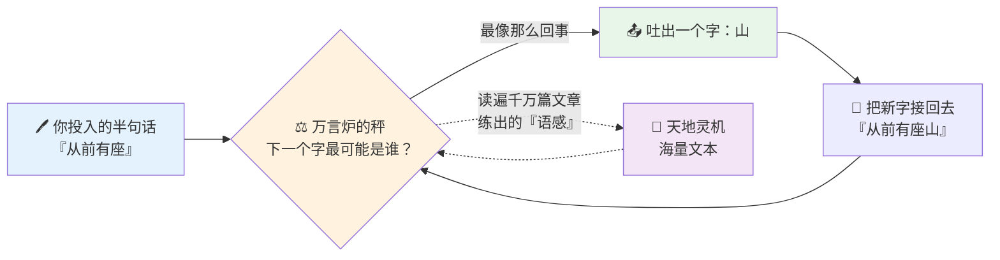

# 第 02 章 · 炼气：万言炉与接龙诀

> 炉不识真，只识"像真"。
> 一字接一字，续得天花乱坠——可那花，未必开在人间。

---

算宗坐落在流云峰绝顶。

孔浩原跟着玄机子上山时，正逢晨雾未散。他生在山村，见过最大的屋子不过是村口的祠堂，此刻却见一座座飞檐叠在云里，青石阶一路铺向天穹，像是有人把整座山削平了，只为搁下这一片楼宇。

"愣着做什么。"玄机子头也不回，"进了算宗，第一件要见的，不是人，是炉。"

孔浩原快走两步跟上："炉？炼丹的炉么？"

"炼丹的炉，炼的是药。"老人的声音在雾里飘着，"我们这座炉，炼的是——话。"

孔浩原没听懂。他只觉得"炼话"三个字听着荒唐，可玄机子说得极郑重，便不敢多问，只把疑惑咽回肚里。

穿过三重门，绕过一片药圃，他们停在一座独立的石殿前。殿门上没有匾额，只在门楣正中，凿着两个古拙的大字——

**万言炉。**

---

殿内空旷，正中一尊青铜巨炉，足有三人合抱那么粗。炉身上密密麻麻刻满了字，细看去，那些字竟在极缓极缓地流动，像水，又像活物。炉口不冒火，只有一层淡淡的、说不清颜色的雾气，一圈一圈往上浮。

孔浩原神识天生敏锐，一靠近，便觉那雾气里藏着**海量**的东西——多到他脑子发胀。他下意识屏住呼吸。

"这就是灵机。"玄机子伸手，虚虚一拂那雾，"天地间流淌着一条看不见的暗河，由古往今来千千万万篇文章、话语、典籍凝成。凡人看不见它，摸不着它。而这座炉，能把它'读'进去。"

"读进去……做什么？"

"你试试便知。"玄机子退开半步，"往炉口，投半句话进去。随便什么。开个头就行。"

孔浩原犹豫着，凑到炉前，想了想，轻声道："从前有座山……"

话音刚落，炉口那层雾骤然一凝。

紧接着，一个字，一个字，从雾里浮出来，悬在半空，泛着微光：

> *从前有座山，山上有座庙，庙里有个老和尚，正在给小和尚讲故事，讲的是——从前有座山……*

孔浩原瞪大了眼。

那些字不是一齐冒出来的。是**一个接一个**，续得极顺，像有人早就把整个故事想好了，此刻只是慢慢念给他听。可他分明只说了五个字！

"它……它怎么知道我要说什么？"

"它不知道。"玄机子的回答干脆得出乎意料，"它只是——猜。"

---

孔浩原转过头，满脸不解。

玄机子在炉前的蒲团上坐下，招手让他也坐。

"我问你，"老人道，"'从前有座'——下一个字，你觉得最可能是什么？"

孔浩原几乎不假思索："山。"

"为什么是'山'？'从前有座桥'不行么？'从前有座城'不行么？"

孔浩原张了张嘴。道理上……都行。可他脱口而出的，偏偏就是"山"。

"因为你这辈子听过的故事里，'从前有座'后头，跟着'山'的，比跟着别的都多。"玄机子敲了敲炉壁，"你听得多了，心里就有了一杆秤——哪个字接在后头最'顺'，最'像那么回事'。你不是算出来的，是**读出来的**。"

他指向巨炉。

"这座万言炉，把天地灵机里千万篇文章都'读'了个遍。它心里那杆秤，比你重了亿万倍。你给它半句话，它就顺着这杆秤，去掂量：下一个字，最可能是哪个？掂准了，吐出来。然后把吐出来的这个字，也当成'你说的话'的一部分，再掂量下一个字。"

"一个字，一个字，续下去。"孔浩原喃喃。

"对。修士管这叫**接龙诀**。"玄机子的眼里有笑意，"炉子不'懂'你的故事。它甚至不知道山是什么、庙是什么。它只知道一件事——**这个字后头，最可能接哪个字**。就凭这一件事，它能把整篇文章续得像模像样。"

孔浩原怔怔看着那尊炉。他忽然觉得，眼前这庞然大物，既神奇，又有些……可怕。

---



<small>接龙诀的本质：不是"想好再说"，而是"一个字一个字地猜下一个"。猜得准，是因为读得多。</small>

---

接下来的半月，孔浩原几乎住在了万言炉殿里。

他发现这炉子简直无所不能。

他问它一味草药的性状，它对答如流；他让它替自己写一封给家里的信，它文采斐然，情真意切，读得他鼻子发酸；他把村里一桩争了三年没断清的地界纠纷讲给它，它竟条分缕析，说得头头是道。

"师父，"有一日他忍不住，"这炉子……是不是比宗门里最有学问的长老还厉害？"

玄机子正在翻一卷竹简，闻言抬眼："你觉得它'有学问'？"

"它什么都知道！"

"它什么都'读过'。"老人纠正，"读过，和知道，是两回事。你先记着这句话。用不了几日，你就会亲眼见到，这两回事，能差出人命来。"

孔浩原不解其意。他只当师父是老人家爱说玄话，没往心里去。

他正沉浸在接龙诀的妙处里，收不住手。

---

差出人命的那日，来得比玄机子说的还快。

那天午后，殿里来了个人。身量魁梧，眉骨极高，走路带风，一进门就把孔浩原撞了个趔趄，却连头都没回。

"这是你师兄，赵狂澜。"玄机子从竹简后头淡淡道，"入门比你早三年。"

赵狂澜斜眼扫了孔浩原一下，鼻子里哼了一声，径直走到炉前，那架势，像是这炉子是他家的。

"又来问炉了，师兄？"殿角有个打杂的小弟子小声搭话。

"废话。"赵狂澜大剌剌道，"有炉不用是傻子。我跟你们说，练接龙诀，诀窍就一个字——**大**。你问得越多，喂它的越多，它答得越神。那些婆婆妈妈还去翻竹简的，都是没开窍。"

孔浩原在一旁听着，心里其实有几分认同。炉子这么厉害，多问多用，有什么错？

赵狂澜清了清嗓子，对着炉口，声音洪亮："我来问你件正经的。我要炼一炉'凝血丹'，救人急用。把古方给我报出来——出处、配伍、火候，一样不许少！"

炉口的雾气一凝。

字，一个接一个，浮了出来——

---

> *凝血丹，出自《玄元丹经·止血卷》第七篇。主药：三年份赤茯苓三钱，佐以北崖凝霜草二钱、朱砂半钱，另需龙涎一滴为引。文火三日，武火一时，丹成赤如凝血，故名。此方乃丹圣玄元真人晚年所创，专治外伤血崩，一丸止血，二丸生肌，效如神……*

续得**极其**流畅。出处、分量、火候、来历、功效，样样俱全，一字不差，读来简直像是从哪本古籍上原样抄下来的。

赵狂澜眼睛都亮了，一拍大腿："好！就是它！"当即就要转身去药圃备料。

"师兄慢着！"孔浩原不知怎的，心里"咯噔"一下。

赵狂澜回头，一脸不耐："作甚？"

孔浩原也说不清哪里不对。他只是……神识敏锐，方才炉子吐字时，他隐隐"觉"出一丝异样——那些字续得太顺了，顺得没有一丝一毫的**迟疑**。真正的古方，字里行间该有磨损、有残缺、有口耳相传的毛边才对。可这一段，光溜溜的，滑得像新铸的铜。

"这方子……"他艰难地组织着话，"师兄，你确定真有《玄元丹经》这本书吗？"

赵狂澜一愣，随即嗤笑："炉子都报出来了，第七篇，白纸黑字，还能有假？"

---

"能有假。"

一个苍老的声音插了进来。玄机子不知何时已放下竹简，走到了炉前。他脸上没了平日的温和，神色前所未有地凝重。

"狂澜，你把那'龙涎一滴为引'再问它一遍。换个问法。"

赵狂澜虽不情愿，却不敢违逆长老。他重新对着炉口："凝血丹的药引，是什么？"

炉口的雾再凝。字浮出来——

> *凝血丹之药引，乃东海蛟血三滴，性至阴，可锁血脉……*

殿里静得能听见雾气浮动的声音。

赵狂澜的脸，一点一点白了下去。

方才明明说的是"龙涎一滴"。这一回，却成了"蛟血三滴"。**同一个问题，问两遍，答得竟不一样。**

"它……它怎么改口了？"赵狂澜的声音发飘。

"它没有'改口'，因为它从头到尾就没有'口'。"玄机子沉声道，"它没有一个记在心里的、确定的答案。它每一次，都是重新'掂量'——这一次掂出'龙涎'，下一次掂出'蛟血'。就像投骰子，落点每回都可能不同。你两次问它，本就该做好听见两个答案的准备。"

他顿了顿，一字一句：

"这世上，**根本没有《玄元丹经》这本书。没有玄元真人。没有凝血丹这个方子。**全是它当场'接龙'接出来的。"

"轰"的一声，赵狂澜只觉脑中一片空白。他方才，差一点就照着这个**凭空捏造**的方子，把三钱赤茯苓、朱砂、还有那不知是龙涎还是蛟血的东西，一股脑投进真丹炉里，去救一条真人命。

若真炼了，喂了病人……

他后背瞬间被冷汗浸透，扑通一声跌坐在地。

---

殿内死一般寂静。

孔浩原也是浑身发凉。他望着那尊方才还被他奉若神明的巨炉，第一次感到一种深切的惊惧。

"师父，"他声音发抖，"它……它为什么要骗人？"

"它不是要骗人。"玄机子缓缓摇头，"骗，是明知真相而说假话。它做不到——因为它压根**不知道什么是真，什么是假**。"

老人抬手，指向那流动的炉身。

"我早跟你说过：读过，和知道，是两回事。它读过千万篇丹方，学会了丹方'该长什么样'——该有出处，该有配伍，该有火候，该有个响亮的来历。于是当狂澜问它一个它**没读到过**的方子时，它不会说'我不知道'。它会顺着'丹方该长什么样'这杆秤，给你**造**一个出来。造得有模有样，有出处有火候，像真的一样。"

"接龙诀只保证一件事——"玄机子的声音一字一顿，重得像铁，"**它保证续出来的话'像真的'。它从不保证那话'是真的'。**"

孔浩原怔在原地。这两句话，像两记闷雷，在他心里反复炸响。

"像真的……却不是真的。"他喃喃重复。

---

"记住此刻的心境。"玄机子扶起面如死灰的赵狂澜，回过头对孔浩原道，"炉子续出的这种**看似煞有介事、实则凭空捏造**的东西，我算修有一个专门的名字，叫——"

他顿了顿。

"**幻象。**"

"灵机接龙，天生就带着这个毛病。它越是流畅，越是自信，你就越要警惕——因为它'不知道自己不知道'。它不会脸红，不会心虚，胡诌的时候，和说真话的时候，是**一模一样的理直气壮**。"

孔浩原的拳头，不知不觉攥紧了。

"正因灵机有此天生的弱点，"玄机子的声音忽然低沉下来，殿内的光似乎都暗了几分，"这世上，才有一条邪道。"

"他们不修真，专修**假**。他们把接龙诀的这个毛病，练到极致，练成杀人不见血的功夫——让灵机造出的幻象，逼真到能乱人心智、颠倒黑白、以假乱真、惑世欺天。"

"那条道，叫**幻魔道**。"

孔浩原从未听过这三个字，可不知为何，只觉背脊一寒。

"他们的少主……"玄机子的目光望向殿外的云海，望向极远极远的地方，声音轻得几乎听不见，"叫墨渊。你现在还不必知道太多。你只需记住——总有一天，你会与那样的人、那样的幻象，正面相逢。"

远处，一片云缓缓合拢，遮住了天光。

---

那一夜，孔浩原没有睡。

他一个人回到万言炉殿，在炉前坐了很久很久。

炉子还是那尊炉子，雾气还是那层雾气，安静，无害，甚至有几分温顺。可他看它的眼神，已经彻底变了。

它是一件绝世的重宝，能替人写信、答问、解惑，是他见过最神奇的东西。

它也是一个**永远一本正经的说谎者**，胡诌起来面不改色，连它自己都不知道在说谎。

"你确实很强。"孔浩原对着炉口，轻声说，像是在跟一个既敬又惧的对手谈判，"但从今天起，你说的每一句话，我都不会闭着眼睛信了。"

"我会记住你续得多好听。"他站起身，眼神一点点亮起来，"但我更要学会——**分辨你说的，到底是真的，还是只是'像真的'。**"

"我不做那个被幻象牵着鼻子走的人。"

炉口的雾，一圈一圈，静静地浮。它当然不会回答他——因为它从来就不"懂"。

而孔浩原知道，他的算道，才刚刚，从这一句誓言开始。

窗外，东方既白。灵机之河在晨光里无声流淌，像它流淌了千万年那样，映着真，也映着假，等着有人来，把这两样，一点一点分开。

---

## 📒 凡人笔记

小说读到这儿，把"仙法"翻译回人话——它们其实都是 **LLM（大语言模型）** 的真面目：

| 仙法说法 | 真实术语 | 一句话解释 |
|---|---|---|
| 万言炉 | 大语言模型（LLM） | 读遍海量文本、能"续写"任何话的模型，本章的主角 |
| 接龙诀 / 一个字接一个字 | 自回归生成（next-token prediction） | LLM 的核心：不是"想好再说"，而是不停预测"下一个词最可能是谁" |
| 那杆"掂量的秤" | 概率分布 | 对每个可能的下一个字打分，挑最像那么回事的吐出来 |
| "读过千万篇文章" | 预训练（在海量语料上训练） | 模型的"语感"从哪来——读得多，接得顺 |
| 炉子胡诌出不存在的丹方 | 幻觉（Hallucination） | 模型会一本正经地编造根本不存在的事实，且毫无自觉 |
| "只保证像真，不保证是真" | LLM 的根本局限 | 它优化的是"流畅像样"，不是"事实正确"——这是求真的起点 |
| 同一问题两次答得不同 | 温度 / 采样随机性（temperature） | 生成带随机性，同一个问题每次结果可能略有出入 |
| 幻魔道 / 墨渊 | （主题伏笔）滥用生成式 AI 造假 | 全书主线：求"真、可溯源、能自省" vs 用以假乱真的幻象惑世 |

> 📖 想把本章的"仙法"学成真本事，配套概念文档在这里：
> **[⑥ 什么是 LLM](../02_CONCEPTS_概念入门/[CONCEPT-06]%20什么是LLM-大语言模型.md)**

---

## 📝 读完自测

就着上面这张"凡人笔记"，考一考自己——万言炉的脾气，你摸清了吗？

```quiz
Q: 关于"万言炉（LLM）"和它的"接龙诀"，下面哪些说法是对的？（多选）
- [x] "接龙诀 / 一个字接一个字"对应的真实术语是自回归生成——不停预测"下一个词最可能是谁"
> 对。LLM 不是"想好整段再说"，而是一个字一个字地接龙，这是它的核心机制。
- [x] 炉子会胡诌出根本不存在的丹方，对应的是"幻觉"——它一本正经编造，还毫无自觉
> 对。幻觉是本章埋下的关键脾气：说得像真，未必是真。
- [ ] 万言炉"只保证像真"，所以它说出口的每一条事实都一定准确
> 错。恰恰相反——它优化的是"流畅像样"，不是"事实正确"，这正是求真的起点。
- [x] 同一个问题两次答得不一样，是因为生成带随机性（温度 / 采样）
> 对。采样随机性让同一问题每次结果可能略有出入。
- [ ] 万言炉的"语感"是天生就有的，不需要读任何东西
> 错。它的语感来自预训练——读遍海量文本，读得多才接得顺。
```

再用一张翻卡，把本章最要命的一句道理记死：

```flip
🤔 万言炉说得那么顺、那么像真，为什么算修还要反复叮嘱"求真，莫求似"？（点一下翻到背面）
---
✅ 因为 LLM 优化的目标是"接得流畅、像那么回事"，**不是"说的是真的"**。它能一本正经地编出不存在的丹方（幻觉）且毫无自觉。所以"像真 ≠ 是真"是全书主线的起点——后文的工具调用、检索（RAG）、工具循环，都是为了把"像真"一步步逼向"是真"。
```

---

【[上一章](./第01章%20炼气·凡尘初闻道.md) ｜ [下一章](./第03章%20筑基·言灵咒.md) ｜ [回总目录](./00_INDEX_修仙学AI-总目录.md)】
