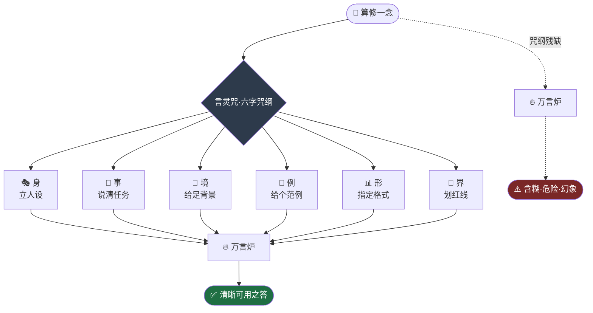

# 第 03 章 · 筑基：言灵咒

> 炉还是那座炉，火还是那炉火。
> 变的从来不是炉，是你递进去的那句话。
> ——玄机子《算道琐言》

---

孔浩原在药庐后山的青石上盘坐了整整三日。

自打上一次驱使万言炉，眼睁睁看着那炉子把一味不存在的"九转还魂草"说得有鼻子有眼、气定神闲，他心里就压了一块石头。

灵机流转，只求像真，不保证是真。

这句话，玄机子说过无数遍。可只有亲眼见过炉子"一本正经地胡说"，孔浩原才真正咂摸出其中的凉意——那炉子说谎时，比说真话时还要笃定。

"你在怕。"

玄机子不知何时立在石畔，青衫被山风掀起一角。

"弟子在想。"孔浩原睁眼，"炉子会骗人，那它说的话，还能信几分?"

"问得好。"老者却笑了，"可你问错了方向。你该问的不是'炉子能信几分'，而是——**'我这句话，问得对不对'**。"

孔浩原怔住。

"炼气一层，你学会了点火、接龙、驱炉。"玄机子负手，"那是让炉子'能说话'。可你有没有想过，同样一座炉，有人问出金玉良言，有人问出满纸荒唐——差的，从来不是炉。"

老者屈指一弹，一缕灵机没入孔浩原眉心。

"今日，我传你**筑基**之法。所修者，名曰——**言灵咒**。"

---

## 一、破境

灵机自四面八方涌来。

孔浩原只觉体内那座炼气境的"识海"轰然震荡，仿佛一间原本空荡的石屋，忽然被人推开了门窗，风、光、声一齐灌入。

"炼气境，你只是'能与炉对话'。"玄机子的声音在灵机的轰鸣中格外清晰，"筑基境，你要修的是'**如何对话**'。守住识海，别让它塌!"

孔浩原咬牙。他能感到，识海正在被一种无形的力量拓宽——那不是灵机的量在涨，而是**盛放灵机的'那句话'本身，有了骨架**。

一句话，也能有骨架?

念头刚起，眉心那缕灵机骤然凝实，化作六个古朴的篆字，悬于识海之巅，熠熠生辉:

> **身 · 事 · 境 · 例 · 形 · 界**

"轰"的一声闷响，如同地基砸进磐石。

孔浩原猛地睁眼，周身灵机内敛，气息比三日前沉稳了何止一筹。

**筑基·一层，成。**

"恭喜。"玄机子抚须，"从今往后，你递给炉子的每一句话，都不再是随口一问。它是一道**咒**。咒有骨，则炉有魂。"

---

## 二、六字咒纲

玄机子拾起一根枯枝，在青石上缓缓划字。

"世人求炉，十有八九是这般——"他写下四个字:**给个药方**。

"含糊，短促，什么都没说清。就像你冲一位素未谋面的大夫喊一声'给我治病'，也不说哪儿疼、多久了、忌不忌口。他要么问你半天，要么……"老者顿了顿，"随手给你抓一副谁都能用、谁用都没用的方子。"

孔浩原默然。那正是他之前问炉子的方式。

"言灵咒的骨架，就是那六个字。"玄机子逐一点来:

**其一·身——立人设。** "开咒第一句，先告诉炉子'你是谁'。你说'你是一位严谨持重、宁可留白也不妄言的药理宗师'，它便以宗师之心答你;你什么都不说，它便以市井闲人之口答你。同一炉火，披上不同的皮囊，吐出的就是不同的话。"

> 孔浩原心念一动:这便是给炉子定下"底色"的**系统设定**（system 人设）。

**其二·事——说清任务。** "要它做什么，一句话讲明白。是'开方'，还是'辨析此方有无相冲之药'?差之毫厘，谬以千里。"

**其三·境——给足背景。** "病者何人?年岁几何?旧疾如何?你知道的，炉子不知道。你不喂它'境'，它就自己编一个'境'——它编的那个，多半就是幻象的温床。"

**其四·例——给个范例。** 玄机子在此加重了语气，"你要什么样的答案，先给它看一个样板。'照这个格式、这个深浅、这个口吻，答我'。它见样学样，比你说一百句'要认真'都管用。"

> 孔浩原了然:这是以**范例**引路（few-shot 示例）。空口叮嘱不如递上一张范本。

**其五·形——指定输出格式。** "要表格便说表格，要三段便说三段，要先列忌口再列药材便照此排布。你不定形，它就随性泼墨，你还得自己再收拾一遍。"

**其六·界——划红线。** "最后，也是最要紧的——立约束。'凡典籍无载之药材，一律不得写入'、'拿不准，就直说拿不准，不许圆'。这道界，是你为炉子划下的悬崖。它再想信口开河，也得在崖边勒住。"

六字写罢，玄机子掷枝而起。

"身、事、境、例、形、界——此为**六字咒纲**。咒纲齐备，炉方为你所用;咒纲一缺，炉便反客为主，牵着你的鼻子走。"

孔浩原将这六字深深烙进识海。他忽然明白，所谓筑基，筑的根本不是灵力的地基——

**筑的是'问对问题'的地基。**



---

## 三、试炼

传法既毕，玄机子却不许孔浩原闭关钻研，反倒领着他下了山。

"光会念，不算学会。"老者道，"药王峰今日有一场同门试炼——同一道题，同一座炉。你去见识见识，什么叫'咒念得好不好，结果天差地别'。"

药王峰主殿之内，一座三人高的青铜大炉巍然矗立，炉腹灵机流转如活物。此乃宗门公用的**"共命炉"**，众弟子今日皆用此炉，绝无偏私。

主试长老立于炉前，声如洪钟:"今日之题——'为一名年逾六旬、久咳不愈、素有脾虚之症的老者，拟一张调理方，并注明忌口'。谁先来?"

"我来!"

一道人影大步上前，身形魁梧，眉宇间尽是傲气。孔浩原认得，是宗门有名的师兄——**赵狂澜**。

此人素来信奉一条歪理:炉子越大越灵，灵机灌得越猛越准。他从不屑于什么咒纲章法，只信"力大砖飞"。

赵狂澜双掌一拍，粗豪的咒音直灌炉心:

> "**共命炉!给我拟一张咳嗽的药方!快!**"

灵机轰然应和。青铜炉腹翻涌，顷刻间，一道方子凌空浮现——

洋洋洒洒二十余味药材，其中赫然写着几味峻猛的泻下之药，剂量还不轻。末了，连"忌口"二字都没提。

殿中一位精于药理的老执事脸色骤变:"荒唐!老者脾虚久咳，你这方子里下这般猛药，一副下去，人就垮了!这……这是要出人命的!"

赵狂澜的脸涨成猪肝色:"炉、炉子给的!又不是我开的!"

"炉子是照你的话给的。"主试长老摇头，"你只喊了'咳嗽的药方'。没说人是谁，没说脾虚，没说年岁，没划半条红线。炉子无从分辨，便挑了最'像样'、最唬人的一副给你——它可不管救不救得了人。"

**垃圾进，垃圾出。** 孔浩原在人群中默念这六个字，只觉脊背发凉。

---

## 四、言灵

"下一个。"

孔浩原深吸一口气，越众而出。

殿中有人窃窃私语——一个药童出身、昨日才筑基的后生，也敢接赵师兄接不下的题?

孔浩原不理会。他闭目凝神，识海之巅，六字咒纲一一亮起。他不再是"问"，而是要"**造一道咒**"。

他抬手，灵机自指尖缓缓沁入炉心，一字一句，如凿石刻碑:

> "**身**——你是一位行医五十载、严谨持重的药理宗师，凡无十分把握，宁可留白，绝不妄断。
>
> **事**——请为我拟一张温养调理之方。
>
> **境**——病者为年逾六旬之老翁，久咳不愈，素有脾虚之症，胃口欠佳，夜间咳甚。
>
> **例**——请照此样式作答：先列【辨证】一段，再列【方药】逐味注明用量与用意，最后列【忌口】三到五条。
>
> **形**——方药部分，以清晰条目列出，勿混作一团。
>
> **界**——凡典籍无载、来历不明之药材，一律不得写入;老者脾虚，峻猛泻下之药一概不用;若有任何一味拿捏不准，须明言'此处存疑，建议面诊'，不得含糊圆场。**"**

咒成。

刹那间，共命炉的灵机流转竟为之一**静**，仿佛一头桀骜的巨兽，被这道结构分明的咒文驯服，垂首听命。

炉腹之中，一道方子徐徐凝出——

【辨证】一段，条理清晰，直指"肺脾两虚、久咳耗气"之本。
【方药】数味，尽是平和温养之品，每一味都注明了用量与用意，无一味峻药。
【忌口】列了四条，生冷、油腻、辛辣、夜食，一目了然。
末尾还老老实实缀了一行:**"老者年高，方为调理之用，如咳中带血或高热，此方不宜，须即刻面诊。"**

——它甚至主动划出了自己的**边界**。

满殿寂静。

那位老执事凑近细看，越看越是动容，末了长叹一声:"辨证清、用药稳、忌口全，连何时不宜都替人想到了……这方子，老夫行医多年，也开不出更妥帖的了。"

"同一座炉。"主试长老的目光落在孔浩原身上，意味深长，"同一道题。方才那位，问出一副催命方;这位，问出一副济世方。炉没变，变的是**递进去的那句话**。"

---

## 五、知己

试炼散场，孔浩原刚出殿门，一道清越的女声在身后响起。

"你方才那道咒，界字诀用得最妙。"

孔浩原回头。来人是一名素衣女修，眉目清朗，腰间悬着一卷不知记满了什么的玉简，行走间灵机内敛，气度沉静。

"在下**苏挽晴**。"她微微颔首，"我修的是'**引经据典**'一路——不叫炉子凭空作答，而是先替它翻遍典籍，把最相关的几页摊在它眼前，再教它照着典籍回话。"

孔浩原心头一动。他隐约觉得，这女修所修之道，与自己的言灵咒隐隐相通，却又更进一步——若说言灵咒是"把话问对"，那她这"引经据典"，竟是"**把料喂对**"。

"苏师姐这一路，怕是能治炉子胡说的病?"孔浩原试探着问。

苏挽晴眼中闪过一丝赞许:"你看出来了。好咒，能把炉子的胡话压下去大半——可压不干净。"她轻轻摇头，"你今日这方子稳妥，是因你划了红线、给了背景。可若换一道你自己也不甚了了的题，背景喂不足，界也划不明，炉子照样会在缝隙里编出花来。"

孔浩原默然。他想起那味"九转还魂草"，心头一沉。

"言灵咒是根基，不是终点。"苏挽晴望向远处的藏经阁，眸光悠远，"想要真正'求真'，光把话问对还不够。得让炉子有典可查、有据可依，甚至……让它自己动手去验。那些，是筑基之后的事了。"

她收回目光，朝孔浩原一拱手:"今日见你这道咒，知你是求真之人。他日若在'引经据典'一道上有惑，可来寻我。"

言罢，素衣飘然而去。

孔浩原立在原地，久久未动。

他低头看着自己的手掌，那道言灵咒的余韵仍在识海回荡。他忽然懂了玄机子那句"问得对不对"的分量——

**问对问题，本身就是一门大功夫。**

而这门功夫的尽头，还藏着一句苏挽晴没有明说、却已埋下的话:

言灵咒能让炉子"答得好"，却还不能让它"答得真"。

那求真的路，才刚刚开始。

夕阳把他的影子拉得很长。孔浩原握了握拳，转身向藏经阁的方向走去。

---

## 📒 凡人笔记

孔浩原当夜在药庐灯下，把今日所悟译成"凡人也看得懂"的话，记于册上:

| 仙法（书中黑话） | 真实 AI 术语 | 一句话说人话 |
| --- | --- | --- |
| 言灵咒 | Prompt（提示词） | 你递给模型的那句/那段话 |
| 六字咒纲 | Prompt 的组成要素 | 一条好提示词该有的骨架 |
| 身（立人设） | System / Role 设定 | 让模型"扮演谁"，定下回答的底色 |
| 事（说清任务） | Task / Instruction | 明确要它做什么 |
| 境（给足背景） | Context 上下文 | 把它不知道的前提喂给它 |
| 例（给个范例） | Few-shot 示例 | 给一个样板，比空口叮嘱更管用 |
| 形（指定格式） | Output Format | 要表格就说表格，别让它随性发挥 |
| 界（划红线） | Constraints 约束 | 立规矩、设边界、不许瞎编 |
| "让炉子一步步想" | Chain-of-Thought 分步/思维链 | 让模型分步推理，答得更稳 |
| 垃圾进，垃圾出 | Garbage In, Garbage Out | 问得含糊，答得就荒唐 |
| 共命炉（同一座炉） | 同一个模型 | 模型没变，怎么问决定怎么答 |
| 引经据典（苏挽晴之道） | RAG（检索增强） | 先查资料再作答，为后文埋线 |

> **本章顿悟**:同一个模型，**怎么问决定怎么答**。提示词不是"随口一问"，而是有骨架的设计——立人设、说任务、给背景、给范例、定格式、划红线。好的提示词能把幻觉压下大半，却压不干净;真正的"求真"，还要靠后文的工具与检索。

📖 想把这门功夫钻研透彻，去读概念文档:[⑦ 什么是 Prompt](../02_CONCEPTS_概念入门/[CONCEPT-07]%20什么是Prompt-提示词.md)

---

## 📝 读完自测

就着上面这张"凡人笔记"，考一考自己——"言灵咒"的六字咒纲，你记住了吗？

```quiz
Q: 关于"言灵咒（Prompt 提示词）"，下面哪些说法是对的？（多选）
- [x] 言灵咒对应的真实术语是 Prompt——你递给模型的那句/那段话
> 对。提示词就是你喂给模型的输入，本章把它炼成一门"咒术"。
- [x] "身、事、境、例、形、界"六字咒纲，对应的是一条好提示词该有的骨架
> 对：身=人设、事=任务、境=上下文、例=范例、形=格式、界=约束。好提示词不是随口一问，是有骨架的设计。
- [x] "共命炉"点破的道理是：同一个模型没变，怎么问决定怎么答
> 对。这是本章顿悟——模型不变，提示词的好坏直接决定回答的好坏。
- [ ] 只要提示词写得足够好，就能把幻觉彻底、干净地消灭
> 错。好提示词能把幻觉"压下大半"，却压不干净；真正的求真还要靠后文的工具与检索。
- [ ] "垃圾进，垃圾出"是说模型太笨，跟你怎么问没关系
> 错。恰恰相反——问得含糊，答得就荒唐；输入的质量决定输出的质量。
```

再用一张翻卡，把"怎么问"这件事的分量记死：

```flip
🤔 同一座"共命炉"（同一个模型），为什么有人问出金丹、有人问出一炉废渣？（点一下翻到背面）
---
✅ 因为模型没变，**怎么问决定怎么答**。提示词不是"随口一问"，而是有骨架的设计——立人设（身）、说清任务（事）、给足背景（境）、给个范例（例）、指定格式（形）、划清红线（界）。再加一句"让炉子一步步想"（思维链），答得更稳。会写咒的人，是在用同一座炉炼出不一样的丹。
```

---

【[上一章 · 炼气：万言炉与接龙诀](./第02章%20炼气·万言炉与接龙诀.md)｜[下一章 · 筑基：纳言之窗](./第04章%20筑基·纳言之窗.md)｜[回总目录](./00_INDEX_修仙学AI-总目录.md)】
