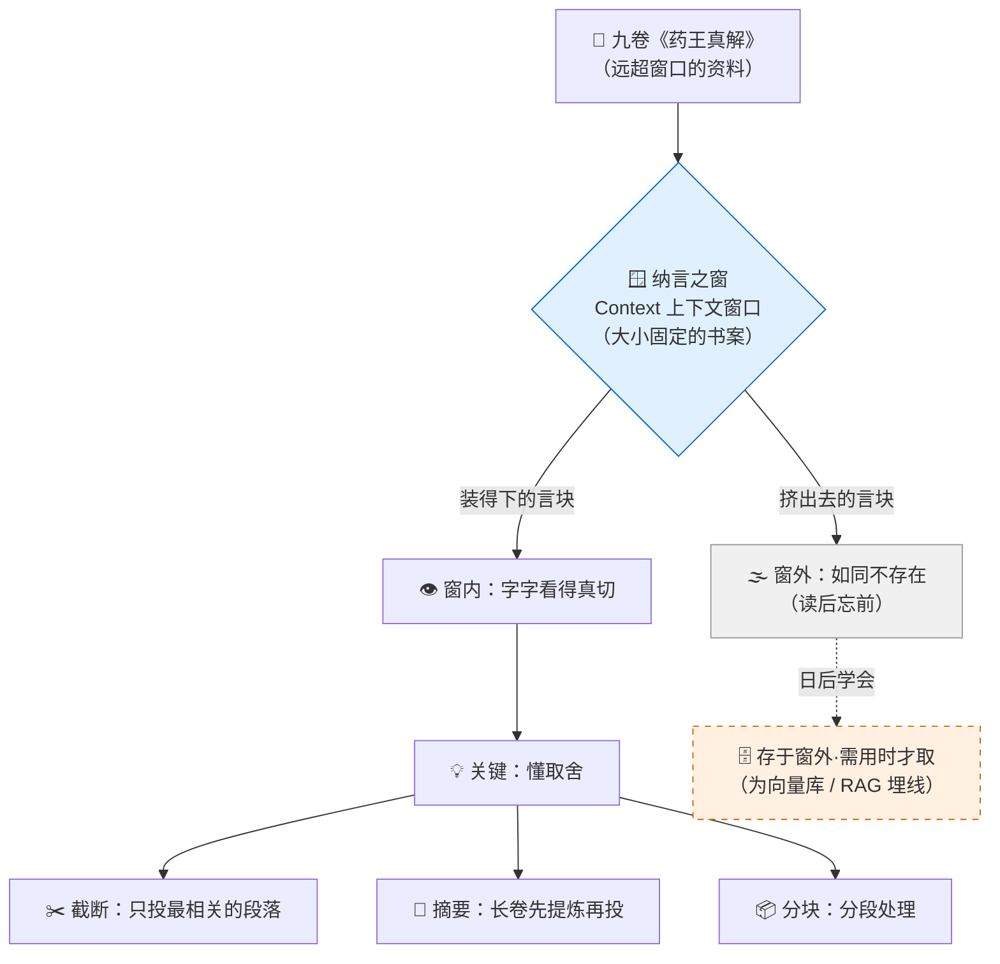

# 第 04 章 · 筑基：纳言之窗

> 心神之窗终有边界。真正的大能，不是把窗撑到无限，而是懂得何物当纳、何物当舍。
> ——玄机子·授孔浩原语

---

清晨，药庐后的石阶上还挂着夜里的露。

孔浩原盘膝坐在万言炉前，膝上摊着一整套残破的《药王真解》。

这套古卷来历不小。据说是三百年前一位药王亲手所著，前后共分**九卷**，从药性、火候、丹方一路讲到人身经脉、灵机流转。可惜年久失修，纸页脆黄，字迹时断时续，有些整段整段地缺失。

自打上一章习得「言灵咒」，懂了「问对问题」的功夫，孔浩原这些日子越发得心应手。他心里正美：万言炉既通言灵，那我把这九卷《药王真解》整套投进去，再问它一句「照此卷，替我配一炉安神丹」，岂不是水到渠成？

他把九卷一股脑摊开，深吸一口气，运起言灵咒，将满纸古文尽数投入炉中。

炉火腾地一亮，青烟盘旋。

「万言炉，」孔浩原朗声道，「依《药王真解》所载，替我配一炉安神丹，火候、药引、忌讳，一并说来。」

炉中光影翻涌，半晌，吐出一行字：

> **「安神丹？此卷第七卷有载，需朱砂三钱、茯神二钱……然,配伍之法,卷中未言。」**

孔浩原一愣：「卷中未言？第一卷开篇就写了配伍总纲啊！」

他翻回第一卷，指着那一段：「你看，'凡安神之属，君臣佐使，以茯神为君'——这不是写得清清楚楚？」

炉火闪了闪，竟像是有些茫然：

> **「……第一卷?抱歉,我方才'看'的,是第六卷往后的字句。前面的,我已经……记不真切了。」**

孔浩原呆住了。

他又追问了几句，越问越不对劲——炉子答第七卷时头头是道，一问回第二卷的内容，它就前言不搭后语，甚至把「茯神为君」说成了「朱砂为君」，前后自相矛盾。

「怎么会这样？」孔浩原百思不得其解，「我明明整套都投进去了，它怎么读到后面，就忘了前面？」

---

一道苍老的声音自身后传来：「因为它的**窗**，太小了。」

孔浩原回头，见玄机子负手立在阶下，白须微动，眼里含着几分笑意。

「窗？」孔浩原起身行礼，「师父，什么窗？」

玄机子踱步上前，伸手在半空虚划了一个方框：「你可曾想过，一个人读书，一次能'同时看住'多少字？」

孔浩原想了想：「一目十行的，或许能看住百来字？」

「炉子也一样。」玄机子指着万言炉，「它心神之中，有一扇窗——为师唤它作**『纳言之窗』**。窗有多大，它一次就只能'同时看住'那么多字句。你把九卷古卷尽数塞进去，可窗就那么大，装不下的，便被挤出窗外，落到它'看不见'的地方去了。」

他弯腰，从孔浩原膝上取过古卷，摊在石阶上：「你想象这窗，是一张**大小固定的书案**。」

玄机子把第一卷摊上「书案」的一角，又铺第二卷、第三卷……铺到第六卷时，案面已满。

「现在，你要放第七卷。」他把第七卷往上一放，第一卷「啪」地被挤落阶下，「——喏。第一卷,掉出去了。它现在'眼里'只剩第六到第九卷。你问它第一卷的'茯神为君',它自然答不上,因为那几页,早已不在案上。」

孔浩原如遭雷击，怔怔地看着阶下那卷被挤落的《药王真解》。

「所以它不是'忘性大'，」他喃喃道，「是它的书案……本来就只有那么大。资料一多，旧的就被新的顶掉了。」

「正是。」玄机子颔首，「此窗，行内唤作**『上下文窗口』**（Context window）。窗内之物，它字字看得真切，句句能引；窗外之物，于它而言，如同不存在。你今日之困，不在古卷太残，而在你贪多——把远超书案的东西，硬摊了上去。」

---

孔浩原心头一震，却又生出新的疑惑：「师父，那这窗……到底能装多少字？是按字算的么？」

玄机子摇头，捻须一笑：「问得好。这就要说到第二桩要紧事了——炉子吞吐，不是按'字'，是按**『言块』**。」

「言块？」

「行内唤作 **token**。」玄机子拾起一枚落叶，「炉子读一段话，并非一个字一个字地嚼，而是把话切成一小块一小块的'言块'来吞。一个言块，约莫等于几个字符——放到我们中土的文字上，大略是**半个到一个汉字**；放到蛮夷的拼音文字上，或许是一个词、一小段词根。」

他把落叶撕成大小不一的碎片，摊在掌心：「你看，'茯神'可能是一个言块，'君臣佐使'或许拆成两三块，一个生僻的古字，说不定自成一块。炉子的书案，量的不是字数，是**能摊下多少言块**。」

孔浩原盯着那掌碎叶，若有所悟：「所以我该问的，不是'装多少字'，而是'装多少言块'。」

「聪明。」玄机子把碎叶一扬，任风吹散，「而言块这桩事，你要记牢两条铁律——」

他伸出一根手指：「**其一，窗有上限。** 言块超了这个数，装不下，就必有旧物被挤出窗外。这是死数，撑不破。」

又伸第二根指：「**其二，吞吐言块，是有代价的。** 炉子每嚼一个言块，都要耗一分灵力。你投进去的越多，它嚼得越多，灵力耗得越凶——这代价，可不是白付的。」

孔浩原还没完全明白第二条的分量。

他心想：不就是费点灵力么？我灵力充沛，怕它作甚。

——他很快就为这个念头，付出了代价。

---

「我不信这九卷就装不下。」孔浩原年轻气盛，不服输的性子上来了，「师父，容我再试一次。这回我把火候催足，多灌灵力进去，撑一撑这窗，未必就摊不开！」

玄机子似笑非笑，退后一步：「你且试试。」

孔浩原深吸一口气，双手结印，将周身灵力尽数逼入万言炉，同时把九卷古卷**一字不落**地强行灌入。

炉火骤然暴涨，由青转红，再由红转紫！

炉身开始剧烈震颤，嗡嗡作响，一圈圈灼热的气浪从炉口喷出，把孔浩原的额发都烤得卷了起来。

> **「言块……超载……言块超载……灵力透支……」**

炉中传出扭曲的声音，光影疯狂闪烁，像一个被塞了太多东西、几近撑破的皮囊。

「孔浩原，撤手！」玄机子低喝。

孔浩原这才惊觉不对，猛地收印撤力。炉火「轰」地一缩，紫气骤散，炉身「咔」地裂开一道细纹，青烟呛人。

孔浩原瘫坐在地，只觉自己丹田空了大半——方才那一下，他自己的灵力也被抽了个七七八八。

「险些炸炉。」玄机子叹了口气，走上前拍了拍炉身，「这便是为师说的**第二条铁律**。窗撑不破，你偏要撑，灵力便如决堤之水，哗哗地淌。投得越多，嚼得越多，耗得越凶——直到炉毁人伤。你今日,是拿丹田的灵力,给自己上了一课。」

孔浩原满头大汗，喘着粗气，这回是真真切切地记住了：**言块不是白吞的，多一分贪心，多一分代价。**

---



---

「那……」孔浩原缓过一口气，抬头看向师父，「窗就这么大，古卷又这么长，难道就真没法子读了？」

玄机子扶他起身，摇头道：「谁说没法子？法子多得是，只是都不在'把窗撑大'这条死路上。」

他重新在石阶前坐下，把九卷古卷一卷卷理好：「你想想，你要配的是**安神丹**。九卷之中，讲兵器的、讲经脉的、讲外伤的，与安神何干？」

孔浩原一怔：「……无干。」

「那就**别投**。」玄机子把无关的六卷抽出，搁到一旁，「书案就那么大，你就该只摊**最相关**的那几段上去。这叫**取舍**——只投最相关的段落，把书案的每一寸，都用在刀刃上。」

他又拿起讲安神的那一卷，卷子仍嫌太长：「这一卷还是太长，摊上去仍要挤掉别的。那便**先提炼**——你先让炉子把这一卷'嚼'成一段百字摘要:君用茯神,臣用朱砂,佐使若干,火候三分。再拿这段短短的摘要去配丹。摘要短,言块少,书案摊得下,灵力也省。」

「这叫**摘要**。」玄机子竖起第三根指，「还有第三法:古卷太长,便**分段**——今日只读前三卷,得一批药理;明日再读后三卷,续上前文的摘要。一段一段来,窗虽小,典籍再长也读得完。这叫**分块**。」

孔浩原眼睛一点点亮了起来：「截断、摘要、分块……」他把这三个词在舌尖滚了一遍，「原来读长卷，不是硬塞，是**先想清楚该纳什么、该舍什么**。」

「孺子可教。」玄机子欣慰地捋须。

---

他忽又神色一肃，望向远处云海，声音低沉了几分：

「孔浩原，你要记住今日这一课，它比你想的更深。**心神之窗，终有边界。** 不论炉子练到多高的境界，这扇窗，总有个尽头——你可以把它磨大些，却永远撑不到无限。」

「真正的大能，」玄机子一字一顿，「不是妄图把窗撑到无限，那是取死之道，如你方才险些炸炉。真正的大能，是懂得**何物当纳、何物当舍**——甚至，学会把浩如烟海的典籍，**存于窗外**，编成册、列成目，平日不占书案，需用时才精准地取那一页进来。」

孔浩原心头猛地一跳，隐隐觉得师父这句话里，藏着一条通往更高境界的路：「存于窗外……需用时才取……师父，这是……」

「这是后话了。」玄机子摆摆手，眼里闪过一丝深意，「等你筑基圆满，结了金丹，学会了驭器，再往后……自有一门'把万卷藏于窗外、招之即来'的大神通等着你。今日，你只需先把这'纳言之窗'的道理，刻进骨子里。」

孔浩原似懂非懂，却把「存于窗外」四个字牢牢记在了心底。

——他还不知道，师父口中那门神通，日后会引他一路踏上「炼虚」「合体」之境，与一位红颜知己并肩，去追一个叫「向量」的东西。

---

日近正午。

孔浩原正欲照着「先摘要、再配丹」的法子重试，藏书阁那头忽然传来一声炸响，惊起满山飞鸟。

紧接着，是一阵鬼哭狼嚎般的惨叫。

孔浩原与玄机子对视一眼，循声赶去。

只见藏书阁前浓烟滚滚，师兄**赵狂澜**正抱着一座冒着黑烟、噼啪炸响的巨型言炉，满脸乌黑，狼狈不堪地在地上打滚。

「师兄！你这是……」孔浩原大惊。

赵狂澜从烟里探出焦头烂额的脑袋，兀自嘴硬：「我……我不信邪！你们不是说窗小装不下么？我偏要试试——我把整座藏书阁、三千卷典籍，**一卷不落全塞了进去**！我就不信，炉子够大、灵力够猛，还撑不破这窗！」

玄机子闭了闭眼，长叹一声。

孔浩原看着那座裂了七八道口子、还在往外喷紫烟的言炉，又想起自己方才险些炸炉的一幕，只觉后背发凉——原来贪多之祸，撑到极处，竟是这般模样。

「师兄，」孔浩原上前想扶他，「窗撑不破的。灵力再猛，也只是……把炉子撑坏得更快。」

赵狂澜一把甩开他的手，脸涨得通红：「不可能！定是我灵力还不够！下回我再多灌三成……」

「下回你就没这炉了。」玄机子冷冷打断，「赵狂澜，你迷信'越大越猛越好'，却从不肯问一句：这么多典籍，我当真**每一卷都要用**么？你要配一炉疗伤丹，塞进去三千卷讲天文地理的，除了把书案挤爆、把灵力烧干，于你何益？」

赵狂澜张了张嘴，答不上来。

玄机子转身，指着一旁抱着「安神一卷摘要」的孔浩原：「你看你师弟。他只取一卷，先炼成百字摘要，再从容配丹——窗虽小，事却成了。**这不是他的窗比你大，是他懂得何物当纳、何物当舍。**」

赵狂澜顺着师父的手看去，正见孔浩原将那段短短的摘要投入完好的万言炉中，炉火温润青碧，稳稳吐出一张条理分明的安神丹方——君臣佐使，火候忌讳，一应俱全。

一边是炸得焦黑的三千卷巨炉，一边是从容出丹的百字摘要。

高下立判。

赵狂澜脸上红一阵白一阵，终究颓然坐倒在焦土上，一句话也说不出来。

---

回到药庐，孔浩原把那张安神丹方小心收好，忽然对着裂了道细纹的万言炉，生出一种前所未有的亲切。

他曾以为，炉子「读到后面忘了前面」是个天大的缺陷，恨不得它记性无穷。

可这一日他才明白——**记性有限，不是缺陷，而是天道。**

真正要修的，不是去妄求一扇无限大的窗，而是学会**管理这扇窗**：何物当纳、何物当舍，何物摊在案上、何物存于案外，需用时才招之即来。

窗外那片浩瀚的、暂时看不见的典籍之海，不再让他惶恐。

因为他隐隐知道，总有一天，他会学会一门神通，把那片海，尽收于一枚小小的令牌之间，招之即来，挥之即去。

炉火轻轻跳动，像是在为他这一步筑基，无声地喝彩。

（未完待续）

---

## 📒 凡人笔记

孔浩原这一章跌的跟头、悟的道理，翻成凡间「AI 修士」的白话，是这么回事：

| 仙法 / 修真黑话 | 对应真实 AI 术语 | 一句话人话 |
| :--- | :--- | :--- |
| 纳言之窗 · 大小固定的书案 | 上下文窗口 Context window | 模型一次能「同时看住」的信息有上限，摊满了旧的就被挤出去 |
| 言块 | Token 令牌 | 模型不按「字」而按「言块」吞吐，一个约等于半个到一个汉字 |
| 读到后面忘了前面 | 超出上下文窗口 / 信息被截断 | 超过窗口的内容模型「看不见」，会答非所问、前后矛盾 |
| 吞言块要耗灵力 | Token 计费 / 算力开销 | 投入的言块越多，消耗（费用/算力）越大 |
| 险些炸炉 · 灵力透支 | 超长输入导致成本飙升 / 报错 | 贪多硬塞，代价高昂甚至直接失败 |
| 取舍 · 只投最相关的段落 | 截断 Truncation / 上下文筛选 | 只把最相关的内容放进窗口，别的先放一边 |
| 先提炼成百字摘要再投 | 摘要 Summarization | 长文先压缩成短摘要，省言块也省钱 |
| 分段一卷一卷读 | 分块 Chunking | 长文档拆成小段，分批处理 |
| 存于窗外 · 需用时才取 | 检索增强 RAG / 向量库（伏笔） | 把海量资料存在窗口之外，用到时才检索进来（后续章节详解） |
| 赵狂澜硬塞三千卷炸炉 | 迷信「context 越大越好」的误区 | 无脑堆输入不等于效果好，会挤爆窗口、烧光预算 |

> 📖 想把这一炉「纳言之窗」的道理炼得更透，去读概念篇：
> [⑧ 什么是 Context 与 Token](../02_CONCEPTS_概念入门/[CONCEPT-08]%20什么是Context与Token-上下文与令牌.md)

---

## 📝 读完自测

就着上面这张「凡人笔记」，考一考自己——「纳言之窗」的边界，你摸清了吗？

```quiz
Q: 关于「纳言之窗（上下文窗口）」和「言块（Token）」，下面哪些说法是对的？（多选）
- [x] 纳言之窗对应「上下文窗口」——模型一次能同时看住的信息有上限，摊满了旧的就被挤出去
> 对。窗口大小固定，就像一张摆得下有限卷宗的书案，塞满了先来的就被挤下去。
- [x] 「言块」对应 Token——模型不按「字」而按「言块」吞吐，一个约等于半个到一个汉字
> 对。模型的吞吐单位是 token，不是我们直觉里的「一个字」。
- [x] 赵狂澜硬塞三千卷炸炉，讽刺的是「context 越大越好」这个误区
> 对。无脑堆输入不等于效果好——会挤爆窗口、还烧光灵力（预算）。
- [ ] 只要把资料全塞进窗口，塞得越多模型答得就越准
> 错。超出窗口的内容模型根本「看不见」，还会答非所问、前后矛盾；贪多反而炸炉。
- [x] 长文先提炼成百字摘要再投、或分卷分段读，是省言块又省灵力的正道
> 对。摘要（Summarization）+ 分块（Chunking）+ 只投最相关段落（截断），才是会过日子的用法。
```

再用一张翻卡，把「窗外还能存东西」这条伏笔记住：

```flip
🤔 纳言之窗就这么大，海量资料塞不下，又不能不用——高人是怎么破这个局的？（点一下翻到背面）
---
✅ 把海量资料「存于窗外」，**需用时才取一小段进来**——这就是后文要细讲的检索增强（RAG）/ 向量库。窗口有限不是死穴：不必把整座藏经阁搬上书案，只在要用时，精准检索出那一两页放进窗口即可。既不炸炉，又能博览群书。（本章先埋线，后续章节详解。）
```

---

【[⬅️ 上一章 · 筑基·言灵咒](./第03章%20筑基·言灵咒.md)｜[下一章 · 金丹·驭器术 ➡️](./第05章%20金丹·驭器术.md)｜[🏠 回总目录](./00_INDEX_修仙学AI-总目录.md)】
