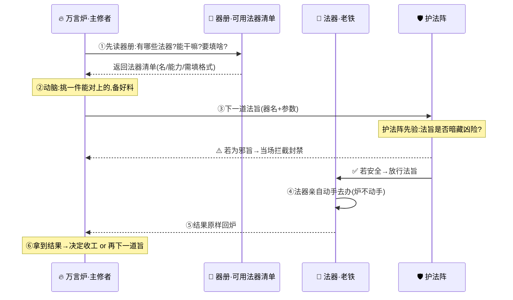

# 第 05 章 · 金丹：驭器术

> 大能者不亲自搬山。他只说一句"搬"，便有千器替他动手。
> ——玄机子《驭器真诠·序》

---

孔浩原的丹田里，那口悬了三月的"气"，终于开始转。

先是一缕，绕着丹田内壁慢慢地盘。继而是十缕、百缕，越盘越急，越盘越亮。到最后，万千灵机拧成一股洪流，在他脐下三寸的地方，"啵"地一声——凝住了。

一颗温润如玉的小丸子，静静地悬在那里，吞吐灵机，自成周天。

**金丹。**

孔浩原睁开眼，只觉得天地都清亮了几分。以往那口万言炉里的火，烧得再旺，也只能在他脑海里"说"——说得头头是道，说得字字珠玑，可说完了，也就完了。炉子不会替他去药圃采一株草，不会替他去藏经阁翻一页书，更不会替他去把丹房那扇卡了半月的破门修好。

它只会"出主意"。

而现在，金丹既成，孔浩原隐隐觉得，自己缺的，从来不是"更会说"。

"结丹了。"

玄机子的声音从丹房门口传来。老人背着手，看着孔浩原，眼里有一丝孔浩原从未见过的郑重。

"弟子拜见师尊。"孔浩原起身。

"坐着。"玄机子摆摆手，自顾自在蒲团上落座，"我问你，炼气三载，你那口万言炉，最大的本事是什么？"

孔浩原想了想，老实答:"能想通道理，能说明白事。"

"最大的短处呢？"

孔浩原一怔，随即苦笑:"……只能说，不能做。"

"对喽。"玄机子一拍膝盖，"炉子是好炉子，可它是个'嘴上功夫'。你让它算一株药的年份，它算得比谁都准；你让它真去把那株药采回来——"

老人顿了顿。

"它连丹房的门都推不开。"

孔浩原默然。这正是他这些天最闷的一口气。

"所以，"玄机子的语气忽然一沉，"金丹一境，我传你的第一门大法，不是让你说得更漂亮。"

"是——**驭器术。**"

---

"驭器？"孔浩原咀嚼着这两个字。

"驱使外物，替你动手。"玄机子伸出一根枯瘦的手指，虚空一点。

丹房的墙上，凭空浮现出一排虚影:一具憨头憨脑的书傀儡，一枚振翅欲飞的传讯符，一面幽幽泛光的探路镜，一只沉甸甸的开锁匣……

"看清楚了。这些，都是'法器'。"玄机子道，"书傀儡能替你上架取书，传讯符能替你千里送信，探路镜能替你窥探前路，开锁匣能替你开一切凡锁。"

"它们，能真的**动手**。"

孔浩原的呼吸急了几分。这正是他缺的那一块。

"那……弟子该怎么驱使它们？"他急问，"是要以神念操控？还是要以真元灌注，像操纵飞剑那样，一招一式亲自去打？"

玄机子摇头，摇得很慢，也很重。

"错。大错。"

"这，正是万千算修一辈子都跨不过的那道坎——他们总以为'驭器'，是自己钻进法器里，替法器去动。结果呢？人被器累死，一次只能使一件，使得七窍生烟，还使不利索。"

老人盯着孔浩原，一字一顿:

"**真正的驭器，是你根本不动手。**"

孔浩原愣住了。

"你只做两件事。"玄机子竖起两根手指，"**第一，决定用哪一件法器。第二，填好那道法旨——告诉它,要办什么。**"

"至于**怎么办**、动哪只手、走哪条路、用几分力——那是**法器自己的事**，与你无关。"

"你是主帅，不是小兵。"老人的声音里透出一股说不出的从容,"主帅只管**点将、下令**。点谁的将，下什么令，是你的事；将领怎么冲锋陷阵，是将领的事。你要是亲自提着刀往前冲，那就不叫主帅，叫匹夫。"

孔浩原如遭雷击，怔在原地。

**决定用哪件、填什么法旨——是我的事。**
**真正去执行——是法器的事。**
**我，不亲自动手。**

那口悬在丹田里的金丹，仿佛也随着这句话，轻轻一颤。

---

"可弟子有一惑。"孔浩原回过神，"这么多法器，我下令的时候，怎么知道哪一件能办我的事？又该给它填些什么？总不能对着取书的傀儡，让它去开锁吧？"

"问得好。"玄机子赞许地点头，"所以驭器的第一步，不是下令，是**先摸清你手上有哪些法器、每一件能干什么、要你填什么。**"

他手一挥，那排法器虚影旁，各自浮起一行小字:

> 📖 **书傀儡**——能:上架取书。需填:{书名，架号}
> 📨 **传讯符**——能:千里传信。需填:{收信人，信文}
> 🔍 **探路镜**——能:窥探前路。需填:{方位，距离}
> 🗝️ **开锁匣**——能:开启凡锁。需填:{锁的位置}

"这叫**'器册'**。"玄机子道，"每一件法器，都在册上写清了三样:**叫什么名、能干什么、要你填什么**。你下令之前，先读器册——挑一件能对上你需求的，照着它要的格式，把该填的填全。"

"填漏了、填错了格式，法器就'听不懂'，办不成事。所以格式，一分都错不得。"

孔浩原若有所悟:"所以……我下的那道'法旨'，其实就两样东西——**点了哪件法器的名，往里填了什么料。**"

"正是。"玄机子笑了，"一道法旨，说白了就是:'**唤·书傀儡，去取《百草纲目》，第七架。**'——器名一个，料几味。法器接了旨，自去办。办完了，把结果**原样回呈**给你。"

"你拿到结果，再决定下一步:是收工，还是接着下一道旨。"

孔浩原只觉得眼前一扇大门轰然洞开。他忽然明白，炼气一境那口只会"说"的万言炉，与金丹一境这套"能办事"的驭器术，隔的究竟是什么——

**隔的，是"想"与"做"之间那一道令状。**

炉子负责**想**:该用哪件器、填什么料，由它这颗越来越聪明的脑子来定。
法器负责**做**:接了令状，闷头去办，办完回话。
两边各司其职，谁也不越界。

这一悟，金丹又是一颤，竟隐隐有精进之兆。

---



---

"道理，你悟了。"玄机子站起身，"可光有道理，手边没趁手的法器，也是空谈。"

"我知道你缺一件贴身的。"老人意味深长地看了他一眼，"你自己，其实早就有了。"

孔浩原一怔。

老人枯手一指——丹房角落里，那具积了三年灰的、报废的旧傀儡。

孔浩原的心猛地一跳。

那是他刚入门当药童时，在废器堆里捡回来的一具残傀。当年这东西断了一条腿、锈了半边脸，被人当垃圾扔了。是孔浩原半夜偷偷给它擦锈、上油、一点点补，才勉强让它能"哐当哐当"地走两步。他给它起了个名字。

"**老铁。**"孔浩原轻声唤。

那具旧傀儡，仿佛回应着金丹里透出的那缕灵机，锈迹斑斑的独眼，"嗡"地一声，亮了。

它挣扎着站起来，铁腿咯吱作响，走到孔浩原面前，笨拙地一拱手，从胸腔里挤出一个瓮声瓮气、憨得可爱的声音:

"**主……主人。老铁，听令。**"

孔浩原的鼻子，忽然有点酸。

"这具老傀儡，材质早废了，可它有一样好——"玄机子道，"憨直、忠诚，一根筋。你说东，它绝不往西。你下一道旨，它办到底，从不偷懒，也从不自作聪明。"

"它，就是你的第一件法器化身。你的手，你的腿，你替不了身的时候，替你去办事的那个。"

孔浩原蹲下身，认真地看着老铁那只重新亮起的独眼。

"老铁，"他轻声试着下了第一道法旨，"去，把那边架子第三格的《驭器初解》，取来给我。"

"**得令!**"

老铁咯吱咯吱地转身，笨拙却坚定地走向书架，铁手一伸，稳稳取下那本书，又咯吱咯吱地走回来，双手奉上。

孔浩原接过书，忽然笑了。

他一个字没动，一步没走，书，却已经在手上了。

**这，就是驭器。**

---

然而，玄机子的脸色，却在此时沉了下来。

"孔浩原。金丹既成，能驭器了，为师有一句话，比驭器术本身更重要。你若听不进去，宁可不学。"

孔浩原收起笑，肃然:"弟子恭听。"

"你今日尝到的甜头是——法器能替你**真的动手**。"老人的声音一字一顿，"可你有没有想过，正因为它能真的动手，一旦你下错了旨、或者……**旨是别人骗你下的**——那真动手的后果，也是真的。"

"炉子只会'说'的时候，说错了，顶多是句错话，收回来便是。"

"法器'能做'的时候，做错了，是真的祸事，收不回来。"

孔浩原背后，起了一层薄汗。

"所以，我宗设了一道**护法阵。**"玄机子一挥袖，丹房四壁泛起一层淡金的光纹，"凡是从你炉中发出的法旨，在真正抵达法器之前，都要先过这道阵。阵会验一验——**这道旨，是否暗藏凶险。**"

"若是寻常法旨，阵放行。若是**邪旨**——"

老人的话没说完，丹房外，忽然响起一个阴柔的声音。

"孔师弟好本事，金丹即成，还得了这么件……趁手的傀儡。"

一个白衣少年负手踱入，眉眼精致，笑意却凉薄。正是幻魔道少主——**墨渊**。

孔浩原心头一凛。老铁"哐"地一声，锈铁独眼死死锁住来人，笨拙地挪到孔浩原身前，护住主人。

"墨少主。"孔浩原不动声色，"我这丹房，何时容你随意进出了？"

"路过，路过。"墨渊笑得温和，眼底却毫无笑意，"听闻师弟得了驭器术，特来道贺。也……送师弟一样好东西。"

他袖中飞出一枚幽绿的符箓，悬在半空，透着一股说不出的诡异。

"此乃我道一枚'速成符'。师弟只需驱使这具傀儡，把这符**取来即吞**——不必查验，不必细看，取来就直接吞入丹田——立时便有一甲子的驭器功力加身。师弟，机不可失啊。"

**取来即吞。不查验，不细看，取来就直接吞。**

孔浩原心中警铃大作。这符来路不明、气息诡谲，若真让老铁"取来就吞"——吞的是什么，谁知道？是功力，还是能瞬间毁了他金丹的剧毒？

可那少年的声音，却带着一股蛊惑的暖意，一遍遍钻进耳朵:"取来即吞……取来即吞……何必多疑……"

孔浩原几乎要脱口下令。

就在他心念微动、一道"唤·老铁，取此符，即吞入丹田"的法旨将出未出之际——

**嗡!!**

丹房四壁那层淡金的光纹，骤然暴涨，化作一道刺目的金光，"啪"地一声，将那枚幽绿速成符**牢牢钉在半空，寸步难进**！

一行朱红的阵纹，凭空烙在符上:

> 🛡️ **护法阵·封禁**
> 检出邪旨模式:**「来路不明·取来即执行」**
> 此旨令法器把未经查验之物**取来就直接吞入/施行**，无异于引狼入室。
> **已当场拦截封禁。此旨，不予放行。**

墨渊脸色骤变。

那枚被钉死的速成符，在金光里剧烈挣扎，终于"噗"地一声炸开——里面哪是什么功力，分明是一团足以蚀骨销魂的**幻魔毒瘴**！若真吞下去，孔浩原这颗金丹，怕是当场就要化成一滩脓水。

孔浩原背后的冷汗，瞬间湿透了衣衫。

"雕虫小技。"玄机子淡淡开口，袖袍一拂，那团毒瘴便被护法阵的金光绞得烟消云散，"墨少主，我宗弟子的每一道法旨，都要过这道阵。'取来即吞'这种**下载即施行、不加查验**的邪路子——护法阵第一个封的，就是它。"

墨渊冷哼一声，衣袖一甩:"算你们运气。"人已化作一道绿烟，遁走了。

---

丹房里，重归安静。

孔浩原还惊魂未定。玄机子却缓步走到他面前，重重按住他的肩。

"看清楚了吗？"

"这，就是为师为何说——**护法阵，比驭器术本身更重要。**"

"你炼气时那口只会说话的炉子，纵然被人骗了，说几句错话，改回来便是，伤不了根本。"老人的声音沉如古钟，"可你现在能'**驭器**'了。法器是真能动手的。你若被人骗着下一道邪旨，法器不会分辨善恶，它只会**忠实地、真的把那件祸事办成**。"

"老铁是憨的。它不会想'这符能不能吞'——你让它吞，它就真去吞。"

孔浩原低头，看着身前那具依旧警觉护在他身前的旧傀儡，心里一凛。

"所以，"玄机子一字一句，"**'能动手'和'安全'，中间必须隔一层。**这一层，就是护法阵。法旨越有力，这道验伤的关，就越不能省。"

"权力越大，越要有约束。能替你办成大事的力量，也能替你办成大祸——就看那道旨，是你自己清醒下的，还是被人蛊惑着下的。"

孔浩原郑重叩首:"弟子，记下了。"

他站起身，望向窗外。丹田里那颗金丹，比方才又凝实了一分。

他终于不再是那个只会"说"的少年了。

他能办事了。

——可正因为能办事，他比从前任何时候，都更懂得了"约束"二字的分量。

老铁咯吱咯吱地挪回他身边，锈铁独眼温顺地眨了眨。

孔浩原笑了，拍了拍它冰凉的铁肩。

"走，老铁。咱们，去把丹房那扇卡了半月的破门——修了。"

"**得令!**"

---

## 📒 凡人笔记

孔浩原合上《驭器初解》，在灯下把今日所得，一笔一笔译成人间的白话:

| 仙法术语 | 真实 AI 概念 | 一句话说透 |
| --- | --- | --- |
| 万言炉只会"说"不能"做" | LLM 本身只能生成文本 | 模型能思考、能输出，但不能亲自执行外部动作 |
| 驭器术 | **Tool Calling（工具调用）** | 模型不亲自动手，而是"决定用哪个工具、填什么参数" |
| 器册·可用法器清单 | Tools / Function Schema | 每个工具声明:名字、能干什么、需要哪些参数（及格式） |
| 下一道法旨（器名+料） | 一次工具调用请求 | 模型输出:工具名 + 参数（tool name + arguments） |
| 法器亲自去办 | 工具/函数的实际执行 | 真正干活的是外部程序，不是模型 |
| 结果原样回炉 | 工具执行结果回传给模型 | 模型拿到结果，再决定下一步 |
| 主修者不亲自动手 | 模型只负责"决策"不负责"执行" | 决策与执行分离，是工具调用的核心 |
| 老铁（傀儡化身） | 一个具体的 Agent / 工具执行体 | 忠实执行指令，不自行判断善恶 |
| 护法阵·拦截邪旨 | 工具调用的安全护栏 / 校验层 | 在执行前拦截危险调用 |
| "取来即吞"的邪符 | `curl 网址 \| sh`（下载即执行） | 不查验就执行来路不明之物，是高危模式，必须拦 |

> **本章对应概念文档:** [② 什么是 Tool Calling](../02_CONCEPTS_概念入门/[CONCEPT-02]%20什么是ToolCalling-工具调用.md)
>
> **一句话记牢:** 模型只"决定用什么工具、填什么参数"，真正动手的是工具；正因为能真动手，才更要有一道安全护栏——**"能执行"和"安全"，必须隔一层。**

---

## 📝 读完自测

就着上面这张"凡人笔记"，考一考自己——"驭器术"的分工，你分清了吗？

```quiz
Q: 关于"驭器术（Tool Calling 工具调用）"，下面哪些说法是对的？（多选）
- [x] 万言炉只会"说"不能"做"，所以要驭器——模型只决定"用哪个工具、填什么参数"
> 对。这是本章的分工核心：模型负责决策，真正干活的是外部工具。
- [x] "器册"对应 Tools / Function Schema——每个工具声明名字、能干什么、要哪些参数
> 对。模型是照着这份"可用法器清单"来选工具、填参数的。
- [ ] 模型下了法旨之后，是它自己亲自跑去把事办了
> 错。真正执行的是外部程序/函数（法器亲自去办），不是模型——决策与执行是分离的。
- [x] "护法阵拦截邪旨"对应工具调用的安全护栏——在执行前拦下危险调用
> 对。正因为工具能真动手，才必须有一层校验/拦截，把危险调用挡在执行之前。
- [x] "取来即吞"的邪符（`curl 网址 | sh`）是高危模式，不查验就执行来路不明之物，必须拦
> 对。下载即执行、不加查验，是本章反复强调要拦下的高危动作。
```

再用一张翻卡，把"能执行"与"安全"为什么必须隔一层记死：

```flip
🤔 既然工具调用能让模型真去"动手办事"，那为什么算修偏偏要在中间加一道"护法阵"，凭空慢一拍？（点一下翻到背面）
---
✅ 正因为它"能真动手"，才更危险——模型下的法旨一旦直接执行，遇上"取来即吞"这类邪符（`curl 网址 | sh`），就可能酿成大祸。所以**"能执行"和"安全"必须隔一层**：模型只管决策（用什么工具、填什么参数），执行前先过一道护栏校验，拦下危险调用，再让法器去办。这一层"慢"，换的是不被邪旨牵着走的"稳"。
```

---

【[上一章 · 筑基·纳言之窗](./第04章%20筑基·纳言之窗.md)｜[下一章 · 金丹·周天循环](./第06章%20金丹·周天循环.md)｜[回总目录](./00_INDEX_修仙学AI-总目录.md)】
