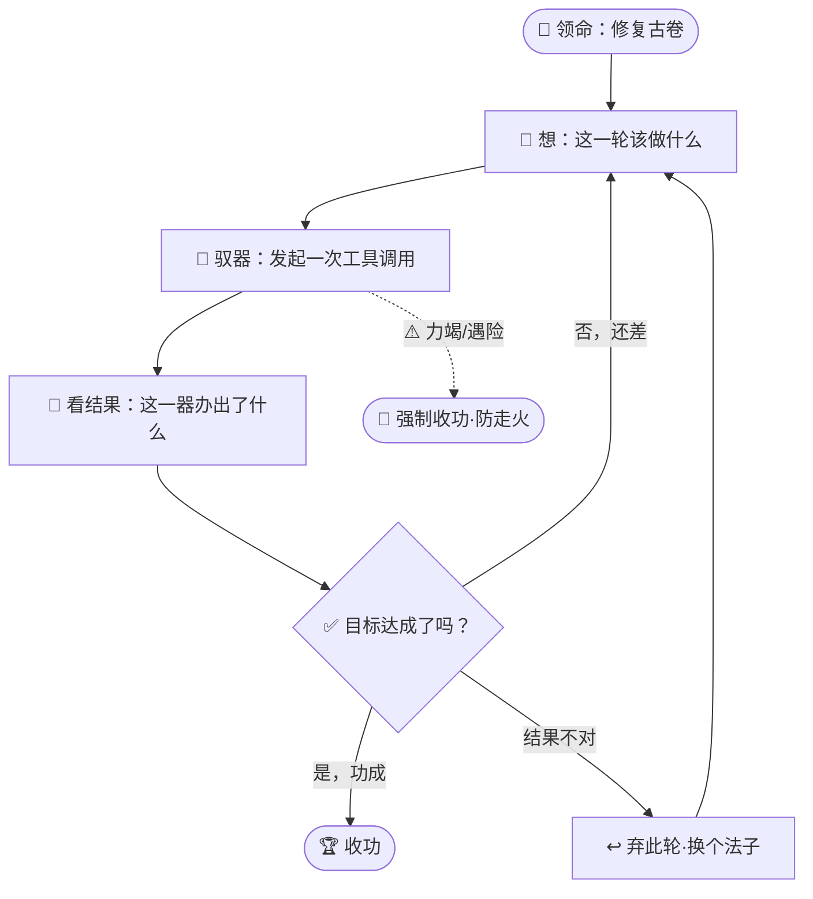

# 第 06 章 · 金丹：周天循环

> 一击不成，便再来一击；每一击都睁眼看清落点，直到山开。
> 蛮力者以为一斧断江，智者以周天化力，环环不息，终至功成。

宗门后山的"藏经崖"上，悬着一卷残破的《引灵古卷》。

那是三百年前一位算修前辈留下的镇宗之物，记着一门早已失传的引灵阵法。可惜岁月侵蚀，古卷残缺、字迹斑驳、更有一道裂纹自中而分，稍一触碰便有灵机溃散之险。历代弟子都想修复它，却无人成功——不是补了这头漏了那头，就是补到一半灵机反噬，前功尽弃。

玄机子把孔浩原叫到崖前，负手而立。

"上一回，你学会了驭器术。"老人淡淡道，"你能下令，老铁能执行，一次驭一器，办一步事。可我问你——若一件大事，一步办不完呢？"

孔浩原怔了怔。

他想起昨日修那口破损的丹炉：驭器取来炉身，一看，缺了炉耳；再驭器补上炉耳，一看，火门又歪了；再校火门……他当时是**手动**一步步来的，每办完一步都要停下来自己看一眼，再想下一步该驱哪一器。累是累，可确实一步步把炉修好了。

"弟子……是一步一步接着办的。"他老实道。

"接着办。"玄机子笑了，"你已摸到门槛了。今日我教你的，便是让这'一步接一步'**自己接力**，串成一条生生不息的环——算道谓之**周天循环**。"

---

老人抬手，一缕灵机在他掌心画出一个圆环，环上流转不息。

"你可知内力如何运转周天？"他问，"起于丹田，行经百脉，归于丹田，再起再行，循环往复，永不停歇。修复此卷，也是同理。你且看——"

他的声音沉了下来，一字一句：

"**先想**：这一步该做什么。"
"**再驭器**：发起一次驭器术，去取、去读、去补。"
"**看结果**：睁大眼睛，看这一器办出了什么。"
"**再判断**：目标达成了没有？成了，收功；没成——"
"**回到第一步**：想下一步该做什么，再驭一次器。"

孔浩原的心猛地一跳。

"如此一轮接一轮，"玄机子的指尖在环上重重一点，"环环相扣，直到古卷彻底修复，方才收功。这，就是周天循环。它不是一次搞定的独门法术，而是**反复多轮**的接力——每一轮，都从上一轮的结果里，长出下一轮的决断。"

"弟子明白了！"孔浩原眼中放光，"上次修丹炉，弟子是自己在中间停下来看、停下来想。若把'看'和'想'也**收进这条环里自动接力**，弟子就不必每一步都亲自照看，它自己就能一轮轮办下去，直到功成！"

"孺子可教。"

---

孔浩原盘膝坐于崖前，老铁化作一柄古朴的木尺，静静悬在他身侧。

他闭目凝神，第一次尝试驱动**属于自己的周天**。

**第一轮。**

*想*：古卷残缺，我先得看清它缺在哪。
*驭器*：他驱老铁化作一面照灵镜，覆上古卷，取回一幅"残图"。
*看结果*：残图显现——右下角，缺了整整一角，阵纹断在半途。
*判断*：目标是"完整修复"，如今连图都不全，远未达成。**不收功，进下一轮。**

**第二轮。**

*想*：缺了一角，我得去补全那段阵纹。
*驭器*：他驱老铁探入卷中灵机残络，欲牵引灵机补全缺角。
*看结果*：……不对。老铁取回的，竟是一段**隔壁另一道阵纹**的残络——他方位判错了，取错了东西。
*判断*：补错了地方，若强行接上，反而更乱。**这一轮结果不对，弃之，重来。**

孔浩原额角渗出细汗，却不气馁。他心中忽然雪亮——**这，正是"看结果再决定"的妙处啊！**若他闭着眼一口气蛮补，此刻早已把错的接了上去，酿成大错。正因每一轮都睁眼看清了结果，才能在错处及时刹住、及时改道。

**第三轮。**

*想*：方位错了，我这次先驭器**读一读**残存阵纹的走向，认准了再补。
*驭器*：老铁化作探针，细细读过断口两侧的纹路脉络。
*看结果*：走向明了——缺角处本该是一段"螺旋引灵纹"。
*判断*：方向对了，但还没补上。**继续。**

**第四轮。**

*想*：认准了走向，这就补。
*驭器*：孔浩原牵引灵机，循着螺旋走向，一寸寸补全缺角。
*看结果*：缺角补齐，阵纹连贯！
*判断*：可还有那道**中分的裂纹**未修。**未达成，下一轮。**

**第五轮。**

*想*：修那道裂纹。
*驭器*：他驱灵机弥合裂纹。
*看结果*：裂纹合拢……可细看之下，合缝处还有几道**发丝般的细纹**未净。
*判断*：还差一口气。**再来一轮。**

**第六轮。**

*想*：净掉那几道细纹。
*驭器*：他以老铁细细打磨合缝。
*看结果*：细纹尽去，古卷通体灵光流转，阵纹完整、裂痕全消！
*判断*：**目标达成——收功！**

---

孔浩原长长吐出一口气，睁开眼。

崖前那卷残破了三百年的《引灵古卷》，此刻竟灵光内蕴、完好如初。他做到了！第一次，靠自己一轮接一轮的**周天循环**，独立办成了一整件大事——不是一击，而是六轮环环相扣的接力，每一轮都从上一轮的结果里长出下一步。

一股滚烫的成就感自胸中炸开。他望着自己修好的古卷，几乎想放声大笑。



---

可周天循环，也并非全然安稳。

那日午后，孔浩原贪功，又寻了一处"锈蚀灵枢"来练手。这一回，他犯了个致命的疏忽——他心中定的目标，竟是一个**永远达不成的目标**。

于是可怕的事发生了。

*想→驭器→看→判断"未达成"→再想→再驭器→再看→仍"未达成"*……周天不停地转，一轮，两轮，十轮，百轮……古枢纹丝毫未变，可循环却**永不收功**，像一头蒙眼拉磨的驴，绕着同一个圈子空转不休！

孔浩原的灵力如江河决堤般疯狂流泄。他脸色煞白，冷汗淋漓，想停却停不下来——那循环已陷入**死局空转**，眼看就要把他的灵力抽干，走火入魔！

"糊涂！"

玄机子一声断喝，一道灵光打入孔浩原周身，那疯转的周天"咔"地一顿，硬生生**刹住**了。

孔浩原瘫软在地，大口喘气，惊魂未定。

---

"记住今日这一劫。"玄机子沉声道，"周天循环生生不息，是它的妙处；可若无'刹车'，生生不息便成了**永坠深渊**。凡驱周天者，必先立好三道刹车——"

老人竖起一根手指：

"**其一，功成即止**。目标达成，立刻收功。这是最好的收场。"

第二根手指：

"**其二，力竭即止**。哪怕目标未成，只要灵力将尽、或**轮数到了上限**，也须强制收功。你今日之险，便是没有立这道'轮数上限'的刹车——若你早定下'最多转三十轮，到了不管成没成都停'，何至于险些走火？这一道刹车，专防你陷入死循环、被空转耗干。"

第三根手指：

"**其三，遇险即止**。一旦驭器出错、或触到危险之兆，不必等目标达成，**立刻停手**。宁可这一件事没办成，也不可酿成大祸。"

孔浩原重重点头，将这三道刹车刻进心底：**功成、力竭、遇险**——周天循环再玄妙，也须有这三道闸门看着，方能收放自如，而非任其空转走火。

"原来……"他喃喃，"这循环之道，一半在'生生不息'地办下去，另一半，却在'该停时就停'。"

"正是。"玄机子颔首，"懂得起，还要懂得止。止，才是真正的驾驭。"

---

一旁传来一声嗤笑。

赵狂澜抱臂立于崖边，满脸不屑。

"转来转去，一轮又一轮，看结果、再判断——啰嗦！磨蹭！"他冷笑，"办件事哪用这般婆婆妈妈？看我的——一口气**蛮干到底**！"

他也寻了一卷残图来修，却全然不肯"看结果、再判断"。他仗着灵力雄浑，凭着第一眼的印象，**一口气**把自以为该补的、该修的，噼里啪啦全糊了上去，中途一眼都不回看。

"瞧见没？"他得意洋洋，"这才叫痛快！你那周天转六轮的功夫，我一轮就……"

话音未落，他那卷残图"嗤"地冒出一缕黑烟——补错了三处，接反了两段，裂纹非但没合，反而被他生生撑大，整卷灵机轰然溃散，化作齑粉！

赵狂澜脸都绿了。

孔浩原望着那堆废墟，心中透亮：赵师兄输就输在——**从不看结果，也就无从判断对错**。他把周天循环里最要紧的"看"和"判"全砍了，只剩蛮干的"做"，自然是一步错、步步错，还错得浑然不觉。

"稳扎稳打的周天，一轮接一轮，"孔浩原轻声道，像是说给赵狂澜，又像是说给自己，"**每一步都查验，错了就改道**——这看似慢，实则最快，也最稳。蛮力一口气到底，看着痛快，实则是把身家性命押在'第一眼没看错'上。"

玄机子在一旁听得眼中微光——这少年，不仅学会了周天循环，更悟到了循环背后那点**工程纪律**的真味：**求真而非求快，每步查验而非一味蛮干**。这，才是正道算修与幻魔道蛮修的分野。

远处的崖影里，一双幽冷的眼睛静静看着这一切，无声地退去了。墨渊收回目光，唇角勾起一丝冷笑——正道这般"稳扎稳打"，倒也有趣。

夕阳西沉，藏经崖上，那卷重焕新生的《引灵古卷》灵光温润。

孔浩原握紧手中的老铁，第一次真切地感到：他已能凭自己的周天，**闭环**办成一件完整的大事了。而下一步，玄机子说，该教他如何从千百次的经验里，自己"**观例悟法**"——那已是元婴之境的门槛了。

---

## 📒 凡人笔记

| 仙法术语 | 真实 AI 术语 | 一句话对照 |
|---|---|---|
| 周天循环 | Tool Loop（工具循环） | 想→驭器→看结果→判断→再来一轮 / 收功，反复多轮直至目标达成 |
| 一轮周天 | 一次循环迭代 | 思考 → 发起一次工具调用 → 观察结果 → 决定下一步 |
| 生生不息地接力 | 自动多轮编排（非一次搞定） | 每一轮从上一轮结果里长出下一步，环环相扣 |
| 看结果再决定 | 观察反馈后再规划下一步 | 拿到工具输出后据实调整，错了就改道 |
| 三道刹车 | 终止条件（Stop / Termination） | ①功成 ②力竭（步数/预算上限）③遇险（出错/危险即停） |
| 死循环空转、走火入魔 | 无限循环 / 资源耗尽 | 无终止条件的循环会耗干预算，靠步数上限兜底 |
| 步数上限这道刹车 | max iterations / max steps 上限 | 到达轮数上限强制收功，防死循环 |
| 赵狂澜一口气蛮干 | 无反馈的一次性生成 | 不看中间结果、不查验，一步错步步错 |
| 稳扎稳打 + 每步查验 | 逐步验证的工程纪律 | 慢即是快：每步核验比蛮力更稳更快 |

> 本章对应概念文档：[③ 什么是 Tool Loop](../02_CONCEPTS_概念入门/[CONCEPT-03]%20什么是ToolLoop-工具循环.md)

---

## 📝 读完自测

就着上面这张"凡人笔记"，考一考自己——"周天循环"的门道，你转明白了吗？

```quiz
Q: 关于"周天循环（Tool Loop 工具循环）"，下面哪些说法是对的？（多选）
- [x] 一轮周天对应一次循环迭代：思考 → 发起一次工具调用 → 观察结果 → 决定下一步
> 对。工具循环不是一次搞定，而是"想→驭器→看结果→判断→再来一轮"，多轮接力直到目标达成。
- [x] "看结果再决定"对应"观察反馈后再规划"——拿到工具输出后据实调整，错了就改道
> 对。每一轮都从上一轮结果里长出下一步，环环相扣，这是循环比"一次生成"强的地方。
- [x] "三道刹车"对应终止条件：①功成 ②力竭（步数/预算上限）③遇险（出错/危险即停）
> 对。没有终止条件的循环会走火入魔（死循环空转、耗干预算），三道刹车缺一不可。
- [ ] 只要目标够重要，就该去掉步数上限，让循环一直转到成功为止
> 错。恰恰相反——步数上限（max steps）这道刹车是防死循环的兜底，绝不能去掉。
- [ ] 赵狂澜"一口气蛮干、不看中间结果"，才是最高效的做法
> 错。不看反馈的一次性生成一步错步步错；稳扎稳打、每步查验才是"慢即是快"。
```

再用一张翻卡，把"为什么要一轮轮转、而不是一口气办完"记死：

```flip
🤔 既然目标明确，为什么不让炉子"一口气蛮干"办完，偏要拆成一轮轮的周天，还每轮都停下来看结果？（点一下翻到背面）
---
✅ 因为工具的结果事先没人知道——只有"动一步、看一眼、再决定下一步"，才能据实调整、错了改道。这正是工具循环（Tool Loop）比"无反馈的一次性生成"强的地方：赵狂澜一口气蛮干，一步错步步错；稳扎稳打 + 每步查验，慢即是快。而这一切要安全，靠的是**三道刹车**（功成 / 力竭 / 遇险），任何一道都能让循环及时收功，绝不空转走火入魔。
```

---

【[上一章 · 金丹·驭器术](./第05章%20金丹·驭器术.md) ｜ [下一章 · 元婴·观例悟法](./第07章%20元婴·观例悟法.md) ｜ [回总目录](./00_INDEX_修仙学AI-总目录.md)】
