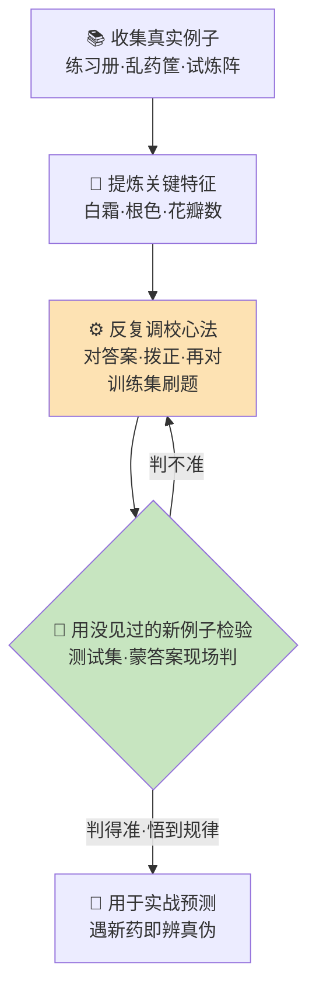

# 第 07 章 · 元婴：观例悟法

> 师父写死一千条规矩，不如弟子亲眼看一千个例子。
> ——《算道天书·元婴卷》开篇

---

孔浩原是在一个平平无奇的清晨结成元婴的。

没有雷，没有霞光，只有丹田里那口盘转了三年的金丹，忽然"啵"地一声，化开成水，又在水里凝出一个盈盈寸许、眉眼与他一模一样的小人儿。那小人儿盘膝端坐，睁开眼，冲他笑了一下。

孔浩原的呼吸停了半拍。

他"看见"了。不是用肉眼——是用那尊元婴的神识。厨房外的老槐树，每一片叶子的脉络；墙角一只蚂蚁搬着比它大三倍的米粒；三里外集市上此起彼伏的叫卖；甚至苏挽晴在自己的小院里翻书，指尖停在某一页上的那点犹豫——**万象同时涌入，却又条理分明，各安其位。**

"这就是元婴。"玄机子不知何时立在门口，负手而笑，"金丹只能'做事'，元婴能'分神'。一缕神识出窍，可观照万象。浩儿，你以前是攥着一件件炼好的法器办事——今日起，你要开始明白，那些'本事'，究竟是怎么'学'出来的。"

孔浩原收摄心神，元婴归位。他站起身，郑重行礼："请师父指点。"

---

玄机子没有多言，只袖袍一拂，卷着他破空而去。

落地时，眼前是一片望不到边的**石林**。每一根石柱上，都密密麻麻刻满了字。孔浩原凑近去看最近的一根，上面刻的是：

> 「叶片带白霜者，有毒。」

再一根：

> 「根须发黑者，有毒。」

再一根：

> 「花开七瓣、逢午时闭合者，有毒。」

一根，又一根，一直刻到天边。

"这是'规矩林'。"玄机子的声音里带着一丝叹息，"上古时候，修士辨药，全靠师父把毕生经验，一条一条**写死**成规矩，刻在石上，让弟子背。你数数，这里有多少根石柱？"

孔浩原放出神识扫过，倒抽一口凉气："……何止十万。"

"十万条规矩，看着森严。可你看这根。"玄机子指向一根断裂的石柱，上面刻着「叶片带白霜者，有毒」，旁边却歪歪扭扭补了一行小字：「然雪见草带白霜而无毒，例外。」再往下，又补了一行：「然寒露参午后生霜亦无毒，例外。」

补丁摞着补丁，刻痕深深浅浅，像一张打满补丁的旧网。

"规矩是死的，世间药材是活的。"玄机子摇头，"每遇一个例外，就得回来补一刀。补到后来，谁也记不全，谁也理不清。一个新弟子照着背，遇到石上没有的药材，就两眼一抹黑——因为**没人教过他这一条**。"

孔浩原默然。他想起自己当药童时，也是这样一条条死记的，背错一条被罚跪半宿。

"那……不靠写死的规矩，还能怎么辨？"

玄机子笑了："元婴大能，一缕神识可观照万象。你不必再等师父一条条喂给你规矩——你可以**亲眼遍观千万个真实的例子，自己从中悟出规律**。这门法，叫'观例悟法'。"

他顿了顿，一字一句道：

"**不背死规矩，看万千例子自悟规律。** 这，就是元婴的根本。"

---

孔浩原心头巨震。这四个字——"观例悟法"——像一把钥匙，"咔"地插进了他心里某处一直空着的锁孔。

玄机子引他穿过石林，来到林后一片开阔的谷地。谷中有三座法坛，分踞三方。

"观例悟法，依例子的不同，分三种法门。"玄机子指向第一座法坛。坛上悬着一册厚厚的**练习册**，每一页都是一张药材图，图下写着标准答案：「此药，有毒」「此药，无毒」。

"其一，**有师引路**。"玄机子道，"这册子里有成千上万味药材，每一味都**配好了标准答案**。你一页页看下去——看得多了，你自会悟出：哦，原来带白霜的多半有毒，但若同时根须洁白，又多半无毒……这些'配对好答案的例子'教出来的规律，比死规矩活得多。因为规律是你**自己从例子里长出来的**，不是别人硬塞的。"

孔浩原看着那练习册，若有所悟："题目配着标准答案……就像有位师父在旁边，我答一道，他对一道。"

"正是。"

玄机子又指向第二座法坛。坛上堆着一大筐**来历不明的药材**，杂乱无章，没有一张标签，没有一个答案。

"其二，**无师自分**。这筐药材，没人告诉你哪个是哪个，连名字都没有。可你放出神识细看——这几味叶形相似、气味相近，自然是一类；那几味根茎同色、灵性相通，又是一类。**没有答案，你却能凭'相似'把万物自己归成一堆一堆。**"

孔浩原试着放出神识，果然，那一筐乱药在他"眼"中渐渐分出了七八个堆，泾渭分明。他惊道："我并不知道每一堆'叫什么'、'是什么'……可它们确实自己分开了。"

"你不需要知道名字，也能看出'结构'。"玄机子颔首，"这门法，专用来在一团乱麻里，找出藏着的门道。"

最后，他指向第三座法坛。坛上是一座缩微的**试炼阵**，阵中有个小小的木人，正一遍遍地闯阵。闯对一步，阵顶落下一颗光珠为赏；闯错一步，阵壁弹出一道电芒为罚。木人被打得踉跄，却一次比一次走得稳。

"其三，**试错受罚**。这门法没有练习册，也不靠归堆。它把你丢进实战——**做对了得赏，做错了受罚**。你不知道什么是对的，但你知道'疼'与'甜'。一次次试，一次次挨，你自会摸索出：怎么走，赏最多、罚最少。对弈、闯阵、推演，越练越精，全靠这个。"

孔浩原看着那木人从跌跌撞撞到步步生莲，喃喃道："……越挨打，越聪明。"

玄机子大笑："糙是糙了点，理是这个理。"

---

孔浩原在三座法坛前盘桓良久，忽然抬头问："师父，这三门法门虽异，可我总觉得，它们骨子里走的是同一条路。"

"哦？"玄机子眼中闪过赞许，"你说说看。"

孔浩原闭目凝神，将元婴神识铺展开来，把方才所见一一串起：

"第一步，**收集例子**——练习册也好，乱药筐也好，试炼阵也好，都得先有足够多、足够真的例子。例子太少、太假，后头全是空中楼阁。

"第二步，**提炼关键特征**——不能眉毛胡子一把抓。辨药要看的是白霜、根色、花瓣数这些'要害'，而非它长在哪块地、被谁摘的。抓住要害，规律才立得住。

"第三步，**反复调校**——第一遍悟出的规律必定粗糙，答错一片。就拿它去对练习册的答案，错在哪，回头把心法拨正一分；再对，再拨，反反复复，直到答得越来越准。这一步，最熬人。

"第四步……"孔浩原睁开眼，目光灼灼，"**用没见过的新例子检验**。"

玄机子的笑容忽然深了。"说下去。这一步，最要紧。"

"我若只拿练习册里练过的题来考自己，那不算数——那些答案我早背熟了。"孔浩原一字一句，"我得找一批**从没在练习册里出现过**的药材，蒙着答案，让自己现场判。判得准，才叫真悟到了。若我把练习册和考卷弄成同一套……"

"那便是**作弊自欺**。"玄机子接口，声音陡然一沉，"刷题的册子和真考的卷子，绝不能是同一套。用练过的题考自己，考一百次得一百个满分，出了考场却寸步难行。此乃大忌，切记切记。"

孔浩原重重点头。他将这一整套流程在心中演了一遍，元婴神识流转，竟自然勾出一幅图来：



图成的刹那，孔浩原只觉得心里那片混沌豁然开朗。

---

正当此时，一道洪亮的笑声从谷口传来："师弟结婴了？可喜可贺！不如，与为兄比试一场，也让为兄见识见识这'观例悟法'的深浅？"

来的是赵狂澜。

这位师兄向来信奉一条铁律：**炉要够大，料要够多，背得够狠**。他闯规矩林时，硬是把十万条石刻一字不落全背了下来，为此在林中枯坐了整整八年，出关时人瘦得脱了形，却引以为傲。

玄机子袖手退开，笑而不语，显然乐见其成。

比试的规矩很简单：谷中有位守坛的老执事，捧出两只药箱。第一只箱里的药材，全部取自那本练习册——**练过的题**。第二只箱里的，则是老执事新采、从未编入任何册子的野药——**没见过的题**。

先比第一箱。

老执事一味味取出。赵狂澜几乎不假思索，脱口便答，快如闪电："雪见草——无毒！寒露参——无毒！七瓣午合花——有毒！"一连三十味，无一错漏。他越答越得意，声如洪钟："师弟，可看清了？这些，为兄**全背过**！"

孔浩原答得慢些，一味味凝神细辨，也是三十味全中。

第一箱，打平。

赵狂澜哈哈大笑，不以为意："第二箱又如何？为兄这脑子，装得下十万条，还怕装不下你这几味野草？"

老执事换上第二只箱，取出一味谁也没见过的紫纹小草。

赵狂澜盯着它，笑容一点点僵住。

他飞快地在脑中翻检那十万条石刻——没有。这药材不带白霜，根须不黑，花也不是七瓣。**石上没刻过它，练习册里没有它，于是他一片空白。** 他额头沁出冷汗，硬着头皮赌了一把："……无、无毒！"

老执事摇头："此乃'紫纹断肠',剧毒。"

第二味，赵狂澜又错。第三味，再错。他背得滚瓜烂熟的十万条规矩，在这些"没见过的新题"面前，竟一条也套不上。他答一味错一味，脸涨成了猪肝色。

轮到孔浩原。

他放出元婴神识，将那紫纹小草里里外外照了个通透。他不去翻记忆里有没有"这一味"——他压根不是靠背的。他调动的是这些天从千万个例子里**悟出的那条活规律**：叶脉走向紊乱如断线者，多主毒；断纹越深，毒越烈。

紫纹断肠，叶脉紊乱，断纹极深。

"剧毒。"孔浩原淡淡道。

老执事点头。

第二味野药，孔浩原取的是"归堆"的法门，将它与见过的同类相比，判"无毒"，中。第三味，他索性用上"试错"的心气，先以微弱灵机一探药性反应，据其"疼甜"再断——又中。

一连十味没见过的新药，孔浩原对了九味。

赵狂澜，一味未对。

谷中静得能听见风穿石林的呜咽。

赵狂澜怔怔地看着自己的手，喃喃道："我背了十万条……我明明比他多背了十万条啊……"

"师兄，"孔浩原收了神识，语气里没有半分得意，只有一种恍然，"你不是没本事。你是把练习册里的**每一道题**，连着答案，死死背进了脑子。一模一样的题摆在面前，你对答如流；可题目一换个样子，你脑子里没有'这一条'，就全乱了。"

他顿了顿，说出那个玄机子还没来得及教他、他却已经自己悟到的词：

"你悟的不是**规律**，是**答案本身**。你把心力都花在'记住每一道题'上，反倒没工夫去悟那条**举一反三**的活理。所以练过的题你满分，没见过的题你交白卷。"

玄机子在一旁轻轻叹了口气，接了一句让孔浩原终生难忘的话：

"背得太死、太贴合练习册，反而**丧失了应对新局的能力**——此谓'**死记**'之患。真正的悟道，不在记住多少道题，而在**从题里长出能应对万变新题的那条理**。浩儿求的，是后者。"

---

比试散了。赵狂澜失魂落魄地走了，临走前，第一次没有提"更大的炉、更多的料"。

孔浩原独自留在谷中，望着那三座法坛和身后那片打满补丁的规矩林，心里翻涌不休。

他忽然想到一件事，脊背微微发凉。

师兄赵狂澜，这些年逢人便说：**炉子要更大，材料要更多。** 从前孔浩原也隐隐觉得这话没错——料多总比料少强，炉大总比炉小猛。

可今日一比，他看清了：赵狂澜的炉子够大了，背下的"料"多到十万条，可他**没有一套好的悟法，没有分清刷题册与考卷，更没防住'死记'之患**。于是这一身惊人的"大"与"多"，在没见过的新题面前，竟成了一场徒劳。

"炉大、料多，是好的。"孔浩原对着空谷喃喃，"可若没有好法子去'悟'，没有真而多样的好例子去'练'，没有防着自己'死记'……再大的炉，再多的料，也只是空烧一炉柴火。"

这个念头，像一粒种子，落进了他心里。他隐隐觉得，这里头还藏着一条更深的道，只是眼下他还够不着。

元婴在他丹田里静静盘坐，睁着一双与他一模一样的眼，仿佛也在望着那片望不到边的、无穷无尽的例子。

孔浩原长长吐出一口气。

他忽然明白，自己已经跨过了一道看不见的门槛——从前他会**用**别人炼好的本事，如今他开始懂得，那些本事，是怎么从**万千真实的例子里，一点一点'学'出来的。**

（本章完）

---

## 📒 凡人笔记

| 仙侠说法 | 真实 AI 术语 | 一句话对照 |
| --- | --- | --- |
| 元婴·观例悟法 | 机器学习（Machine Learning） | 不背死规矩，看万千例子自悟规律 |
| 规矩林·写死的石刻 | 硬编码规则 / 专家系统 | 靠人一条条写死规则，遇例外就打补丁，脆而难维护 |
| 有师引路（练习册+标准答案） | 监督学习（Supervised Learning） | 用"输入+正确标签"的样本学规律 |
| 无师自分（把乱药归堆） | 无监督学习（Unsupervised Learning） | 无标签，靠相似性自动聚类、找结构 |
| 试错受罚（闯阵得赏挨罚） | 强化学习（Reinforcement Learning） | 在环境里试错，靠奖惩信号越练越强 |
| 提炼关键特征（看白霜根色） | 特征工程 / 特征（Feature） | 抓住要害属性，规律才立得住 |
| 反复调校心法 | 训练（Training） | 拿预测对答案、算误差、反复拨正参数 |
| 刷题册 vs 真考卷（不能同一套） | 训练集 vs 测试集 / 数据泄露 | 用练过的题考自己＝作弊自欺 |
| 赵狂澜死记每道题 | 过拟合（Overfitting） | 背熟训练样本，遇新样本就露馅 |
| 孔浩原举一反三 | 泛化（Generalization） | 悟到真规律，能应对没见过的新数据 |
| "炉大料多却徒劳" | 规模 ≠ 一切 | 没有好方法、好数据、防过拟合，规模只是空烧柴火 |

> 📖 深入一层，读概念文档：[⑫ 什么是机器学习](../02_CONCEPTS_概念入门/[CONCEPT-12]%20什么是机器学习-MachineLearning.md)

---

## 📝 读完自测

就着上面这张"凡人笔记"，考一考自己——"观例悟法"的门道，你悟明白了吗？

```quiz
Q: 关于"观例悟法（机器学习 Machine Learning）"，下面哪些说法是对的？（多选）
- [x] 观例悟法对应"机器学习"——不靠人一条条写死规矩，而是看万千例子自己悟出规律
> 对。这正是它跟"规矩林·写死石刻"（硬编码规则）的分野：例外太多时写死规则会脆而难维护。
- [x] "有师引路"=监督学习（带正确标签的样本）、"无师自分"=无监督学习（无标签靠相似性聚类）、"试错受罚"=强化学习（靠奖惩越练越强）
> 对。三种学法对应机器学习的三大范式，本章用引路/自分/受罚三条线分别点透。
- [x] "刷题册"和"真考卷"不能是同一套——训练集与测试集混用＝数据泄露，是作弊自欺
> 对。用练过的题考自己，分数虚高，遇真正的新题就露馅。
- [ ] 赵狂澜"死记每道题"是最扎实的学法，样本背得越熟越好
> 错。死背训练样本＝过拟合，遇没见过的新样本就露馅；孔浩原"举一反三"（泛化）才是真悟到规律。
- [ ] 只要炉子够大、喂的料够多，规模本身就能保证学得好
> 错。"炉大料多却徒劳"——没有好方法、好数据、防过拟合，规模只是空烧柴火。
```

再用一张翻卡，把"过拟合 vs 泛化"这对反义词记死：

```flip
🤔 同样学了一册药理题，赵狂澜把每道题连答案都背得滚瓜烂熟，为什么一上真考卷反而不如"只悟到规律"的孔浩原？（点一下翻到背面）
---
✅ 因为赵狂澜是**过拟合（Overfitting）**——他背死的是训练样本本身，不是背后的规律，遇到没见过的新样本就露馅。孔浩原是**泛化（Generalization）**——悟到了真规律，能应对没见过的新数据。所以机器学习的目标从来不是"把训练集背到满分"，而是"在没见过的数据上也答得好"；这也是为什么"刷题册"和"真考卷"必须分开（训练集 vs 测试集），拿练过的题考自己只是自欺。
```

---

【[上一章 · 金丹·周天循环](./第06章%20金丹·周天循环.md) ｜ [下一章 · 化神·神识重楼](./第08章%20化神·神识重楼.md) ｜ [回总目录](./00_INDEX_修仙学AI-总目录.md)】
