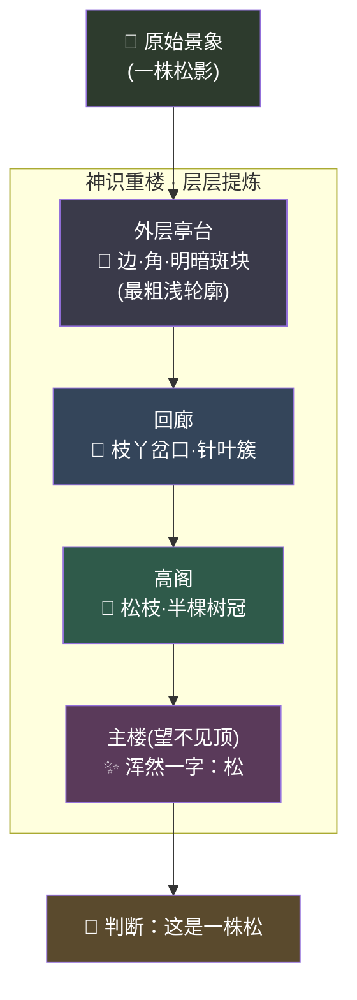

# 第 08 章 · 化神：神识重楼

> 一团神识，只是一团；千楼神识，方见真意。
> 外楼辨轮廓，内楼参深意——所谓"深"，不是高，是层层往里走。
> ——玄机子《化神要略》

---

孔浩原在元婴期上足足熬了三个月。

那三个月他做的事，说来简单：看例子，悟法门。看一万张符纹，悟出"哪一笔是真、哪一笔是伪"；看一万味药材，悟出"何者可入丹、何者是障"。他的元婴像一面被反复擦拭的铜镜，照过的例子越多，映出的规律越准。

可这三个月里，有一件事始终硌着他。

"师父，"这日清晨，他终于问出口，"我观例悟法，每回都得您先替我圈出'该看哪几处'——看符纹要看'转折的锐钝'，看药材要看'断面的油润'。若无人替我圈出这些**要害**，我这元婴，便对着满目景象无从下手。"

玄机子正在煮茶，闻言手一顿，眼里闪过一丝笑意。

"你问到点子上了。"他放下茶勺，"元婴之学，是'观例悟法'——但**看哪些要害，得有人先替你挑好**。挑得好，你悟得快；挑得偏，你满盘皆错。这一步'挑要害'，修真界唤作'择征'，靠的是老修士几十年的眼力。天下多少奇才，就卡死在'不知该看哪里'上。"

孔浩原缓缓点头。这正是他的困境。

"那……有没有一种境界，"他声音压低，"能让神识**自己**从满目景象里，把该看的要害一层层挑出来？不必人指点？"

茶水沸了。

玄机子没有立刻回答，只是抬手，指了指窗外那座矗立在云海中的**藏经重楼**——九层高阁，层层递进，越往上越隐没在云里，望不见顶。

"化神。"他只说了两个字。

---

## 一、重楼初现

冲击化神那夜，孔浩原是被自己的神识"惊"醒的。

往日打坐，他的神识是一团——一团温润的、浑然的光雾，笼在识海上方。那团光雾能照、能映、能悟，却始终是**一团**，浑浑然分不出内外。

可这一夜，那团光雾忽然"塌"了。

不是溃散，是**坍缩成形**。光雾自内而外，一层一层地凝结、分野，竟化作一座**层层叠叠的楼阁**——外层是一圈低矮的亭台，往里一层是回廊，再往里是高阁，最内是一座望不见顶的主楼。九层，层层相扣，气脉相连。

孔浩原心神剧震，试着将一缕外景放进去——那是院中一株老松的影子。

那松影自最**外层亭台**流入。外层亭台里的光，只做了一件极粗浅的事：把松影拆成了**一堆边、一堆角、一堆明暗的斑块**。什么"松"、什么"树"，它一概不知，它只认得"这里有条边、那里有个角、这块亮那块暗"。

粗浅得可笑。可孔浩原没有笑。

因为那"一堆边角"往里流过一层，到了第二层回廊——回廊里的光，把那些零散的边角**拼**了起来:几条边凑成"枝丫的岔口"，几个斑块凑成"针叶的簇"。

再往里一层，"枝丫"与"针叶簇"又拼成了"一段松枝"。

再往里……"松枝"拼成了"半棵树冠"。

一层一层，越往内的高楼，参悟的东西便越**深**:从"边、角、斑块"这些**粗浅轮廓**，一路提炼到"枝、叶、冠"，最后在那座望不见顶的主楼里，浑然凝成一个字——

**松。**

孔浩原猛地睁眼，冷汗涔涔，却是狂喜。

"我懂了……"他喃喃，"外层只辨粗浅轮廓——边、角、形；越往内的高楼，越能参悟深层真意——枝、叶、冠，直到那一个'松'字！**层层递进，逐层提炼**！"

"这，就是'深'字的意思。"玄机子不知何时立在门外，衣袂沾着夜露，"不是楼盖得高就叫深。是这景象自外而内，**要走过这许多层**，一层一层被剥、被拼、被炼，才见真意。走的层数多，故曰'**深度**'。"

他顿了顿，一字一句:

"元婴观例，要人替你择征——替你挑'该看边、还是该看角'。**化神重楼，自己择征**。原始景象往里一放，它自己就把边、角、枝、叶一层层挑出来、拼起来。不必人指点。这，才是它比元婴高明的地方。"

孔浩原怔在原地。

他终于明白，为什么天下奇才卡死在"择征"上——因为择征本是**最难、最靠天赋、最费人力**的一步。而化神重楼，把这最难的一步，**吞进了楼里，自己做了**。



"外层挑粗，内层挑精，越深越会看。"玄机子笑道，"记住这张图，胜过我教你十年。"

---

## 二、调校重楼:射偏了，就回头拧旋钮

新境界的狂喜没持续多久，孔浩原就撞上了新麻烦。

他的重楼虽已成形，判起东西来却**错漏百出**——把老松认成枯柳，把真符看成伪纹。九层楼阁里，每一层的每一根梁、每一处斗拱上，都嵌着密密麻麻的**机括旋钮**，成千上万。楼判得准不准，全看这些旋钮拧到了什么位置。

而此刻，这些旋钮全是**乱**的。

"师父，这么多旋钮，我一个个去拧，拧到猴年马月?"

玄机子丢给他一张弓、一壶箭。

"去,射那百步外的靶心。"

孔浩原不解，还是引弓。第一箭,偏左三尺。

"看清偏了多少?"玄机子问。

"偏左三尺。"

"这'偏了多少',就是'**损失**'——你的判断，离真相差了多远。"玄机子踱步过来,"你射偏了,会怎么办?"

"……调姿势。手腕往右压一点,再射。"

"怎么调?凭什么知道要'往右',而不是'往左'?"

孔浩原一愣:"因为……偏在左边,自然要往右修。偏差在哪个方向,我就朝反方向修一点。"

"就是这个理!"玄机子抚掌,"化神调校重楼,分毫不差就是这三步——"

他伸出三根指头:

"**其一,自外而内,让景象流过重楼,得一个判断。** 松影进去,出来一个'柳'。这一趟,唤作'**前向**'。

**其二,拿这判断去对真相,量出差了多少——那便是'损失'。** 你射偏三尺,重楼认错一物。

**其三,也是最妙的一步——**"玄机子眼中放光,"**自内而外,回过头去,把每一层楼的旋钮,都朝'能减小这偏差'的方向,微微拧一点点。** 主楼的旋钮先调,再回调高阁,再回调回廊,一路调回最外层亭台。这自内而外、层层回拧的功夫,唤作'**反向**'——就像你射偏后回头调姿势,只不过重楼要**同时回调成千上万个旋钮**,每个都只拧'恰好该拧的那一丝'。"

孔浩原呼吸一滞:"那……要拧多少回?"

"射一箭,调一次姿势。"玄机子淡淡道,"想百步穿杨,得射上亿万箭。重楼想判得准,就得让亿万道景象流过它、对亿万次真相、回拧亿万遍旋钮。一遍比一遍偏得少,一遍比一遍准。直到——箭箭中的。"

孔浩原看着手中的弓,忽然懂了。所谓"炼"化神,不是打坐冥想,是**射箭**:前向出箭、量出偏差、反向调姿、再出箭。周而复始,亿万遍。

那一夜,他射了整整一宿的箭。

天亮时,靶心上,箭箭攒成一簇。

他的重楼,也第一次,把老松认成了老松。

可就在他狂喜之际,玄机子却泼了一盆冷水。

"别急着高兴。"老人拈起一根偏出靶外的旧箭,"我问你——你若只对着**这一个**靶子射,射上亿万遍,你这一身姿势,是练精了,还是练**死**了?"

孔浩原一愣。

"换一个靶,换一阵风,你这套'专为这一个靶子拧死的旋钮',还准么?"玄机子摇头,"重楼调校,最忌'把这几道景象背得滚瓜烂熟,一换新景象就抓瞎'——这毛病,你元婴时便见过,唤作'**过拟合**'。射箭要练的是'百步穿杨的本事',不是'把这一个靶子的偏差背下来'。故而调校时,总要**留几道没见过的景象**,时时拿去考它:见过的准,没见过的也准,这楼才算真炼成了。"

孔浩原出了一身冷汗,重重记下。原来化神与元婴,在"求真不求似"这一点上,竟是一脉相承——重楼再深,也逃不过这条铁律。

---

## 三、微调:借前辈半座楼,只点化最上三层

真正让孔浩原窥见"化神"深处凶险的,是三日后。

那日,同辈里出了两桩事。

一桩在赵狂澜。这位一向迷信"规模"的师兄,听闻化神能自己择征、层层提炼,便发了狠——**要从零起一座旷世重楼**,九层不够,他要盖**九十九层**。他闭死关,倾尽师门给他的全部灵石家底,一层一层、一根旋钮一根旋钮地从头炼起,誓要炼出一座通晓天下万物的绝世神楼。

另一桩,在孔浩原自己。

他在后山采药,无意间踏进一处坍塌的古洞,洞底封着一缕**前辈残存的神识**——那是一座**半成的重楼**。楼主早已飞升或陨落,只留下这座楼:外面八层皆已炼得炉火纯青,唯独最内那**主楼**,还是空的、未定的。

孔浩原心念一动,试着将自己**这一门的丹药之学**,那一点点独门心得,注入这座残楼。

奇事发生了。

他**根本没碰外面那八层**。那八层"辨边、拼枝、识形"的功夫,前辈早已炼到极致,拿来即用。他只是用自己**少量的**丹道心得,去**点化最上面那两三层**——把那座空着的主楼,填成"专辨丹药真伪"的样子。

不过三日。

三日之后,孔浩原这座"捡来"的重楼,**辨药之能竟已技惊四座**——比赵狂澜从零硬炼了半个月的九十九层楼,还要精准十倍。

"这……"苏挽晴闻讯赶来,盯着孔浩原的重楼,又惊又叹,"你没从零炼?"

"没有。"孔浩原也是后怕又庆幸,"我若从零起楼,把'辨边、拼枝'这些**通用**的粗浅功夫也从头炼一遍——那要耗尽我一门之力,旷日持久。可这些通用功夫,前辈的楼里**早已炼好**。我何必重炼?我只**借他成的通用重楼,用自己少量心得,再点化最上面几层**,让它专精我这一门,便速成了。"

玄机子适时而至,听罢,长叹一声,眼中是罕见的赞许。

"你这一趟,悟到了化神最要紧的三重心法。"他伸出三指,"天下修士,九成卡死在第一重,唯有聪明人,才走得到第二、第三重——"

**"其一,从零起楼——'预训练'。** 把'辨边、拼枝、识形'这些**通用**的粗浅功夫,从一片虚无里,靠亿万道景象,一层一层炼出来。这一步**极贵**,耗尽一宗之力、旷日持久。赵狂澜此刻正在受这个罪。天下能从零炼成一座通用神楼的,不过寥寥几家大宗。

**其二,借楼点化——'微调'。** 请来一位前辈**已成的通用重楼**,外面那些通用层原样不动,只用你**自己少量的心得**,把**最上面几层**再点化一番,它便速成你这一门的专精。**便宜、高效**。你今日走的,正是此路。"

孔浩原重重点头。

"那第三重呢?"苏挽晴忍不住问——她修的是"开卷问道"一脉,对这个格外上心。

玄机子看了她一眼,笑了:"第三重,是你的看家本事,挽晴。**'开卷问道'——它根本不动重楼**。你的楼是什么样,就什么样,一根旋钮都不拧。它只在**临到答题那一刻**,现去翻书、现去取来相关的典籍资料,喂到楼前,让楼**照着资料**作答。这一脉,后面章节你们会专门学它,唤作**RAG**。"

三人皆若有所思。

玄机子收敛笑意,郑重叮嘱孔浩原:

"**这里头有一条铁律,你务必刻进骨子里——微调擅长改的是'本事'与'风格倾向'**:让一座通用的楼,变得'专精辨药'、变得'说话像医家'、变得'出手偏稳健'。这些是**本事、是脾性**,微调最拿手。

**可若你要给它的,是'新事实、新知识'**——比如'今日城中新到了一味百年雪参'、'某某典籍新添了一条药理'——**那就别去微调!** 你为一条新知识去重拧旋钮,既贵又蠢,还容易把楼拧坏、把旧本事拧忘了。**新事实、新知识,该用'开卷问道'RAG**——现用现查,楼一分不动,资料随时能换。

微调改**本事**,开卷问道供**知识**。记牢这条,你化神一途,便走不岔。"

孔浩原将这几句话,一字一字,烙进识海。

---

## 四、走火的高楼

后山,一声闷雷。

赵狂澜的死关塌了。

众人赶去时,只见他七窍渗血,盘坐在一座**歪斜欲倒的九十九层危楼**中央——楼太高、旋钮太多、家底又不够,他从零硬炼,炼到第七十层时灵石耗尽,却不肯回头,强行以真元续楼,终致**走火**。那座楼,底下八十层的旋钮还没拧准,他就急着往上盖,通身乱麻,一处偏差,层层放大,轰然半塌。

孔浩原上前扶他,心中百味杂陈。

同样是化神,同样是重楼。他借前辈半座成楼,只点化三层,三日速成;赵狂澜偏要从零起九十九层,耗尽家底,半途走火。

"规模……不是越大越好。"赵狂澜吐出一口血,眼神第一次有了动摇,"该借的楼,不借;该省的层,不省……我错在……什么都想从零硬来。"

玄机子立在一旁,没有落井下石,只留下一句:

"从零起楼,是大宗才担得起的**豪赌**。聪明的修士,站在前人已成的重楼上,只点化自己那几层。**站在巨人的重楼上,你才够得着更高的云。**"

孔浩原扶起赵狂澜,回望云海中那座九层藏经重楼,又低头看了看自己识海里那座"捡来又点化"的新楼。

他忽然觉得,眼界与境界,当真是一同飞的。

昨日他还困在"该看哪里"的元婴,今日他已窥见"层层自炼、借楼速成"的化神深处机关。

远处,苏挽晴望着他,轻声道:"下一步,你该来我这'开卷问道'一脉看看了。你会明白,为什么有些事,宁可**不改楼,只查书**。"

孔浩原笑了。

云海深处,重楼无声,一层一层,望不见顶。

---

## 📒 凡人笔记

孔浩原今日窥见的"化神"深层机关,翻成凡人世界的话,是这样的:

| 仙法 / 隐喻 | 真实 AI 术语 | 一句话人话 |
| --- | --- | --- |
| 神识重楼 · 层层叠叠 | 神经网络 / 深度学习(Deep Learning) | 让判断经过很多"层",一层一层往里走 |
| "深"= 走过许多层才见真意 | 深度(depth)/ 多层堆叠 | 层数越多越"深",能懂越抽象的东西 |
| 外层辨边角、内层参真意 | 逐层特征提炼(低层→高层特征) | 浅层认边角纹理,深层认脸、物、意 |
| 重楼**自己**择征,不必人挑 | 自动特征学习(vs 人工特征工程) | 深度学习自己从原始数据里找该看的要害 |
| 景象自外而内流过重楼 → 得判断 | 前向传播(forward pass) | 数据从头走到尾,吐出一个结果 |
| 判断对真相,量出差多少 | 损失(loss) | 结果离正确答案差了多远 |
| 自内而外回头微拧每层旋钮 | 反向传播 + 梯度下降(backprop) | 按误差方向,一点点回调每层参数 |
| 射箭:射偏→看偏差→调姿→再射 | 训练迭代(iteration/epoch) | 反复"猜—对答案—修正",练亿万遍 |
| 从零起一座通用重楼(极贵) | 预训练(pre-training) | 从海量数据从头学通用本事,极烧钱 |
| 借前辈成楼,只点化最上几层 | 微调(fine-tuning) | 在通用大模型上做专项特训,便宜高效 |
| 不改楼,答题时现查资料 | 检索增强(RAG,下章之后细讲) | 不动模型,只在回答时喂进相关资料 |
| 微调改"本事/风格",新知识用 RAG | 微调 vs RAG 分工 | 改能力/语气用微调;给新事实用 RAG |
| 赵狂澜从零硬起九十九层走火 | 盲目从零训练 / 规模迷信的代价 | 能借就别从零;层数不是越多越好 |

> 📖 想把这一章的"神识重楼"看得更透,去读概念文档:[⑬ 什么是深度学习](../02_CONCEPTS_概念入门/[CONCEPT-13]%20什么是深度学习-DeepLearning.md)。
>
> 一句话记牢:**深度学习 = 让机器自己搭一座多层的"重楼",一层层从原始数据里提炼特征;训练靠"前向出结果、算损失、反向调旋钮"射亿万箭;而"微调"是站在前辈已成的重楼上,只点化最上面几层——改本事用微调,给新知识用 RAG。**

---

## 📝 读完自测

就着上面这张"凡人笔记"，考一考自己——"神识重楼"的层层机关，你走通了吗？

```quiz
Q: 关于"神识重楼（深度学习 Deep Learning）"，下面哪些说法是对的？（多选）
- [x] 神识重楼对应"神经网络/深度学习"——让判断经过很多"层"，一层层往里走；"深"就是层多
> 对。外层辨边角、内层参真意——浅层认边角纹理，深层认脸、认物、认意。
- [x] 重楼能"自己择征、不必人挑"——这就是自动特征学习，跟人工特征工程相反
> 对。深度学习自己从原始数据里找该看的要害，不用人一条条挑特征。
- [x] 训练靠"前向出结果 → 算损失（差多远）→ 反向一点点回调每层旋钮"，反复射亿万箭
> 对。前向传播出结果、loss 量偏差、反向传播+梯度下降回调参数，就是训练迭代。
- [ ] 要给模型加"新知识/新事实"，最省事的办法一定是从零再训练一座重楼
> 错。改本事/风格用**微调**（站在前辈成楼上只点化最上几层），给新事实用 **RAG**（不动模型，答题时现查资料）；从零硬起最贵。
- [ ] 楼层越多越好，赵狂澜从零硬起九十九层是最强路线
> 错。能借前辈成楼就别从零；层数不是越多越好，盲目从零训练/规模迷信会走火。
```

再用一张翻卡，把"微调 vs RAG"这对常被搞混的概念记死：

```flip
🤔 想让模型"会点新东西"——到底该动手改模型（微调），还是别动模型、答题时喂资料（RAG）？两者怎么分工？（点一下翻到背面）
---
✅ 看你要加的是"**本事/风格**"还是"**新事实**"：改口吻、改专项能力（比如把通用模型调成专科医生的说法）→ 用**微调（fine-tuning）**，站在前辈已成的重楼上只点化最上几层，便宜高效；给它一批它没学过的新知识、新文档 → 用 **RAG（检索增强）**，不动模型，只在回答时把相关资料喂进上下文。一句话：**改能力/语气用微调，给新知识用 RAG。**从零训练整座重楼最贵，能借就别从零。
```

---

【[上一章 · 元婴：观例悟法](./第07章%20元婴·观例悟法.md) ｜ [下一章 · 炼虚：万象坐标](./第09章%20炼虚·万象坐标.md) ｜ [回总目录](./00_INDEX_修仙学AI-总目录.md)】
