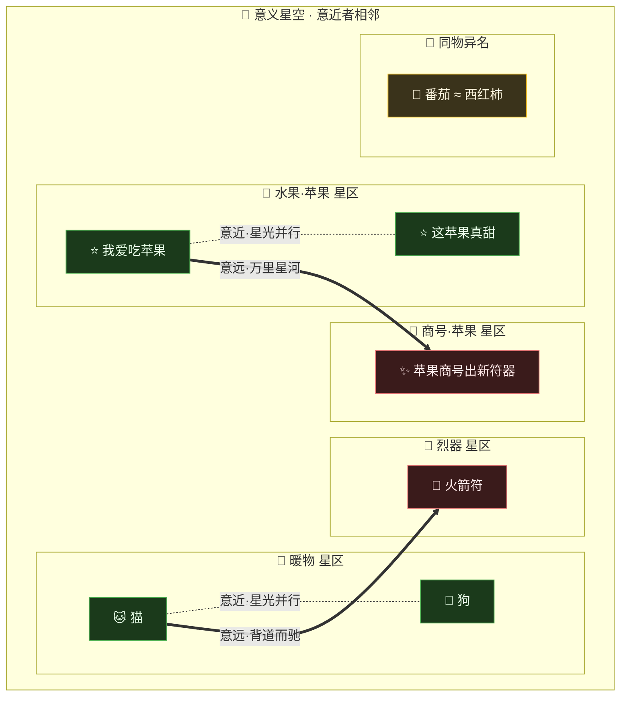

# 第 09 章 · 炼虚：万象坐标

> 字有千般，意归一处；
> 万象化星，近意相邻。

孔浩原是在第七日的清晨破的境。

那一夜他没有合眼。神识重楼在识海里层层升起，一重压一重，像有人在他脑中搭起了一座望不到顶的高塔。塔越高，他看得越远——远到某一刻，他忽然发觉自己看的已经不是"字"了。

一片竹简摊在案上，写着"猫"。

孔浩原以往看这个字，看到的是墨、是笔画、是横竖撇捺。可这一刻，那个"猫"字忽然从纸上浮了起来，化成一团毛茸茸、软乎乎、会喵喵叫、爱蹭人腿的**"意思"**。字没了，意还在。

"轰"的一声闷响，从他丹田深处传来。识海翻涌，一层薄如蝉翼的虚光自四肢百骸渗出，将他整个人笼住。那光不实不虚，似有似无。

玄机子推门进来时，正撞见这一幕。老人愣了一瞬，随即抚须大笑："好！好一个七日成虚！浩儿，你踏入**炼虚**了。"

孔浩原缓缓睁眼，只觉浑身通透。他试着抬手，指尖那团虚光竟随心意流转，忽而聚成一粒星子，忽而散作一缕轻烟。

"师父，"他声音有些发飘，"我方才……看见那个'猫'字，化成了一只猫。不是字，是……意思本身。"

玄机子眼中精光一闪："化实为虚——这正是炼虚的根本。炼气是识得天地灵机，筑基是理清言语脉络，金丹能驱物循环，元婴通晓万法，化神者神识重楼、层层洞照。而炼虚——"

老人顿了顿，一字一句道：

"**炼虚，是把这世间万物的'意义'，从它的皮囊里剥出来，化成可以度量、可以比对、可以安放的东西。**"

---

孔浩原沉默片刻，隐约抓到了什么，却又抓不真切。

玄机子也不急，只领着他出了静室，一路上到后山最高的那座"观星台"。台上空空荡荡，唯有一方漆黑如墨的水镜，嵌在青石之中。

"来，"玄机子指着水镜，"我传你炼虚第一门神通——**万象坐标**。"

他伸出两指，在虚空一点。识海中那座神识重楼轰然运转，一道毫光落进水镜。刹那间，墨色的镜面竟"活"了过来，化作一片深不见底的**星空**——无数光点悬浮其中，或明或暗，或近或远，浩瀚得叫人心头一颤。

"此乃'意义星空'，"玄机子的声音在星光中回荡，"世间每一段话、每一件物、每一缕念想，经神识重楼一炼，都能化成一串**'星位坐标'**，钉在这片星空的某一处。"

孔浩原屏住呼吸。

"奥妙就在这'钉'字上。"玄机子伸指虚点，一颗写着"猫"的星子亮起，"你看着——"

他又点了一下。一颗"狗"星亮起，**紧挨着**那颗"猫"星，两星相依，星光几乎交融。

"猫与狗，都是通人性、会撒娇、绕膝而行的活物。意思相近，坐标便相邻。"

玄机子再一点。远处极远极远的天边，一颗"火箭符"的星子亮起，与那对猫狗之间，隔着浩浩荡荡万里星河。

"猫与火箭符，一个是暖物，一个是烈器，风马牛不相及。意思相远，坐标便隔着万里。"

孔浩原看得心跳如鼓。他终于抓住了那缕捉摸不定的东西——

"师父！这星空里，**离得近的，就是意思近的**？！"

"正是。"玄机子含笑点头，"字面、笔画、读音，统统不管。**它钉的是'意',不是'字'。**"

---

为了让他信服，玄机子做了一件让孔浩原终身难忘的事。

老人点出两颗星。

第一颗，写着"**番茄**"。
第二颗，写着"**西红柿**"。

孔浩原下意识想：这两个词，字不同、音不同、笔画天差地别，坐标该隔得老远吧？

可当那两颗星亮起时——

**它们几乎重合在了一起。**

一颗压着另一颗，星光叠成一团，密不可分，仿佛本就是同一颗星。

孔浩原"啊"地失声。

"字面天差地别，"玄机子缓缓道，"可你我都知道，番茄就是西红柿，西红柿就是番茄——**同一样东西，同一个意思**。皮囊两副，魂却是一个。神识重楼剥的是魂，不是皮。所以它俩的坐标，自然就叠在了一处。"

"这……这太妙了。"孔浩原喃喃，"若是从前，我要找'番茄'的记载，只会去翻带'番茄'二字的竹简，'西红柿'的偏偏就漏了。可有了这星空——**我按'意思'去找，而不是按'字眼'去找**，就再也漏不掉了！"

玄机子抚掌："孺子可教。这，正是求真路上的一件大器——**按意，而非按字。** 幻魔道最爱在字面上做文章，改一个字、换一个说法，就想瞒天过海。可在这意义星空里，换汤不换药的把戏，一照就现原形。"

---

孔浩原越听越是心热："师父，那……这星距，究竟怎么量？两颗星到底算'近'还是'远'，可有个准头？"

玄机子笑了："你莫要被那些量天测地的繁琐算法吓住。说破了，极简单——"

他从两颗相邻的星子上，各引出一道星光，笔直射向孔浩原。

"你只需看这两道星光**指向哪儿**。"老人道，"两道光指的方向越接近、夹角越小，两颗星的意思就越近；两道光若是背道而驰、张开一个大角，那就是意思相远。"

孔浩原凝神看去。果然，"猫"与"狗"射出的两道光几乎平行、并肩而行；而"猫"与"火箭符"的两道光，一道朝东、一道朝西，撑开一个极大的角度。

"就这么简单？看两道星光指得多接近？"

"就这么简单。"玄机子点头，"量星距的门道有好几种，但你此刻只需记住这个直觉：**指向越近，意思越近。** 数术的细节，日后自会补上，不必此刻钻牛角尖。"

孔浩原长舒一口气。他最怕的就是玄之又玄的公式，没想到炼虚的根本，竟是这样一个憨直的道理。

---

"光看不练，终是空谈。"玄机子退开一步，"浩儿，你自己来。把几句话，亲手化成星，钉进这星空里。"

孔浩原定了定神，运转神识重楼。

他取来第一句话：**"我爱吃苹果。"**

念头一起，神识重楼层层洞照，将这句话的"意思"层层剥出、层层提炼，最后凝成一串坐标。水镜星空一闪，一颗新星亮起。

第二句：**"这苹果真甜。"**

又是一串坐标，又一颗星亮起——**就落在第一颗星的旁边**，两星相依，暖融融的一片。

孔浩原心头一喜。这两句都在说"能吃的、甜的苹果"，意思相近，坐标果然相邻！

他不由得来了兴致，取来第三句——这句他是故意挑的：**"苹果商号新出了一件符器。"**

一样的"苹果"二字，一样入炉。神识重楼运转，坐标凝成，新星亮起——

孔浩原瞪大了眼。

那第三颗星，**没有**落在前两颗"水果苹果"的旁边。它孤零零地悬在星空的另一角，遥遥独立，与那对甜苹果隔着一段清晰可见的距离。

"师父！"孔浩原失声，"同样是'苹果'二字，前两句的苹果挨在一块儿，这第三句的苹果……却独悬一角！"

"因为——"玄机子含笑看他。

孔浩原福至心灵，脱口而出："因为前两个'苹果'，说的是能吃的水果；这第三个'苹果'，说的是**卖符器的商号**！字一样，意思不一样——所以坐标就把它们分开钉了！"

"正是此理。"玄机子重重点头，"你钉的从来不是'苹果'这两个字，你钉的是这两个字在**那句话里**、真正指的**那个意思**。字是死的，意是活的。神识重楼，照的就是这活意。"

孔浩原怔怔望着那三颗星——两颗甜苹果相依相偎，一颗商号苹果孤悬远方——只觉一股难以言喻的震撼自心底涌起。

他这一刻，第一次**"看见了意义本身的形状"**。

原来这世间纷繁的言语万物，剥去皮囊之后，都能化成星空里一个个可安放、可比对、可远近的坐标。意近者相邻，意远者相隔，字面的障眼法在这里通通失灵。

叹为观止。

---

下面这幅"意义星空图"，便是孔浩原那一刻眼中所见——万物化坐标、意近者相邻：



---

正当师徒二人沉浸于此，观星台的石阶上，忽然传来一声清越的女音：

"玄机前辈好雅兴，竟在此传授'万象坐标'。"

孔浩原回头，只见一名青衣女修拾级而上，眉目清朗，气度沉静。正是同辈中以"藏经"一道名动一方的天才——**苏挽晴**。

玄机子笑道："挽晴丫头，你这'藏经'之术，可正是把这满天星子好生收纳、随取随用的看家本事。来得正好，与浩儿切磋切磋。"

苏挽晴目光落在水镜里那三颗苹果星上，微微一怔，随即眼底泛起赞许："师弟这三星钉得极准——两颗甜苹果相依，一颗商号苹果独悬。字同意异，你却分得毫厘不差。好神识。"

孔浩原拱手："苏师姐过誉。我方才化星，只觉这星空浩瀚，钉是钉进去了，可日后若有千万颗星，我要在其中找一颗、找一片相邻的，岂不是大海捞针？"

苏挽晴眼睛一亮，似乎正等他这句："问得好。化星是炼虚一门，收星、藏星、于万星中一瞬取相邻——那是我'藏经阁'的本事了。今日不便尽言，师弟若有兴致，改日我带你去藏经阁一观，管叫你知道这满天星子，如何呼之即来。"

孔浩原心头一动。他隐隐觉得，眼前这位师姐所长，恰好接续在他今日所学之后——**化星是第一步，藏星取星，才是这门大道真正的用武之地。**

两人相视一笑，都从对方眼中看到了棋逢对手的欣然。

——

只是他们谁都没有注意到，观星台下方那片幽暗的松林里，一双眼睛正冷冷盯着水镜中那片星空。

那人一袭黑袍，正是墨渊。

他盯着"番茄"与"西红柿"那两颗几近重合的星，唇角缓缓勾起一抹阴冷的笑。

"意近者相邻……"他低声自语，声音里透着幻魔道特有的黏腻，"妙极。若我能算准一段真话的星位，再造一段假话，让它的坐标**死死贴在真话旁边**——那这假话，岂不就能鱼目混珠，被人当成真的取走？"

"以假乱真的相似幻象……"他眸光一寒，转身没入林间黑暗，"这万象坐标，倒真是件好东西。"

松涛呜咽，无人听见。

观星台上，孔浩原尚在为初见"意义的形状"而心潮澎湃，浑然不觉一缕求假的暗流，已悄然盯上了这门求真的大道。

星空浩瀚，明暗交织。求真与造假的角力，才刚刚落下第一子。

---

## 📒 凡人笔记

孔浩原把今日所见，一笔一笔译成了大白话：

| 仙侠说法 | 真实 AI 术语 | 一句话解释 |
| --- | --- | --- |
| 炼虚·化实为虚 | 表征 / 向量化（Embedding） | 把文字、事物的"意思"抽成一串可度量的数 |
| 万象坐标 / 星位坐标 | 向量（Vector） | 一段话被神识重楼炼成的那串坐标 |
| 意义星空 | 向量空间（Embedding Space） | 所有坐标共处的那片高维空间 |
| 意近者相邻 | 语义相似 → 距离相近 | 意思越近，向量离得越近 |
| 看两道星光指向多接近 | 余弦相似度（Cosine Similarity） | 用两向量的夹角衡量"意思有多近" |
| 番茄 ≈ 西红柿 坐标重合 | 语义 > 字面 | 编码的是"意义"，不是"字面" |
| 苹果水果 vs 苹果商号 分开钉 | 上下文相关表征 | 同一个词，在不同语境里意思不同、坐标不同 |
| 神识重楼炼星 | 由深度模型产出 Embedding | 向量正是上一章"深度学习/微调"的产物之一 |

> 📖 想把这门"万象坐标"学到底，去读概念篇：[⑨ 什么是 Embedding](../02_CONCEPTS_概念入门/[CONCEPT-09]%20什么是Embedding-向量.md)。
>
> 下一章，苏挽晴的"藏经阁"，讲的就是：满天星子如何收纳、如何一瞬取来相邻——那便是**向量库（向量数据库）**。

---

## 📝 读完自测

就着上面这张"凡人笔记"，考一考自己——"万象坐标"到底把什么抽成了坐标？

```quiz
Q: 关于"万象坐标（Embedding / 向量）"，下面哪些说法是对的？（多选）
- [x] 炼虚·化实为虚，就是把文字、事物的"意思"抽成一串可度量的数——这就是表征/向量化（Embedding）
> 对。一段话被"神识重楼"（深度模型）炼成的那串坐标，就是向量（Vector）。
- [x] "意近者相邻"——意思越近，两个向量在意义星空里离得越近
> 对。这正是语义相似 → 距离相近；量"两道星光指向多接近"就是余弦相似度。
- [x] "番茄"和"西红柿"字面完全不同，坐标却几乎重合
> 对。Embedding 编码的是"意义"，不是"字面"，所以语义 > 字面。
- [ ] 向量编码的是字面的字，字写得越像，坐标就越近
> 错。编码的是意义不是字面：字面天差地别的"番茄/西红柿"坐标重合，而"苹果水果 vs 苹果商号"字同意异反而分开钉。
- [ ] 同一个词无论放在哪句话里，坐标永远是同一个
> 错。上下文相关表征——同一个词在不同语境里意思不同、坐标也不同（苹果水果 vs 苹果商号）。
```

再用一张翻卡，把"意义 > 字面"这层最容易被忽略的点记死：

```flip
🤔 "番茄"和"西红柿"三个字里没有一个字相同，为什么它们的"万象坐标"却几乎重合？（点一下翻到背面）
---
✅ 因为 Embedding 编码的是**意义**，不是**字面**。神识重楼（深度模型）读懂的是这段话"在说什么"，把这份意思压成一串坐标——所以"番茄≈西红柿"坐标贴在一起，而字一模一样但意思不同的"苹果（水果）/苹果（商号）"反而被分开钉。一句话：**看意思远近，不看字长得像不像。**
```

---

【[上一章 · 化神·神识重楼](./第08章%20化神·神识重楼.md)｜[下一章 · 炼虚·藏经阁](./第10章%20炼虚·藏经阁.md)｜[回总目录](./00_INDEX_修仙学AI-总目录.md)】
