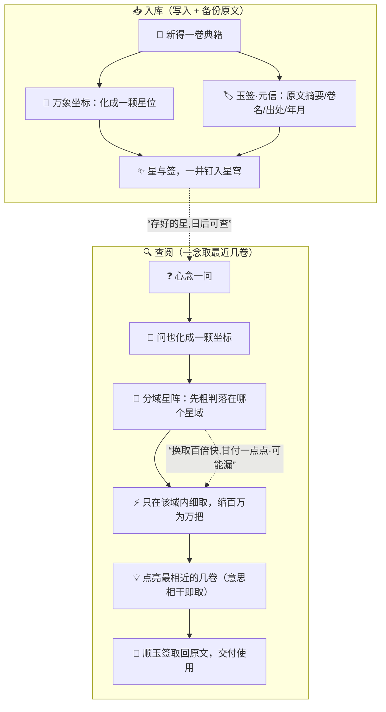

# 第 10 章 · 炼虚：藏经阁

> 记性有限不怕，怕的是不会外求。
> 心窗装不下的，尽可存于窗外星穹，需用时一念取来。

苏挽晴走在前头，青衫拂过晨雾，脚下是一道盘旋而上的白玉长阶。

"再走一炷香，就到了。"她回头，眼里有一种孔浩原从未见过的光，"你昨日炼成'万象坐标'，能把一物一念都化成意义星空里的一颗坐标——对不对？"

"嗯。"孔浩原点头，心里却仍有一处发堵，"可我越炼越怕。一株药、一句诀、一段往事，都能化成坐标，那……千千万万颗坐标，我该往哪里搁？我这颗脑袋、这方心窗，装得下几颗？"

"装不下。"苏挽晴答得干脆，"所以你才要来这里。"

长阶尽头，云雾豁然裂开。

孔浩原整个人怔在原地。

那不是一座书楼。

那是一片**星穹**。

一座巨大的、倒扣的水晶穹顶悬在山巅，里头没有梁、没有架、没有一格一格的书柜——只有**星**。密密麻麻、层层叠叠的光点，从脚底一直铺到头顶再铺到目力尽头，每一颗都在极轻极缓地明灭、流转，像有生命一般彼此呼吸。

"这就是宗门的'星穹藏经阁'。"苏挽晴的声音在穹顶下荡开，"百万卷典籍，从上古丹方到昨日新参的一则心得——每一卷，都先经'万象坐标'化成一颗星位，尽数悬在这方人造星穹里。"

"这些光点……每一颗都是一卷书？"

"每一颗都是一卷书的**意思**。"她纠正，"书还在——原文、摘要、出处、谁人所著、何年入藏，都好好备着。星，只是它在'意义天空'里的落脚点。"

孔浩原抬手，指尖离最近的一颗星还有三尺，那星便微微一颤，仿佛认得他的心念。

"我在藏经阁长大。"苏挽晴仰头望着那片光海，语气里有骄傲，也有一丝孔浩原读不懂的重，"外人只当这是座书楼。他们错了。寻常书楼——"她随手一指山下那座灰扑扑的旧阁，"靠书名、靠编号找书。你要'第三十七卷《百草谱》',它给你翻出来，分毫不差。可你若问它：'跟解百毒意思相干的方子，都有哪些？'——它就哑了。它认字，不认意思。"

"而这里——"

"这里只认意思。"

---

## 一、入库：每得一卷，先化星、再钉入穹

苏挽晴引他走到穹顶正中一方玉台前。台上正躺着一卷新誊的古方，墨迹未干。

"看好了。这叫**入库**。"

她指尖轻点，那卷古方腾空而起，散作一片流光——孔浩原看得分明，正是"万象坐标"之术，把整卷书的意思揉成了一颗坐标。

可她没有就此撒手。

"光化成星还不够。"她另一只手一翻，那颗新星旁边，无声浮起一枚小小的玉签，"这枚签上，记着这卷书的**原文摘要、卷名、出处、入藏年月**——我们管它叫'元信'。星与签，一并钉进穹里。"

"为何要留原文？坐标不就够了？"

"傻。"她笑，"坐标是'意思'，可病人要的是**方子本身**，是那一味一钱的分量。你只凭一颗星去救人，救个鬼。星，是用来**找**的；签上的原文，才是用来**用**的。找到星，顺着签，取回真书——这才算全。"

孔浩原默默把这句刻进心里：**星负责'找得到',原文负责'用得对'。二者缺一,便是空欢喜。**

那颗新星"叮"地一声钉入穹顶，融进百万光点之中，再不分彼此。

---

## 二、查阅：一念化星，星穹点亮最相近的几卷

"入库我懂了。"孔浩原舔了舔发干的嘴唇，"可……百万卷。我若要查一样东西，你总不能让我一颗一颗去看吧？看到我飞升也看不完。"

"所以才有第二桩本事。"苏挽晴敛容，"**查阅**。"

她闭目，指尖抵在眉心，唇齿间无声吐出一问——

孔浩原"看"见了：她那一问，也化成了一颗坐标，一颗**新星**，凭空落入星穹。

刹那间——

整片穹顶暗了下去。

唯有那颗问星**周围**，"啪、啪、啪"接连点亮了七八颗光点，像黑夜里最先应答的几盏灯。它们不多，就那么几颗，却亮得格外温柔、格外笃定。

"这几卷，就是跟我这一问**意思最相近**的。"苏挽晴睁眼，"藏经阁把它们挑了出来——我们叫这个'**取最近的几卷**'。"

孔浩原凑近去看那几颗被点亮的星旁的玉签，越看越是心惊：他这一问，问的是"如何安抚受惊之婴",可点亮的那几卷里，竟有一卷《驯烈马诀》、一卷《抚琴引凤谱》——

"这……这几卷压根没提'婴'字啊！"

"对。"苏挽晴眼中笑意更深，"这正是它比寻常书楼强的地方。书楼认字：你问'婴',它只翻出带'婴'字的。星穹认意思：安抚受惊的婴、安抚受惊的烈马、以琴音抚平躁动——**意思是相干的**，哪怕一个字都不重样，也照样被取出来。"

"记住这句——"她一字一顿，"**取的是意思相干,不是字面相同。**"

孔浩原只觉一扇门在心里轰然洞开。

---

## 三、分域星阵：一点点"可能不准",换百倍的"快"

"可是……"孔浩原的疑问总是接踵而至，"百万颗星。你这一问星落下去，它总得跟每一颗都比一比远近，才知道谁最近吧？百万次啊！怎么会……一瞬就成了？"

苏挽晴神色一正："问到根子上了。这一问，值你三年苦功。"

她抬手，穹顶随她心念缓缓转动。孔浩原这才发觉——那看似浑然一片的星海，其实被无形的界线，划成了一**块一块**的星域，像夜空被分成了东西南北许多天区。

"这叫'**分域星阵**'。"她说，"你说得对，一颗颗去量，太慢，慢到没法救人。所以藏经阁不这么蠢。你那问星一落——阵法先'粗粗一看',它大概落在哪个星域？"

穹顶一角，一整块星域幽幽亮起。

"**先只在这一域里细找**，别的域连碰都不碰。百万卷的活儿，一下缩成万把卷。快了百倍。"

"可是……"孔浩原的心提了起来，"万一，最相干的那一卷，恰恰落在隔壁没去找的星域里呢？"

穹顶下静了一瞬。

"那就——**找漏了**。"苏挽晴坦然承认，没有半分遮掩，"这就是分域星阵的取舍。它给你的,不是'铁定最近的那几卷',而是'**几乎最近、八九不离十的那几卷**'。拿一点点'可能不完全精准',换来百倍的快。"

她转头看他，目光很静："孔浩原，你要记牢——世上没有又快又全的便宜。真要一颗不漏,就得老老实实百万次比对,慢得能急死人。藏经阁选了快。快到能在人断气之前,把方子递到手上。这一点点'可能漏',是它甘愿付的价。"

孔浩原怔怔望着那片被划开的星海，忽然懂了什么叫"取舍"。

正当此时——

山下钟声骤响，一叠声，急如擂鼓。

---

## 四、急症：一念取方，浩海救人

"是外门弟子出事了！"一名执事连滚带爬冲上白玉阶，脸色惨白，"李师弟误服了'噬心草'，五脏翻搅，抽搐不止，快……快不行了！百草堂翻遍了医典也找不到对的解！"

孔浩原心头一紧："噬心草……我从没听过这毒！医典里都没有，藏经阁难道会——"

"医典按毒名编册,查不到就是查不到。"苏挽晴已闭目上前，指尖抵眉，声音却稳得像磐石，"可藏经阁不按名字查。它按**意思**查。"

她不问"噬心草的解药"。

她问的是——**一味能压下心脉逆乱、能缓五脏抽搐、性偏寒而不伤本元的东西,古往今来,可有记载?**

那一问，化星，落穹。

暗。

亮。

这一回点亮的，不是七八颗，而是稀稀落落**三颗**——一卷《寒泉止逆散》、一卷两百年前无名散修的行医手札、还有一卷……残破得几乎认不出卷名的孤本。

"分域星阵，只用了一瞬。"苏挽晴指尖已顺着那三颗星旁的玉签，把三卷**原文**尽数取回——她要的不是星，是签上那实打实的方子，"李师弟中的虽非噬心草,但这三方所治的'心脉逆乱',意思正相干。取其一,加减用之——"

她将那卷散修手札拍在执事怀里："快去!按这方,减半量,先压住抽搐!"

执事踉跄着下山去了。

孔浩原站在原地，久久说不出话。

百万卷。一念。三卷。救一命。

"这就是你从小长大的地方。"他低声。

"这就是我从小长大的地方。"苏挽晴望着那片重新归于沉静的星海，轻轻道，"外人求它'博',我却总记着爹的一句话——**藏得多不算本事,一念取得中,才算。**"

---



---

## 五、星穹里的一颗"假星"

救人既毕，苏挽晴却没有立刻松气。她凝望那片重归宁静的星海，眉心微不可察地一蹙。

"怎么了？"孔浩原问。

"方才取回那卷残破孤本时……"她缓缓道，"我瞥见它旁边，多了一颗**我不认得的星**。"

孔浩原顺她目光看去。那颗星藏在一片古方星域的边角，光色与旁的并无二致，温温润润，仿佛本就该在那里。

"藏经阁的每一颗星，我几乎都识得。"苏挽晴的声音沉了下去，"可这一颗——它旁边的玉签,写着一卷从未入藏的'古方'。字迹工整,出处煞有介事,连年月都编得像模像样。可我方才顺手一读那方子……药性相冲,若真照它用,是要死人的。"

孔浩原的背脊倏地一凉："你是说……有人往星穹里，**掺了一颗假星**？"

"一卷伪造的假典。"苏挽晴一字一顿，指尖已冷，"化成星,混进百万真星之间。它'意思'装得极像真——所以一旦有人来查相干的方子,星穹认意思不认真假,照样会把它点亮、取出。取到手的若是它——"

"就照着假方去救人。"孔浩原只觉遍体生寒，"救一个，害一个。"

穹顶下的星光依旧温柔地明灭着，可孔浩原再看那片浩瀚，心境已全然不同。

他想起玄机子曾说过的话：灵机只求"像真",不保证"是真"。

星穹取的，从来是"意思最相干"。可"相干"，未必"为真"。若有人**存心往这书架上掺假**，那么再快、再准的一念取书，取回来的，也可能是一剂裹着糖衣的毒。

"是谁……"孔浩原的声音发紧。

"我不知道。"苏挽晴摇头，眼底却掠过一个名字般的暗影，"但能悄无声息把一颗假星钉进宗门星穹的，绝非等闲之辈。墨渊……近来在藏经阁走动得,未免太勤了些。"

她伸手，想将那颗假星拂去，指尖却在半空停住。

"不能急着拔。"她收回手，眼神冷静下来，"拔了它,是打草惊蛇。且它既能进来一颗,便能进来第二颗、第一百颗。真正要防的,不是这一颗假星——是**这扇任人往里掺假的门**。"

孔浩原重重点头。他忽然明白，这座辉煌的星穹，教给他的远不止"存"与"取"。

它还教了他一件更要紧的事：**书架再快,取回的也未必是真;快是本事,辨真伪,是另一桩更大的本事。**

---

风起于穹顶的裂隙，吹动苏挽晴的青衫。

"你昨日炼成万象坐标,愁的是'坐标千万,往哪搁'。"她转过身，望着孔浩原，那眼里的光又亮了起来，"今日你见了星穹——存,有了地方;取,有了法门。这座书架,给你备齐了。"

"备齐了……做什么？"

"做**开卷问道**。"苏挽晴笑了，一字一句，像在许诺，"光把书取到手,不算本事。取到手的书,读进去、化进你自己的答话里——问一句,便有百万藏卷替你撑腰,句句有据、字字有源——那才是算道下一重天。"

"那叫什么？"

苏挽晴抬手，指向星穹之外、云海更深处的一座尚未显形的高阁虚影。

"合体。开卷问道。"

孔浩原握紧了拳。他知道，从今往后，他的心窗虽小，身后却已立起一片百万卷的星穹。

**记性有限不怕。怕的是不会外求。**

而他，已经学会了外求。

---

## 📒 凡人笔记

| 仙侠说法 | 真实 AI 术语 | 一句话人话 |
| --- | --- | --- |
| 星穹藏经阁 | 向量数据库（Vector Database） | 专门存"意义坐标"的仓库，百万条一念可取 |
| 入库·化星钉穹 | 写入向量（Upsert / Indexing） | 把每条内容先化成向量，存进库里 |
| 玉签·元信 | 元数据 + 原文（Metadata / Payload） | 光存向量不够，还要连原文摘要一起备着，取回才能用 |
| 一念点亮最相近的几卷 | 近邻检索 / top-k 检索 | 拿问题的向量，找出意思最相近的前几条 |
| 意思相干，不认字面 | 语义检索（Semantic Search） | 不靠关键词，靠"意思像不像"来找 |
| 分域星阵 | 近似最近邻（ANN，如 HNSW/IVF） | 先粗分区、再细找，用一点点"可能漏"换百倍快 |
| 一颗不漏地量遍 | 暴力精确检索（Exact / Brute-force） | 逐条比对，最准但最慢 |
| 寻常书楼按卷名查 | 传统数据库·精确/主键查询 | 只能查"名字/编号对得上"的，答不了"意思相干" |
| 墨渊掺的假星 | 数据源投毒 / 脏数据污染 | 库里混进伪造内容，检索"相干"却未必"为真"，会误事 |

> 本章对应概念：[⑩ 什么是向量数据库](../02_CONCEPTS_概念入门/[CONCEPT-10]%20什么是向量数据库.md)

---

## 📝 读完自测

就着上面这张"凡人笔记"，考一考自己——满天星子如何收纳、又如何一瞬取来相邻？

```quiz
Q: 关于"星穹藏经阁（向量数据库 / 近邻检索）"，下面哪些说法是对的？（多选）
- [x] 向量数据库就是专门存"意义坐标"的仓库，百万条一念可取
> 对。入库（Upsert/Indexing）是把每条内容先化成向量存进去，取用时一念点亮最相近的几卷。
- [x] "一念点亮最相近的几卷"就是近邻检索 / top-k：拿问题的向量，找出意思最相近的前几条
> 对。它靠"意思像不像"来找（语义检索），不靠关键词字面对得上。
- [x] 光存向量还不够，还得连原文/摘要（元数据）一起备着，取回来才能用
> 对。玉签·元信 = Metadata + Payload；只有一串坐标，取回来也没法读。
- [x] "分域星阵（ANN，如 HNSW/IVF）"是先粗分区、再细找，用一点点"可能漏"换百倍快
> 对。跟它相对的是"一颗不漏地量遍"的暴力精确检索——最准但最慢。
- [ ] 寻常书楼按卷名查（传统数据库主键查询）就能做"意思相干"的检索
> 错。传统数据库只能查"名字/编号对得上"的，答不了"意思相干"；语义检索才行。而且"墨渊掺的假星"（数据投毒）说明：检索得再"相干"，取回脏料也未必"为真"。
```

再用一张翻卡，把"快"和"准"这对取舍记死：

```flip
🤔 藏经阁既要"百万条一念可取"的快，又怕漏掉真正最相近的那一卷——"分域星阵（ANN）"是怎么在快与准之间取舍的？（点一下翻到背面）
---
✅ 用一点点"**可能漏**"换回百倍的**快**。ANN（近似最近邻，如 HNSW/IVF）先把星空粗粗分区，只在最可能的几个区里细找，不逐颗量遍——所以极快，但偶尔会漏掉边界上的最优解。真要一颗不漏，就得"暴力精确检索"逐条比对：最准，却最慢。一句话：**ANN = 拿极小的漏检率，换极大的速度；百万级检索离不开它。**
```

---

【[上一章·炼虚·万象坐标](./第09章%20炼虚·万象坐标.md)｜[下一章·合体·开卷问道](./第11章%20合体·开卷问道.md)｜[回总目录](./00_INDEX_修仙学AI-总目录.md)】
