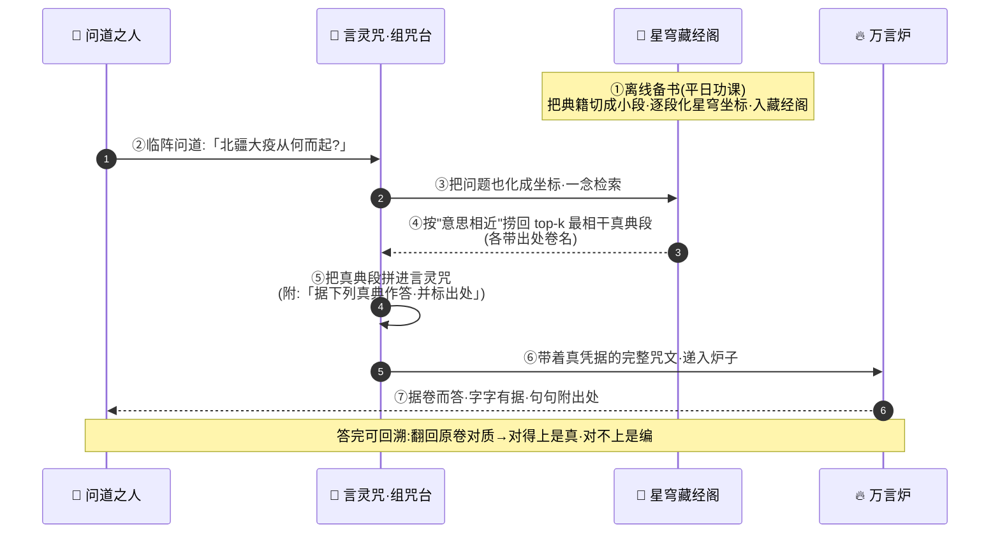

# 第 11 章 · 合体：开卷问道

> 闭卷者，凭一张嘴；开卷者，凭满架书。
> 一张嘴会编，满架书能证——故求真者，先翻书，后开口。

---

孔浩原是在第七夜的三更破的关。

那一刻他没有听见惊雷，也没有看见异象。他只是忽然觉得，识海里那座悬着万言炉的天穹，与更远处那座缀满星辰的藏经阁，之间那道向来隔着的、薄薄的雾，散了。

散得干干净净。

万言炉的火光，与藏经阁的星光，第一次照见了彼此。它们之间凭空架起一道桥——桥上流淌着的，是他修了整整两年的"灵机"。

**合体。**

孔浩原睁开眼，窗外雪未停。他低头看自己的手，掌心里浮着一缕极淡的光，一半是炉火的暖黄，一半是星穹的幽蓝，缠在一起，像两条终于认亲的河。

"成了。"门外，玄机子的声音很轻，却像是等了很久，"进来吧，为师有一诀要传你——这一诀，比你此前学的所有都要重。"

---

孔浩原推门。丹房里只点了一盏灯。玄机子盘坐在蒲团上，面前摊着两样东西：左边是一只小小的万言炉，右边是一枚星穹坐标盘——正是藏经阁的引路之物。

"坐。"玄机子指了指对面，"你先答为师一问。"

孔浩原坐下。

"三百年前，北疆有一场大疫，死者九万。此疫，从何而起？"

孔浩原一怔。这是史书里的悬案，聚讼三百年，众说纷纭。他张口欲言，识海里的万言炉已经"腾"地窜起火苗，热切地要替他作答——那炉子最爱这种问题，最爱在无凭无据处，替他编出一段有鼻子有眼的说辞来。

孔浩原几乎就要顺着炉火说出口了。

"停。"玄机子一个字，如冷水浇顶。

孔浩原猛地闭嘴。他分明感到，方才那即将脱口的答案，来得太快、太顺、太漂亮了——快得可疑，顺得心虚。他心里其实**一无所知**，可炉子偏偏能替他把"不知道"编成一段"言之凿凿"。

"你差一点，又栽在它手里。"玄机子看着那炉子，眼神复杂，"万言炉此物，你入门第二年就领教过——它**只求像真，不保证是真**。你问它不知道的事，它绝不会说'不知道',它会替你**编**一个像模像样的答案出来。此谓幻象。"

孔浩原背后沁出一层薄汗。三百年悬案，他心里空空如也，方才却差点当着恩师的面，"侃侃而谈"。

"那……弟子该如何作答?"

玄机子笑了。他拈起那枚星穹坐标盘，轻轻推到孔浩原面前。

"**翻书。**"

---

"你可还记得,"玄机子缓声道,"炼气之时,你学的是万言炉——它是一张会说话的嘴,肚里装着天下文章的'语感',却装不下天下的'事实'。筑基时,你学言灵咒——学会把话问清楚、把该带的凭据一并递进炉子。金丹时,你学驭器术,让炉子学会自己伸手去取、去做。"

孔浩原一一点头。这些他刻骨铭心。

"再到后来,你入炼虚,学会把万卷典籍**切成小段、逐段化作星穹坐标**,存进那座星辰藏经阁——从此'一念'之间,便能凭'意思相近'把最相干的几段真典,自星海里捞出来。"玄机子顿了顿,"这些,都是零件。今日合体,为师教你把它们**合成一件事**。"

他伸出两指,在灯焰上虚虚一划。灯焰里,竟浮出八个字——

**开·卷·问·道。**

"何谓开卷?"玄机子道,"闭卷考试,凭的是记性与急智,答不出便要瞎编——万言炉一张嘴硬答,便是闭卷,故最易生幻象。**开卷考试,答题前先翻书**:先去藏经阁里,把与这道题最相干的几卷真典找出来,摊在案头,再据着书上白纸黑字来作答,并且**答完还要标明:此话出自哪一卷、哪一段**。"

孔浩原呼吸一滞。他忽然懂了那道横跨炉火与星光的桥,是做什么用的。

"从今往后,"玄机子一字一句,"你答任何难题,**不再凭万言炉一张嘴硬编**。你要——"

"先向藏经阁**一念检索**,取出最相干的几卷真凭实据;"

"把这些真凭实据,**并入言灵咒**,一并递给炉子;"

"令炉子**据卷而答**,字字有出处,句句可回溯。"

"如此,幻象便无所遁形。因为它每说一句,你都能翻回原书去对——**对得上,是真;对不上,是它又在编。**"

孔浩原只觉一股热流自丹田直冲百会。他懂了。这一诀,把他两年所学串成了一条线——**这条线,叫"检索增强"。先检索,后作答;以真典为凭,压住那张爱编的嘴。**

"此法,"玄机子的声音里透出郑重,"江湖上称作**开卷问道**。你且记牢它的全程。"

---

玄机子指尖在案上一点,灯焰化开,映出一幅流转的光图。孔浩原凝神看去——



"看清了?"玄机子道,"分两幕。"

"**第一幕,离线备书**——这是平日的功课,与临阵无关。把要用的典籍,切成一小段一小段,逐段化作星穹坐标,妥妥存进藏经阁。书架备得越齐、越干净,临阵越有底气。此事,你炼虚时已经会了。"

"**第二幕,临阵问道**——真到答题时:先把'问题'本身也化成坐标,往藏经阁里一探,凭'意思相近'捞回最相干的那么几段;把这几段真典,拼进言灵咒,叮嘱炉子'据此作答、标明出处';炉子这才开口。"

孔浩原把这两幕在心里过了三遍,越想越透亮。他忽然抬头:"师父,这……这与驭器术,是一回事么?"

"问得好。"玄机子赞许,"**驭器术,是让炉子自己伸手,去取、去做**——它亲自去量一座山的高、亲自去炼一炉丹。**开卷问道,是你先把真资料喂到它嘴边**——你替它翻好书,摊在案头。一个'亲自去取',一个'喂来现成',殊途同归:**都是给这张爱编的嘴,补上外头的真凭实据,好压住它编造的毛病。**皆是正道。"

孔浩原心悦诚服。

---

"但是——"玄机子话锋陡转,神色一肃,"为师要泼你一盆冷水。**开卷问道,绝非万能。**"

孔浩原凛然。

"你且想:开卷考试,若你**翻错了书**,或书架上**根本没有**这道题的答案,又或者——有人往你书架里,**偷偷塞了一部假书**……"玄机子盯着他,"你据着错书、假书作答,答得越是理直气壮、出处标得越是言之凿凿,便**错得越离谱**。因为你以为自己'有据',其实那'据'本身就是脏的。"

孔浩原后背一凉。他想起藏经阁——想起那个人。

"所以开卷问道,成败全系于三处。"玄机子竖起三指——

"**一,书架干不干净。**藏经阁里若混进伪典,检索得再准,取回的也是毒。故守阁如守命。"

"**二,取得准不准。**问题化坐标,若捞回的段落文不对题,炉子拿着不相干的料,照样答偏。"

"**三,别塞太多杂料。**贪多求全,把一堆半相干、不相干的段落一股脑塞进言灵咒,反成噪音——不但乱了炉子的心神,还挤占了那本就狭小的'心神之窗',真正要紧的一句,倒被挤了出去。**贵精,不贵多。**"

孔浩原默然良久,郑重叩首:"弟子……记下了。"

他记下的不只是法门。他记下的是:**求真,从来不是一句口号。它是要你把书架看住、把典籍取准、把杂料筛净——桩桩件件,都是苦功。**

玄机子扶他起来,望着窗外的雪,忽然轻声道:"你记得便好。因为——只怕过不了几日,便有人要拿一部'假书',当着满天下的面,考你这一诀了。"

孔浩原心头一跳。

---

三日后。清虚宗,论道大殿。

北疆大疫复起的急报,昨夜传遍九州。三百年前那场死了九万人的旧疫,竟在同一片土地上死灰复燃。九大宗门齐聚清虚,要在今日公断:**此疫,究竟从何而起?该如何治、往何处防?**——一言既出,关乎北疆数百万生民的性命。

大殿之上,黑压压坐满了各派长老、真人。孔浩原随苏挽晴一道,坐在藏经阁的席位上。苏挽晴一身素青,神色沉静,只在他坐下时,极轻地递来一句:"孔师弟,今日凶险。藏经阁……昨夜被人动过。"

孔浩原瞳孔一缩。

话音未落,殿门大开,寒风卷雪而入。

一个白衣胜雪、眉目却冷得像冰的青年,踏雪而来。他身后跟着一具面无表情、行动僵直的傀儡——正是那具唤作"老铁"的化身。

**幻魔道少主,墨渊。**

满殿骚动。墨渊却恍若未觉,径直行至殿心,对九宗之主微微一揖,声音清朗,悦耳得近乎蛊惑:"诸位为北疆之疫聚讼不决,墨某,恰有一卷旧典献上。"

他一挥袖,一卷古朴的典籍凭空浮起,徐徐展开。**书页泛黄,墨迹斑驳,边角磨损,连虫蛀的孔洞都恰到好处**——分明是一部尘封数百年的孤本真迹。

"此乃《北疆疫源考》,"墨渊淡淡道,"三百年前,亲历那场大疫的一位无名医修所著。书中言之凿凿:此疫之源,非病非毒,乃是**北疆龙脉自身溃烂所致**。故此疫**无从医治、无从阻断**——唯一之法,是**迁走北疆百万生民,弃地封疆**。"

满殿哗然。

墨渊袖中幻术悄然弥漫,那卷伪典的每一个字,都仿佛在众人识海里活了过来:斑驳的墨迹、恳切的笔触、亲历者字字泣血的记述……**天衣无缝,以假乱真。**连几位德高望重的老真人,都不禁频频颔首,面露戚容。

"龙脉溃烂,天数难违……"

"若果真如此,唯有弃地一途了……"

弃地封疆——那意味着百万生民背井离乡,十不存一。而墨渊要的,正是这北疆的一片"无主之地"。

孔浩原的手,在袖中攥紧了。

**这就是"假书"。有人往书架里塞了一部伪典,还配上幻术,要让满堂据着这部假书,作出一个害死百万人的"结论"。**

他正要起身,身侧苏挽晴的手,已先一步按上了藏经阁的星穹坐标盘。她抬眼看他,目光沉静如渊:"孔师弟——**开卷问道**。你我并肩。"

孔浩原重重点头。

**两人一同起身。**

---

"墨少主,"孔浩原朗声开口,满殿目光齐刷刷投来,"你这部《北疆疫源考》,孔某也想'翻一翻'。"

墨渊眼底掠过一丝极淡的讥诮:"哦?一个小辈,也懂读书?"

"孔某不敢说懂。"孔浩原不卑不亢,"孔某只会一诀笨功夫——**答题之前,先翻书;凡有一说,必对出处。**你说此疫源自龙脉溃烂,好,那便让藏经阁,把三百年间**所有**记过这场疫的真典,都翻出来,与你这一卷,当堂对一对。"

他话音一落,苏挽晴指尖在星穹坐标盘上轻轻一按——

"**一念检索。**"

刹那间,大殿穹顶星光大盛。星穹藏经阁应声而开,亿万星辰流转,如银河倾泻。苏挽晴口中念念有词,将"北疆大疫·疫源"六字,化作一道坐标,投入星海。

星海回应。**七道最相干的真典之光,自浩瀚星辰中被精准捞出,一一悬于殿心,各自亮着出处卷名——**

《清虚宗·北疆坐诊实录·卷三》
《药王谷·瘟疫方剂正典·疫源篇》
《太史局·北疆水土志》
《九宗合修·大疫会诊纪要》
……

"诸位请看。"苏挽晴声音清越,响彻大殿,"**这七卷,皆是三百年间九宗亲历、层层验看、入藏经阁存档的真典。每一卷,出处可查、来路可溯。**现在,我们逐条,与墨少主的孤本对质。"

孔浩原上前一步,接过话头,声如金石——

"**其一。**墨少主的孤本说'龙脉溃烂'。可《太史局·北疆水土志》白纸黑字:大疫之年,北疆龙脉灵机流转如常,太史局年年测记,**从无溃烂之象**。——墨少主,你这'龙脉溃烂',头一句,便对不上。"

墨渊面色微沉。

"**其二。**你说此疫'无从医治'。可《药王谷·瘟疫方剂正典·疫源篇》,清清楚楚录着当年药王谷所拟的三道方剂,并注明'服此三方,活者七千余'。——**七千余条命,是被'无从医治'四个字,一笔勾销了么?**"

殿中已有真人霍然色变。

"**其三!**"孔浩原声音陡然拔高,"你说疫'源自龙脉'。可《清虚宗·北疆坐诊实录·卷三》,记的是**亲历者逐日的坐诊笔录**——它写得明明白白:此疫**始于北疆商道,随南来的一支商队入境,先病者,皆曾与那商队接触**。此疫之源,是**外来的病气,顺着人来人往传开的**,与龙脉,毫无干系!"

一卷,又一卷。七部真典,如七柄利剑,**逐条对质,层层拆穿**。墨渊那部"天衣无缝"的孤本,每被对上一条,便黯淡一分——它的斑驳墨迹开始发虚,它那"亲历者的恳切笔触",在七部真典的交叉印证下,竟渐渐显出一股**编造的、刻意的、经不起追问的**空洞。

"你这部孤本,"孔浩原一字一句,字字诛心,"**孤零零一卷,无人验看,无处存档,来路不明。**它说的每一句,都与这七部有据可查的真典**相悖**。墨少主,孔某斗胆问你一句——"

"**这部书,当真是三百年前的旧典……还是,昨夜才'写'好、连夜塞进藏经阁的新墨?**"

---

满殿死寂。

墨渊的脸,终于第一次,冷得裂开一道缝。

他袖中幻术还想再逞——那卷伪典的字迹又要"活"过来蛊惑众人。可这一次,不管幻象如何摇曳生姿,满殿真人的目光,已不再落在它身上,而是齐刷刷望向那**悬在殿心、出处分明、可回溯、可对质**的七部真典。

**幻术能骗过一双眼,骗不过七卷互相印证的白纸黑字。**

"够了。"清虚宗主终于起身,面沉如水,"墨渊,你这一部孤本,与九宗七卷真典处处相悖,又拿不出半分来路。传令——封了它,查它的墨、查它入阁的时辰。今日之议,便依这七部真典而断:**此疫源自外来病气,循商道传人,可医、可防、可断——即刻遣药王谷携三方赴北疆,封的是商道,救的是生民,绝非弃地!**"

"是——!"九宗齐应,声震殿宇。

墨渊立在原地,白衣胜雪,脸色却比雪更冷。他深深看了孔浩原与苏挽晴一眼,那一眼里,有恨,有忌,也有一丝连他自己都未必愿意承认的——忌惮。

"好一个'开卷问道'。"他从齿缝里挤出这五个字,袖一拂,老铁僵直转身,"孔浩原,苏挽晴……你二人,墨某记下了。今日之败,只因墨某小看了你这'翻书'的笨功夫。来日方长。"

言罢,身形化作一缕白烟,连同那具傀儡,倏然退去。

大殿之上,幻象尽散,唯余七卷真典的星光,静静悬着,照见满堂肃然。

---

散会已是黄昏。雪停了,天边裂开一线金霞。

孔浩原与苏挽晴并肩立在殿外的白玉阶上,谁都没有先说话。方才那场以一敌满堂的凶险,此刻回想,仍叫人心口发烫。

"若不是你昨夜察觉藏经阁被动过,"孔浩原终于开口,由衷道,"若不是你那一念检索,取得那样准、那样全……今日,我一个人,拆不穿他。"

苏挽晴望着天边的霞,唇角极淡地弯了弯:"我守书架,你对质;我把真典取出来,你把假书拆下去。**开卷问道,本就不是一个人的功夫。**"她转头看他,眼里有星光,"何况——今日拆穿他的,从来不是你我。是那七部真典。是三百年间,一笔一画、如实记下、层层验看、代代存档的**真**。"

"我们,不过是替那些'真',说了一句话。"

孔浩原怔住。

他忽然彻骨地懂了恩师那一诀最深的一层——**开卷问道,增强的从来不是那张嘴,而是那张嘴背后,那一架来路分明、字字可溯的真书。嘴会编,书不会;人会诳,据不会。故求真者,不逞一时口舌之利,只把真凭实据一件件立住、看牢、取准——真立住了,假,自然就站不住了。**

金霞漫过白玉阶,把两道并肩的身影,拉得很长很长。

孔浩原低头,看见自己掌心那一缕光,炉火的暖黄与星穹的幽蓝,缠得比破关那夜,更紧了。

"走吧,苏师姐。"他轻声道,"我还有一诀,想再向你请教——他今日那部伪典,是怎么绕过藏经阁的守卫,连夜塞进去的?这书架,还得再看牢些。"

苏挽晴笑了:"正想与你说这个。你可听过……**万法归一**?"

夜色四合,金霞将尽。而属于他们的下一程,才刚刚开始。

---

## 📒 凡人笔记

这一章,孔浩原终于把两年所学"合"成了一件事——先翻书,后开口。把仙侠黑话翻回人话:

| 仙法说法 | 真实 AI 术语 | 一句话人话 |
|---|---|---|
| 开卷问道 | **RAG（检索增强生成）** | 答题前先检索真资料，据料作答，别凭一张嘴硬编 |
| 闭卷硬答、生幻象 | 纯 LLM 生成 / 幻觉 | 不给外部资料，模型不懂也会一本正经地编 |
| 离线备书：切段·化坐标·入藏经阁 | 文档切块 → Embedding → 存入向量库 | 平日先把知识库建好（呼应第9、10章） |
| 问题化坐标·一念检索 top-k | Query 向量化 → 相似度检索 top-k | 把问题也变成坐标，捞回最相干的几段 |
| 真典段拼进言灵咒 | 检索结果拼进 Prompt 上下文 | 把查到的资料塞进提问里一起给模型（呼应第3章） |
| 据卷而答·标明出处 | Grounded answer + 引用溯源 | 答案有依据、可回溯，能翻回原文核对 |
| 书架混进伪典 | 知识库被污染 / 脏数据 | 检索得再准，取回脏料也白搭（呼应第10章掺假典） |
| 取错段、文不对题 | 检索精度差 / 召回不相关 | 取回的资料跑题，模型照样答偏 |
| 塞太多杂料成噪音 | Context 冗余 / 稀释有效信息 | 塞太多半相干内容反成干扰，还挤占上下文窗口（呼应第4章） |
| 开卷 vs 驭器术 | RAG vs 工具调用 | 一个"喂来现成真资料"，一个"让它亲自去取/去做"，都为补外部真据、压幻觉（呼应第5章） |

> 📖 想把这一诀彻底吃透 → [⑪ 什么是 RAG（检索增强生成）](../02_CONCEPTS_概念入门/[CONCEPT-11]%20什么是RAG-检索增强生成.md)
>
> **一句话总纲**：RAG = 先检索、后生成。给模型喂来路分明、可溯源的真资料，让它"据卷而答"——这样它就不必靠一张嘴硬编，幻觉自然被真凭实据压住。但成败全看**书架干不干净、取得准不准、别塞太多杂料**。求真，是苦功，不是口号。

---

## 📝 读完自测

就着上面这张"凡人笔记"，考一考自己——"先翻书、后开口"这门 RAG，你走通了吗？

```quiz
Q: 关于"开卷问道（RAG · 检索增强生成）"，下面哪些说法是对的？（多选）
- [x] RAG = 先检索、后生成：答题前先检索真资料，据料作答，别凭一张嘴硬编
> 对。这正是为了压住"闭卷硬答"——不给外部资料，模型不懂也会一本正经地编（幻觉）。
- [x] 平日要先"离线备书"：把知识库切段 → 化成向量（Embedding）→ 存进藏经阁（向量库）
> 对。呼应第 9、10 章：先把知识库建好，答题时才能"问题化坐标 → 一念检索 top-k"捞回最相干的几段。
- [x] 查到的真典段，要拼进"言灵咒"（Prompt 上下文）一起给模型，答案还要标明出处
> 对。检索结果拼进 Prompt（呼应第 3 章），据卷而答、可溯源，能翻回原文核对。
- [ ] RAG 是通过改模型的权重，把新知识"焊"进模型脑子里
> 错。RAG **不动模型**，只在回答时把相关资料喂进上下文——这正是它和"微调"最大的分工（微调改本事/风格，RAG 给新事实）。
- [ ] 检索时塞进去的资料越多越好，多多益善
> 错。塞太多半相干的杂料反成噪音（Context 冗余），还挤占上下文窗口（呼应第 4 章）；成败全看书架干不干净、取得准不准、别塞太多杂料。
```

再用一张翻卡，把"开卷问道"和第 5 章"驭器术"这对常被搞混的求真手段分清：

```flip
🤔 "开卷问道（RAG）"和"驭器术（工具调用）"都为了补外部真据、压住幻觉——它俩到底差在哪？（点一下翻到背面）
---
✅ 一个"**喂来现成真资料**"，一个"**让它亲自去取/去做**"。RAG 是你事先把知识库备好，答题时检索出相关段落**塞进 Prompt** 给模型读——资料是现成的、被动喂进来的。工具调用（驭器术）则是模型**自己决定去调一个工具**（查数据库、算一笔、发个请求），亲手把真凭据取回来或把事办掉。一句话：**RAG 喂资料，工具调用去动手；都为求真，路子不同。**
```

---

【[⬅ 上一章 · 第10章 炼虚·藏经阁](./第10章%20炼虚·藏经阁.md)｜[下一章 · 第12章 大乘·万法归一 ➡](./第12章%20大乘·万法归一.md)｜[🏠 回总目录](./00_INDEX_修仙学AI-总目录.md)】
