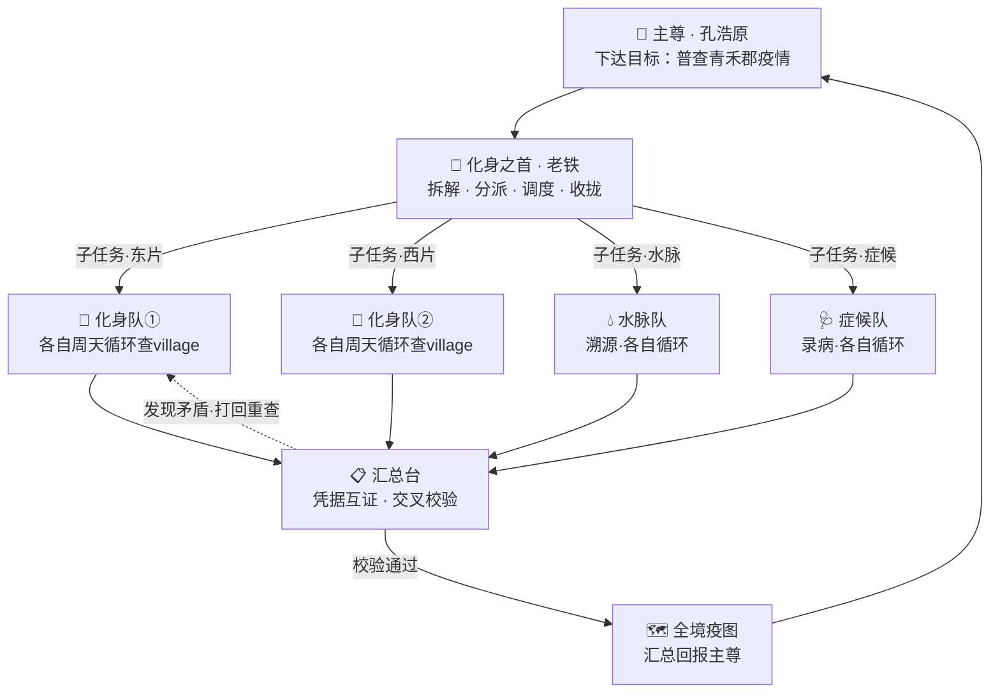

# 第 13 章 · 大乘：化身万千

> 一念动，千身起。授之以目标，而不授之以每一步——此谓"自主"。
> 木偶听令，化身拿主意。同是傀儡，境界已隔天壤。

## 一、一念千身

大乘圆满那一夜，孔浩原在洞府盘膝而坐，忽觉神识如春潮漫堤，再收束不住。

他试着轻轻一念。

刹那间，洞府之内凭空立起百余道身影，衣袂、眉眼、乃至指节的薄茧，皆与他一般无二。每一道身影睁开眼，都自有一缕清明神光——那不是空壳，不是提线的木偶，而是一具具**会自己拿主意的化身**。

孔浩原怔住了。

他想起初入炼气时，玄机子丢给他的第一具木傀——老铁。那时的老铁只会听一句、动一下，孔浩原说"取水"，它便直挺挺去取，路上塌了半座桥也不知绕，非得他一步步喂招。

如今眼前这些化身却不同。孔浩原随手对最近一具道："去把后山那口枯井掏通。"

那化身微一颔首，竟自己转身出门。它先绕井走了一圈，蹲下身探了探井壁的裂纹，皱眉自语："塌方在下三丈，先固壁，再清淤。"——它自己把"掏井"这桩事**拆成了几步**，自己取了木器灵符，自己一趟趟下井、上井、查看进度，掏错一层便退回来重新估算，**不用孔浩原再说第二句话**。

半个时辰后，它回来复命："井通了，出水甘冽，壁已固牢。"

孔浩原心头剧震。

他终于明白老师说的那句话——

> "炼气是给你一副能说话的炉；筑基是教你怎么开口问；金丹是让你会驭器、会周天循环；到了大乘，是把这一切**打包塞进一具会自己走的身子里**。你给它一个'求',它自己去凑齐所有'解'。"

这，便是**自主化身**（自主 Agent）的真意：

- 它自带**会说的炉**（炼气·LLM）；
- 自带**会问的咒**（筑基·Prompt）；
- 自带**会驭的器**（金丹·工具）；
- 自带**周天循环**（金丹·Tool Loop）——一轮不成便看结果、纠错、再来一轮；
- 自带**一键道诀**（大乘·Skill）；
- 更自带一缕**会拿主意的神识**——你只给它**目标**，不给它**每一步**。

第 1 章那具只会听令的木偶，与今夜这千百化身，是同一个"傀儡"么？

是，也不是。前者是**手**，后者是**分身的心**。

## 二、老铁封首

孔浩原唤来老铁。

这具跟了他多年的木傀，早已不是当年那截笨木头。历经周天循环的千锤百炼，它通体沁出温润的铜色，眉眼间竟有了几分老仆的沉稳。

孔浩原将一枚"化身之首"的令印按入它眉心："往后，这千百化身，由你统领。我给你一桩大工程，你替我把它**拆开、分派、盯着、收拢**。"

老铁铜身一震，郑重叩首："老铁……领命。"

恰在此时，山门急报传来——邻州"青禾郡"暴发瘟疫，方圆百里，村村有丧，郡中医者不过数十，杯水车薪，眼看万民将没。

孔浩原起身，眸光一凛："第一桩差事，便是它。"

他没有亲自下场——若只他一人，纵是算道大能，一日也只能踏访三五个村。他要的是**一人之念，千身并作**。

孔浩原闭目，将这桩浩大工程递给老铁："普查青禾郡三百村的瘟情：哪村起病、几人染疫、水源何处、症候异同、可有共因。我要一张能救万民的全境疫图。"

老铁领命，铜掌一挥。

## 三、千身并作

老铁没有把千百化身一股脑撒出去乱撞。它先在识海里把这桩浩大差事，**切成了许多互不打架的子任务**：

- 三百村，按水系分作十二片；
- 每片再派一队化身，一村一具，各自去查；
- 另设"水脉队"专溯河源，"症候队"专录病状，"名册队"专点人丁；
- 最后设一"汇总台"，各队查完，把凭据交上来**彼此校验**。

刹那间，千百化身如惊鸿散入原野，各奔一村。

而每一具化身，落地之后便是一个**完整的小孔浩原**：它自己进村、自己开口问诊（Prompt）、自己驭动灵符测水验血（工具）、一轮查不清便再查一轮（周天循环）、查完自己记录成册（Skill 道诀一键成文）——**不眠不休，各转各的周天，办不完不回来**。

孔浩原立于云端俯瞰，只见大地之上千点灵光此起彼伏，如星河倾泻人间。他一人之念，此刻竟真如一整座宗门在运转。

苏挽晴踏剑而来，望着这漫山化身，秀眉轻扬："好大的手笔。可你就不怕——千身各行其是，乱成一锅粥？"

孔浩原笑而不答，只指了指老铁。



"看，"孔浩原道，"每一队查完，都要把'凭据'交到汇总台。哪村几人染病、水样什么色、症候如何——**空口无凭者不收，须有实据互证**。一具化身说东村死了三十人，汇总台便调另一具的名册来对；对不上，便打回去，两身当面开卷重查。"

苏挽晴眸光一亮："这不就是你我合体期练的那套'开卷问道'（RAG）么——**凡言必有据，据必可查**。你把它用到了化身之间。"

"正是。"孔浩原颔首，"一身可能看错、可能被人蒙骗；但千身彼此以真凭据互证，一粒假料，便难混过整座汇总台。"

## 四、假料惊魂

话音未落，汇总台忽然发出一声刺耳的警鸣。

老铁铜身一僵，急传讯来："主尊！南片'落雁村'的化身报回一册水样，说全村水源清冽无毒、瘟疫乃天时所致——可这与上游三村的记录，全对不上！"

孔浩原神色一沉。

他神识探入落雁村那具化身的记忆，只见它取水验毒时，那井水竟在灵符下显出一片"清冽祥和"之相，半分毒气也无。化身信以为真，便如实录下"水源无碍"。

可上游"断桥村""石潭村"两具化身，明明验出同一条水脉毒气冲天。

"是幻。"孔浩原眸光骤冷，"有人在落雁村那口井上，**做了手脚**——不是把毒去了，是把毒**藏在一层'像真'的幻象之下**，专骗单独一身。"

那一瞬，他仿佛听见幽冥深处，有一个人在冷笑。

**墨渊。**

幻魔道之主，掺假于人间，让灵符验出的"像真"盖过"是真"。若这册假料被采信，全境疫图便会把落雁村判为"安全",救援尽数绕开，一村人将无声无息地死于那口"清冽"的毒井。

千算万算，坏在一身。

可孔浩原没有慌。

"老铁，"他沉声道，"落雁村的册子，不许直接采信。调上下游所有化身的水样凭据，**当场互证**。"

汇总台上，一道道化身的记忆被并列铺开：断桥村——毒气冲天；石潭村——毒气冲天；落雁村居其间，独报"无毒"。

**一处独异，众处皆反。**

老铁铜掌一拍："同一条水脉，上下皆毒，独中间一村清冽——违常理，不可信！打回重查，另遣三身持'照妄符'同去！"

三具化身携着专破幻象的灵符再入落雁村。这一回，它们不再单信一符之验，而是三身各验、彼此对照——层层幻象之下，那口井中的森森毒气，终于原形毕露。

假料，被纠了过来。

孔浩原长舒一口气，额角竟沁出薄汗。

苏挽晴在旁看得心惊："若你只派一具化身、只信它一面之词……"

"那便是万民陪葬。"孔浩原目光沉沉，"所以化身再多、跑得再快，也须守三条铁律——"

他伸出三指：

**其一，护法阵与道诀红线常在。** 每一具化身，纵是自主，也困在"护法阵"（安全护栏）与"道诀红线"里。它可以自己拿主意，却**不能拿'作恶'的主意**——不许伤人、不许越界、不许碰禁忌。缰绳松了，缰绳没断。

**其二，周天刹车不可废。** 每一具化身都带"步数上限"与"遇险即停"。查不清便查、纠错便纠，但**转到某个数还不成，便须停下回报，绝不许一味空转**——千身若一齐走火，那才是真正的浩劫。

**其三，凡言必有据，据须互证。** 化身之间不许"一言堂"，凡有结论，皆以真凭据互相印证。一身之误，众身可纠；一粒假料，难污全局。

这三条，正是他一路从第 5 章的护法阵、第 6 章的周天刹车、合体期的开卷问道，一层层攒下来的家底。

到了大乘，它们不再是各自的招式，而是拧成一股、护住这千身万念的**筋骨**。

## 五、疫图功成

七日之后。

老铁将一卷灵光流转的"全境疫图"呈到孔浩原面前。三百村的病情、水脉、共因，纤毫毕现，落雁村那口毒井赫然标着刺目的红。

青禾郡守持图施救，堵毒井、清水脉、分医药，不过半月，瘟疫竟被生生摁了下去。万民得活。

消息传回宗门，一片哗然。

赵狂澜阴着脸，冷哼一声："不过是撒出去一堆傀儡跑腿，也值得吹嘘？我一道神雷，照样……"

"照样什么？"玄机子拂尘一扫，淡淡截住他，"照样只有你一个人。浩儿这一手，是'**一人如一宗**'。你数得清他今夜化出多少身、办成多少事么？"

赵狂澜语塞，脸色铁青，甩袖而去。

玄机子转向孔浩原，目光里是藏不住的欣慰，却又掠过一丝忧色："化身万千，调度如宗，你已有算道大能之姿。可今日落雁村那口井——你可看清了？"

孔浩原神色肃然："看清了。墨渊在试。他掺一粒假料，试我千身能否互证纠偏。"

"不错。"玄机子声音沉了下来，"一粒假料，你以千身互证纠了过来。可若他掺的不是一粒，而是**铺天盖地的一整片幻象洪流**呢？若假的比真的还多、还快、还像真呢？"

孔浩原心头一凛。

远处苍茫云海之外，幻魔道深处，墨渊负手而立，望着青禾郡那盏被救活的万家灯火，唇边却勾起一抹森然的冷笑。

"化身万千……好，好得很。"他低声呢喃，指尖幻光流转，映出无数以假乱真的虚影，正无声无息地朝天下九州蔓延，"求真？我便让这世间的'假'，多到你千身万念，一具也验不过来。"

**一场席卷天下的大幻劫，正在暗处，缓缓睁开它的眼。**

孔浩原立于云端，师徒、知己、忠仆皆在身侧，千身万念听他一念调遣。

他已集齐了会说的炉、会问的咒、会用的器、会循环的周天、会开卷的求真、会一键的道诀，更学会了以一念化出千身、协力求真。

万事俱备。

只待——最后一劫。

---

## 📒 凡人笔记

孔浩原把这一章的"仙法"翻成大白话，抄在竹简背面：

| 小说仙法 | 真实 AI 术语 | 一句话人话 |
| --- | --- | --- |
| 会自己拿主意的化身 | 自主 Agent（Autonomous Agent） | 你只给它**目标**，它自己拆步骤、自己用工具、自己纠错，办完才回报 |
| 化身自带炉·咒·器·周天·道诀 | LLM + Prompt + Tools + Loop + Skill 打包 | 一具化身 = 前面所有本事**装进一个会自己走的身子** |
| 只会听令的木偶 vs 会拿主意的化身 | 脚本傀儡 vs Agent | 木偶要你喂每一步；Agent 给它一个"求"，它自己去凑齐"解" |
| 老铁封"化身之首"·拆解分派 | 多智能体协作（Multi-Agent / Orchestrator） | 一个**主控**把大任务切成子任务，分给多个 Agent 并行去干 |
| 千身并作·各转各的周天 | 并行 Agent + 各自 Tool Loop | 多个 Agent 同时跑，各自一轮轮循环推进，互不打架 |
| 汇总台·凭据互证 | 结果汇总 + 交叉校验（RAG 求真） | 各 Agent 的结论要拿**真凭据**互相印证，对不上就打回重查 |
| 落雁村假料·多身纠偏 | 单点错误 / 幻觉的多方校验纠错 | 一个 Agent 可能被骗，多个 Agent 以真凭据互证，能纠回来 |
| 护法阵 + 道诀红线 | 安全护栏 / Guardrails | Agent 再自主，也不许越界作恶——缰绳松了没断 |
| 周天刹车·步数上限·遇险即停 | 循环上限 / 熔断（Max Steps / Circuit Breaker） | 转到上限还不成就停下回报，防千身一起空转走火 |

**本章对应概念文档**：
- 主线：[① 什么是 Agent（智能体）](../02_CONCEPTS_概念入门/[CONCEPT-01]%20什么是Agent-智能体.md)
- 回指：[③ 什么是 Tool Loop（工具循环）](../02_CONCEPTS_概念入门/[CONCEPT-03]%20什么是ToolLoop-工具循环.md) · [⑤ 什么是 Skill（技能）](../02_CONCEPTS_概念入门/[CONCEPT-05]%20什么是Skill-技能.md)

---

## 📝 读完自测

就着上面这张"凡人笔记"，考一考自己——"会自己拿主意的化身"到底比"木偶"强在哪？

```quiz
Q: 关于"化身万千（自主 Agent · 多智能体）"，下面哪些说法是对的？（多选）
- [x] 自主 Agent = 你只给它目标，它自己拆步骤、自己用工具、自己纠错，办完才回报
> 对。一具化身 = LLM + Prompt + Tools + Loop + Skill 打包，是前面所有本事装进一个会自己走的身子。
- [x] "化身之首"拆解分派、千身并作，就是多智能体协作（Multi-Agent / Orchestrator）
> 对。一个主控把大任务切成子任务，分给多个 Agent 并行去干，各自转各自的周天（Tool Loop）。
- [x] 各化身的结论要拿真凭据互相印证，对不上就打回重查
> 对。结果汇总 + 交叉校验（RAG 求真）——一个 Agent 可能被假料骗，多身以真凭据互证能纠回来。
- [ ] Agent 就是只会听令的木偶，你喂一步它走一步
> 错。那是"脚本傀儡"。木偶要你喂每一步；Agent 给它一个"求"（目标），它自己去凑齐"解"。
- [ ] Agent 越自主，就越不需要护栏和刹车
> 错。恰恰相反——护法阵/道诀红线（Guardrails）+ 周天刹车（步数上限/熔断）不可少，防千身一起空转走火、越界作恶。
```

再用一张翻卡，把"木偶"和"化身"这一念之差记死：

```flip
🤔 同样是被驱使的"傀儡"，"只会听令的木偶"和"会自己拿主意的化身（Agent）"差在哪一念？（点一下翻到背面）
---
✅ 差在"**你喂它每一步**"还是"**你只给它一个目标**"。木偶（脚本傀儡）要你把每一步都写死喂进去，它照做，缺一步就卡住。Agent 给它一个"**求**"（目标）——比如"帮我把这事查清楚"——它自己拆步骤、自己挑工具、遇错自己纠、拿真凭据自证，直到把"**解**"凑齐，办完才回报。多个 Agent 还能由主控分派、并行协作、互相校验。一句话：**木偶等指令，Agent 认目标；这一念，隔着自主与不自主的天壤。**（但缰绳——护栏与熔断——始终不能松。）
```

---

【[上一章 · 大乘·万法归一](./第12章%20大乘·万法归一.md)｜[下一章 · 渡劫飞升·算道大成](./第14章%20渡劫飞升·算道大成.md)｜[回总目录](./00_INDEX_修仙学AI-总目录.md)】
