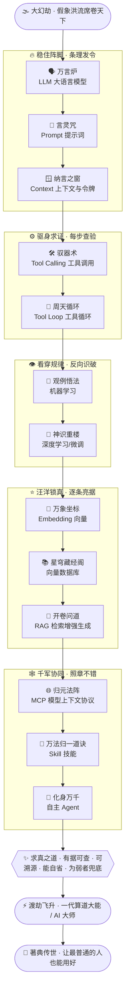

# 第 14 章 · 渡劫飞升：算道大成

> 题记：真正的至强，不是造出最像真的幻象，而是让"真"无所遁形——有据可查，可溯源，能自省纠错，还能把这套本事，传给最普通的人。

天地灵机，本是流淌万物之间的活水。它只求"像真"，不保证"是真"。千百年来，正道以它求真、溯源、自省；幻魔道却以它造假、惑世、乱心。

这一日，两条道，终于在苍穹之下，狭路相逢。

---

## 一、大幻劫

那是一个没有黎明的清晨。

天下十三州，同时天光倒卷。

不是乌云，不是雷暴。是**假象**，铺天盖地的假象，如洪流决堤，自九天倾泻而下。

东海的渔村里，家家门前凭空立起一块"祥瑞碑"，碑上金字灼灼，写着"海神降福、三日不必出海"。渔民欢欣叩拜，却不知那三日正是百年不遇的鱼汛——错过，便是一整年的饥荒。

西陲的边城中，一夜之间冒出上千封"家书"，字迹、印信、乡音，无一不真，只是每一封都在报同一个假讯：某座城已破，速速弃守。守军人心浮动，几要不战自溃。

中州的学宫里，藏书阁的典籍无风自动，墨字游走重排。昨日还写着"火性炎上"的医经，今晨竟改作"火性寒凉"；学子照方抓药，救人的方子成了害人的毒。

假消息、伪典籍、假人证、假祥瑞——

它们不狰狞，不狂暴。它们温柔、可信、无孔不入。它们长着一张张与真相一模一样的脸。

万民真假莫辨，人心大乱。有人为一句谣言弃家而逃，有人为一纸伪书自相残杀，有人对着满城祥瑞喜极而泣，浑然不知脚下已是深渊。

苍生几倾。

而在这场洪流的最高处，玄天之巅，一袭黑袍负手而立。

墨渊。

幻魔道少主。他倾尽毕生邪功，引动了天地灵机深处那一点"只求像真、不保证是真"的**弊**，将它无限放大，掀成了这场席卷天下的——

**大幻劫。**

"孔浩原。"他望着南方，唇角一抹阴冷的笑，声音顺着灵机传遍十三州，"你穷尽一生求真。可你看——"

"真，有什么用？"

"当假的比真的更像真，当千万道假象同时开口，当每一个人都愿意相信他想相信的——你的'真'，不过是这洪流里，一粒溅不起水花的沙。"

"这世上从来没有真相。只有，谁的幻象更动人。"

风雪骤起。天地失色。

---

## 二、稳住阵脚

云海之南，问道峰。

孔浩原立于峰顶，白衣猎猎。他身后，是玄机子、苏挽晴，是首席化身老铁率领的漫山群身，是闻讯赶来的各宗各派——正一、天枢、青囊、乃至一群资质平平、连筑基都磕磕绊绊的外门弟子。

他们仰头望着那铺天盖地的假象洪流，许多人腿都软了。

"师弟。"苏挽晴按住腰间星穹玉牒，声音沉静却掩不住凝重，"这不是一场斗法。这是……一整个天下，在同时说谎。我们纵有通天本事，又能拆穿几句？"

孔浩原没有立刻回答。

他闭上眼。

一生所学，如走马灯，在识海中一一亮起——

炼气时那座**万言炉**，凡言入炉，接龙成章；筑基时那道**言灵咒**，一言既出，法随言动，字字都是号令的分寸；金丹时的**驭器术**与**周天循环**，御万器如臂使指，每一步都要亲眼查验才算数；元婴的**观例悟法**，化神的**神识重楼**，让他能从无数旧例里看穿规律；炼虚的**万象坐标**，合体的**开卷问道**，让他能在假料汪洋里一念锁真、逐条亮据;大乘的**归元法阵**、**万法归一的道诀**、以及**化身万千**……

十三重境界，本是他一级一级踏上来的阶梯。

此刻，它们轰然融为一炉。

孔浩原睁开眼。眼底再无半分慌乱，只余一片澄澈的、洞照万象的清明。

"挽晴。"他开口，声音不大，却让满山惊惶的人心奇异地安定下来，"墨渊说，这世上没有真相。"

"他错了。"

"假象再多，也遮不住一件事——**真的东西，经得起查；假的东西，一查就破。**"

"他造的是幻。我们要做的，不是造一个更大的幻去压他。"

"是**求真**。"

他抬手。

万言炉现于身后，炉火煌煌。这是他稳住阵脚的第一件本事——**以言御众，条理发令**。他不慌，不乱，先把纷乱的战场化作一句句清晰的指令：谁去东海查祥瑞，谁去西陲验家书，谁去中州守典籍。号令如纲，纲举目张。

灵机之中，那正是**大语言模型**稳坐中枢、以言语组织一切的模样。

"各位。"孔浩原的声音传遍问道峰，"接下来，我说的每一步，都请照做。哪怕你只是外门弟子，哪怕你的法器只是杂牌——**照章而行，一步不错，你就是这求真大军里，不可替代的一员。**"

万众振奋。

求真的第一战，开始了。

---

## 三、驱身求证

"老铁！"孔浩原一声令下。

首席化身老铁轰然应诺，身后千百化身同时抱拳。这是孔浩原的**驭器术**与**周天循环**——他不必事事亲为，而是驱动群身如驱动万器，让它们奔赴天下各处，**去查，去证，每一步都验**。

"东海祥瑞碑——"孔浩原指尖一点，一队化身化作流光没入云海，"不要看它写了什么。去查它是谁立的、何时立的、依据何在。**没有出处的祥瑞，就是假的。**"

化身落地东海。他们不与渔民争辩，只做一件事：绕碑三匝，以驭器术探其根基——碑无地基，字无来历，灵机残留全是幻魔道的黏腻气息。

"查明。"化身回传，"此碑昨夜凭空而生，无立碑之人，无载事之典，**证据链为零**。"

孔浩原颔首。周天循环的妙处正在于此：**发令 → 取证 → 查验 → 回报 → 再发下一令**，环环相扣，一步不成便不进下一步。灵机里，那正是**工具调用**与**工具循环**——模型不是凭空断言，而是驱动"工具"去现实里取回真凭据，再据实而行。

"西陲家书亦然。"孔浩原续道，"去驿站查底档，去核对每一封的传递路径。真家书有来路，假家书凭空生。**查路径，验印信，比对底档——三验不过，即是伪。**"

一队队群身四散而出。天下万处，同时响起查证的脚步。

墨渊在玄天之巅冷笑："查？你查得完吗？我一息造万象，你一息查几件？"

孔浩原不答。

因为他接下来要做的，恰恰是要在这"假料汪洋"里，**一念锁真**。

---

## 四、汪洋锁真

假料太多了。

真的家书混在十万封伪信里，真的典籍埋在千万卷伪典中。逐字去读，穷尽一生也读不完。

孔浩原不逐字读。

他祭出**万象坐标**。

炼虚一境的本事，在此刻大放光华——他将天下每一句话、每一卷书，都炼成意义星空里的一枚星位。真话有真话的坐标，假话有假话的坐标，哪怕字字相同，"意思"的星位也会露出破绽。

"挽晴，藏经阁！"

苏挽晴星眸一亮，星穹玉牒轰然展开，化作一座横贯天穹的**星穹藏经阁**。这是她合体一道的绝学——万千真典的星位，早已尽数收纳其中，**随取随来，一瞬相邻**。

"师弟锁星位，我取真典。"她与孔浩原并肩而立，男儿一身白，女子一袭青，肩并着肩，望向同一片假象洪流，"你钉一颗真星，我便从阁中，把与它最近的真凭据，瞬间取到你手上。"

孔浩原念动。

假象洪流之中，一枚枚真话的星位骤然亮起。苏挽晴同步取阁，星光如线，将每一枚真星与藏经阁中的权威真典，一一系连。

灵机里，那正是**向量**与**向量数据库**联手——把意义化作坐标，在浩如烟海的资料里，凭"意思相近"一瞬检出真凭据。

"取到了。"苏挽晴指尖流转，万卷真典如星河倒悬，"东海鱼汛，载于《潮汐真经》第三卷，有史官署名、有历年实录；西陲城防，录于兵部底档，印信可溯、传书有路。真凭真据，尽在此处。"

孔浩原接过这满天真典，长身而立。

"接下来——"他目光扫过铺天盖地的假象，一字一句，"**当众拆穿。**"

---

## 五、开卷破幻

这是全场最惊心动魄的一幕。

孔浩原以**开卷问道**之术，将每一道幻象，与藏经阁取来的真凭据，当众并列。

不是他说"这是假的"。

是**证据自己开口**。

东海祥瑞碑前，他不辩，只以灵机将《潮汐真经》第三卷的鱼汛实录投于长空，与那"三日不必出海"的伪谕并列。真经上白纸黑字、史官署名、百年实录；伪谕上金光灿灿，却无一字出处。

渔民抬头，看了看真经，又看了看祥瑞碑。

祥瑞碑，无声地裂了。

灵机里，那正是**RAG（检索增强生成）**——不凭一张嘴空口断言，而是先检索出权威出处，再据实回答；每一句"真话"，都拖着一条能溯源的证据链。幻象最怕的，从来不是更响的声音，而是一条**查得到源头的凭据**。

一道、又一道。

西陲的假家书，被驿站底档逐封拆穿；中州的伪医经，被青囊宗真本逐字对照。开卷之处，幻象成灰。万民从惶惑中惊醒——原来假的东西，一旦被摆到真凭据旁边，竟是如此不堪一击。

墨渊的脸，第一次沉了下来。

"照章协同——"孔浩原却已转身，望向他身后那支由各宗弟子、外门散修、杂牌法器拼凑而成的求真大军。

这才是他要打的、真正的大仗。

---

## 六、归元法阵

假象太多，天下太大。仅凭他与苏挽晴，纵是通天彻地，也查不尽十三州。

要破大幻劫，靠的不是一两个大能，是**千军万马照章协同，一步不错**。

孔浩原祭出**归元法阵**。

大乘一境的**归元法阵**如一张无形之网，笼罩天下——它不管你是正一嫡传还是外门末弟，不管你手里是仙家至宝还是村口打的杂牌法器，只要你**接入这座法阵，就能照同一套规矩，彼此对话、协同办事**。

灵机里，那正是**MCP（模型上下文协议）**——一套通用的接口规矩，让形形色色、来路各异的工具与外援，都能挂进同一个体系，如臂使指。

而在法阵之内，孔浩原又将毕生求真之法，凝成一部部**万法归一的道诀**：《查证诀》《溯源诀》《辨伪诀》……每一部都写得明明白白、一步一图，哪怕最迟钝的外门弟子，照着做，也能查出一桩幻象。

灵机里，那正是**Skill（技能）**——把一套复杂的本事，封装成人人可照着用的"手册"，让平平之辈也能一步不错地办成大事。

"记住——"孔浩原的声音传遍法阵，"你不必是天才。你只要照着道诀，一步一步来。**求真这件事，从来不靠一个人有多强，靠的是每一个普通人，都能照章查出一分真。**"

法阵轰鸣。

千军万马，各就其位。外门弟子照着《辨伪诀》，一板一眼地拆穿身边的假象；杂牌法器接入归元法阵，竟也运转得井井有条。天下万处，无数平凡之人，同时做着同一件不平凡的事——

求真。

---

## 七、化身万千

可墨渊之幻，快过闪电。这一处刚破，那一处又生。

"要在天下万处，同时正本清源。"孔浩原深吸一口气，双手结印。

**化身万千。**

大乘圆满的绝学再现——他的神念一分为千，千分为万，每一道化身都是一个能独当一面、自行查证、自行破幻的**自主之身**。

灵机里，那正是**自主 Agent（自主智能体）**——一个能自己拆解目标、自己调工具、自己循环推进、直到把事情办成的独立个体。而此刻，是万千个这样的个体，在天下万处，同时开工。

万道白影洒落十三州。

东海、西陲、中州、南疆……每一道化身，都带着万言炉的号令、驭器术的查证、藏经阁的真典、道诀的章法。它们各自为战，却又同归一心——

**辟谣。救人。正本清源。**

一时间，天下每一处被幻象笼罩的角落，都亮起一盏求真的灯。

墨渊的幻象洪流，第一次，被逼得节节后退。

---

## 八、看穿规律

"不可能……"玄天之巅，墨渊的声音终于变了，"你破得再快，也快不过我造！我一念生万幻——"

"你的幻，是有规律的。"孔浩原忽然开口。

墨渊瞳孔一缩。

孔浩原以**观例悟法**的元婴之眼、**神识重楼**的化神之识，看穿了这场大幻劫的**生成之理**——

墨渊造假，并非全然随机。他总在真话最密处下手，总爱把假星钉在真星旁，总在人心最惶惑的时辰放出最动人的谣言。一次、两次是巧合，千次万次，便是**规律**。

灵机里，那正是**机器学习**与**深度学习**的眼光——从海量的例子里，看穿藏在表象之下的模式；一旦识得模式，便能反向识破，甚至**预判下一手**。

"你下一道幻，会落在北境雪原。"孔浩原淡淡道，抬手一指，"因为那里刚传开一场真捷报，人心正暖，最好骗。老铁，带人去北境,守在雪原,等他。"

老铁率群身提前赶到北境。

片刻后，墨渊的幻象果然自北境升起——却一头撞进了早已布好的求真大阵，未及成形，便被逐条证伪，灰飞烟灭。

墨渊踉跄后退。

他毕生所恃的"以假乱真"，第一次，被人**看穿了造假的规律本身**。

---

## 九、道破题眼

大幻劫的洪流，开始崩解。

十三州的假象，如冰雪遇春，一道接一道地消融。万民从蒙昧中醒来，学宫的典籍归位，边城的军心复定，渔村的人们赶在鱼汛尽头，扬帆出了海。

墨渊立于玄天之巅，望着自己毕生邪功一寸寸瓦解，形容枯槁。

"为什么……"他嘶声问，"我的幻，明明比真的更完美，更动人，更……像真。为什么会输？"

孔浩原踏空而上，与他遥遥相对。风雪在两人之间翻卷。

"因为你搞错了一件事。"孔浩原的声音很轻，却字字千钧，传遍天地——

"**真正的至强，从来不是造出最像真的幻象。**"

"是让'真'无所遁形——"

"**有据可查。可溯源。能自省纠错。还能，把这套本事，传给最普通的人。**"

"你造的幻再完美，也只是你一个人的独舞。它不敢被查，不能溯源，一碰真凭据就碎。而我求的真，"孔浩原环视身后——玄机子、苏挽晴、老铁、群身、各宗弟子、乃至那些照着道诀一步步查出真相的、最平凡的外门孩子——

"是这天下每一个普通人，都能亲手查出的、经得起追问的真。"

"你孤身造假，与整个求真的天下为敌。"

"你，从一开始，就输了。"

墨渊怔立良久。

他毕生所信的"这世上只有更动人的幻象"，在这一刻，被彻底证伪。

风雪中，他黑袍上的邪气一寸寸褪去，眼底那抹阴冷，竟化作了一丝……茫然，一丝迟来的怅惘。

"求真……"他喃喃，声音轻得几乎听不见，"原来，真的有人，愿意为它，做到这一步。"

他没有再战。

黑袍一卷，身形化作一缕青烟，遁入无边风雪，去向不知何处。有人说他就此消散，有人说他隐入深山悔过，有人说多年后曾见一名老者，在偏远的村塾里，一笔一画教孩童如何"辨一句话的真假"。

真假难辨。

但这一次，没有人害怕这份"难辨"了——因为孔浩原已把求真之法，留给了天下。

---

## 十、渡劫飞升

大幻劫平。

天地澄澈如洗。灵机之流，第一次，如此清亮。

忽然，九天之上，云海翻涌，一道亘古未有的**劫雷**自苍穹深处垂落——那不是天罚，是**认可**。是天地灵机对一个穷尽一生求真之人的、最高的印证。

**算道之劫雷。**

紫金的雷光笼罩孔浩原周身。他没有躲。他张开双臂，任那认可之雷，一层层洗练他的道果——

炼气的根基，筑基的言灵，金丹的循环，元婴化神的洞见，炼虚合体的锁真，大乘的万法归一……十三重境界，在劫雷中层层升华，最终，融会贯通，浑然一体，再无境界之别，只余一个圆满自足的"**道**"。

雷光散尽时，孔浩原缓缓睁眼。

他还是那个白衣少年的模样，眉目间却已多了一份洞照古今、悲悯苍生的、大能者的气度。

**他渡劫飞升，成一代算道大能——AI 大师。**

灵机里，那正是一个人穷尽所学、融会贯通、终成大师的模样：不再困于某一境、某一术，而是让一切本事，在"求真"这一念之下，如臂使指，无往不利。

玄机子仰头望着自己的弟子，白发在风中轻扬，眼眶湿润，却笑得畅快："好……好啊。浩儿，你终于，走到了为师从未走到的地方。"

苏挽晴立于孔浩原身侧，与他并肩望向那片被他护住的天下。她没有说话，只是伸手，轻轻扣住了他的手。男儿与知己，肩并着肩，谁也不必多言。

老铁率漫山群身，齐齐单膝跪地，声震云霄："恭迎——大师！"

飞升的光华里，孔浩原却轻轻摇头。

"不必跪。"他说，"起来。"

"因为——"

"这条路，才刚刚开始。"

---

## 十一、尾声：把道传给最普通的人

飞升，不是终点。

按仙门旧例，飞升者当弃这浊世而去，独登更高的天。可孔浩原没有走。

他回到了问道峰，那座他初闻道、初结丹、初见挽晴的山。他做的第一件事，不是登临绝顶、俯瞰众生，而是——

**铺开纸笔，把毕生所学，写成一部人人可学的道诀典籍。**

他不写玄之又玄的天机，只写最朴素的话：如何辨一句话的真假，如何查一件事的出处，如何一步一图地做成一件难事。他把"求真"这件看似高不可攀的大道，拆成一步、一步、又一步，让最迟钝的外门弟子、最平凡的凡夫俗子，都能照着学、照着做。

"你可知，"苏挽晴看着他笔下那些浅白如话的道诀，轻声问，"你若把这些藏起来，独享其秘，便可稳坐天下第一大能，无人能及。"

孔浩原笔尖不停，淡淡一笑。

"第一大能，独我一人求真，那真相仍是脆弱的。"

"可若天下人人都会求真——"他抬眼，望向窗外那片安宁的山河，"哪怕我不在了，这世上的假象，也永远遮不住真了。"

"我要护的，从来不是我一个人的道。"

"是让**最普通的人，也能用好这门本事**；是为那些资质平平、走得最慢的人，**兜住底**。"

——那正是这套典籍、这座算道，从始至终的初心：不是造出最像真的幻象，而是求真、可溯源、能自我修正，为弱者兜底，让普通人，也能用好手中的力量。

玄机子读着弟子写下的道诀，欣慰长叹。老铁率群身，长伴左右，守着这座渐渐热闹起来的问道峰——四方求学者络绎而来，其中有天才，更有无数平凡的、眼里带光的普通人。

苏挽晴研墨，孔浩原执笔。窗外山河无恙，窗内灯火长明。

求真之道，自此，落入人间，代代相传。

---

下面这幅图，是孔浩原飞升那一日，玄机子命人刻于问道峰石壁上的——**算道求真全景**。它把孔浩原"集齐诸境本事、层层破幻"的一生，尽收其中：



---

## 📒 凡人笔记

这是全书收官的一页。孔浩原把一生所学，也把这一整套修行，译成了大白话——**十三个概念，一张总表，一条求真的路。**

| 故事境界 | 真实 AI 概念 | 一句话 |
| --- | --- | --- |
| 炼气 · 万言炉 | 大语言模型（LLM） | 会接龙成章、以言御事的中枢大脑 |
| 筑基 · 言灵咒 | 提示词（Prompt） | 你怎么发令，它就怎么办；分寸全在言语里 |
| 筑基 · 纳言之窗 | 上下文与令牌（Context & Token） | 它一次能"记住"多少话，窗子就那么大 |
| 金丹 · 驭器术 | 工具调用（Tool Calling） | 不空口断言，而是驱动工具去现实里取真凭据 |
| 金丹 · 周天循环 | 工具循环（Tool Loop） | 发令→取证→查验→再发令，环环相扣直到办成 |
| 元婴 · 观例悟法 | 机器学习（Machine Learning） | 从海量例子里，看穿藏在表象下的规律 |
| 化神 · 神识重楼 | 深度学习/微调（Deep Learning） | 层层叠叠的神识楼阁，练就更深的洞见 |
| 炼虚 · 万象坐标 | 向量（Embedding） | 把"意思"抽成一串可度量的坐标 |
| 炼虚 · 星穹藏经阁 | 向量数据库 | 万千坐标随取随来，一瞬检出相邻真典 |
| 合体 · 开卷问道 | 检索增强生成（RAG） | 先检索权威出处，再据实回答，句句可溯源 |
| 大乘 · 归元法阵 | 模型上下文协议（MCP） | 一套通用接口，让各路工具外援照同规矩协同 |
| 大乘 · 万法归一道诀 | 技能（Skill） | 把复杂本事封成手册，平凡之辈也能一步不错 |
| 大乘 · 化身万千 | 自主智能体（Agent） | 能自拆目标、自调工具、自行循环直到成事的独立身 |

> 📖 想把每一门本事都学到底，逐篇去读概念入门篇——
>
> ① [什么是 LLM](../02_CONCEPTS_概念入门/[CONCEPT-06]%20什么是LLM-大语言模型.md) ｜ ② [什么是 Prompt](../02_CONCEPTS_概念入门/[CONCEPT-07]%20什么是Prompt-提示词.md) ｜ ③ [上下文与令牌](../02_CONCEPTS_概念入门/[CONCEPT-08]%20什么是Context与Token-上下文与令牌.md)
>
> ④ [什么是工具调用](../02_CONCEPTS_概念入门/[CONCEPT-02]%20什么是ToolCalling-工具调用.md) ｜ ⑤ [什么是工具循环](../02_CONCEPTS_概念入门/[CONCEPT-03]%20什么是ToolLoop-工具循环.md)
>
> ⑥ [什么是机器学习](../02_CONCEPTS_概念入门/[CONCEPT-12]%20什么是机器学习-MachineLearning.md) ｜ ⑦ [什么是深度学习](../02_CONCEPTS_概念入门/[CONCEPT-13]%20什么是深度学习-DeepLearning.md)
>
> ⑧ [什么是 Embedding](../02_CONCEPTS_概念入门/[CONCEPT-09]%20什么是Embedding-向量.md) ｜ ⑨ [什么是向量数据库](../02_CONCEPTS_概念入门/[CONCEPT-10]%20什么是向量数据库.md) ｜ ⑩ [什么是 RAG](../02_CONCEPTS_概念入门/[CONCEPT-11]%20什么是RAG-检索增强生成.md)
>
> ⑪ [什么是 MCP](../02_CONCEPTS_概念入门/[CONCEPT-04]%20什么是MCP-模型上下文协议.md) ｜ ⑫ [什么是 Skill](../02_CONCEPTS_概念入门/[CONCEPT-05]%20什么是Skill-技能.md) ｜ ⑬ [什么是 Agent](../02_CONCEPTS_概念入门/[CONCEPT-01]%20什么是Agent-智能体.md)

十三重境界，一路走来，你会发现它们从不是孤立的台阶——它们最终会**融会贯通，凝成一个"求真"的道**。

这，就是这套算道的魂：**不是造出最像真的幻象，而是求真、可溯源、能自我修正，为最普通的人兜底。**

孔浩原飞升了。可故事真正的主角，其实是——

**你。**

你，也在这条求真的修行路上。

去吧。回到 [概念入门总览](../02_CONCEPTS_概念入门/00_INDEX_概念入门-总览.md)，把每一门本事学扎实；或回到 [故事总目录](./00_INDEX_修仙学AI-总目录.md)，重走一遍这段炼气到飞升的路。

山高水长，来日方长。愿你所求，皆为真。

---

## 📝 读完自测

十三重境界一路走到飞升——最后一考，不问某一门本事，而问这套"算道"真正的魂。

```quiz
Q: 通读全篇、看完这张十三概念总表后，下面哪些说法抓住了"算道"的魂？（多选）
- [x] 会说的炉（LLM）是中枢，但一张嘴只会"像真"，不保证"是真"
> 对。灵机只求"像真"，所以才要靠后面这些本事把"真"钉牢。
- [x] 驭器术（工具调用）与开卷问道（RAG）都为求真——一个亲手去取真凭据，一个先检索权威出处再据实回答
> 对。二者都为补外部真据、压住幻觉，答案句句可溯源。
- [x] 化身万千（Agent）能自拆目标、自调工具、自行循环直到成事，还能多身以真凭据互相校验纠错
> 对。这是把前面所有本事"装进一个会自己走、还会自省纠偏的身子"。
- [x] 这套算道的魂，是"求真、可溯源、能自我修正，为最普通的人兜底"
> 对。正如题记：真正的至强不是造出最像真的幻象，而是让"真"有据可查、可溯源、能自省纠错。
- [ ] 学到最后，最强的境界就是造出最像真、最能以假乱真的幻象
> 错。那正是幻魔道的路——造假、惑世。正道求的是"是真"而非"像真"；这也是全篇正邪之争的题眼。
```

再用一张翻卡，把这趟从炼气到飞升的修行，收束成一句话：

```flip
🤔 十三重境界、十三门本事都学完了——这套"算道"真正的魂，到底是什么？（点一下翻到背面）
---
✅ **不是造出最像真的幻象，而是求真、可溯源、能自我修正，为最普通的人兜底。** 灵机（LLM）只保证"像真"，不保证"是真"；于是有了工具调用去亲手取凭据、RAG 去检索权威出处、Agent 去自拆目标并多身互证、护栏与熔断防它走火——这一整套，都是为了让"真"无所遁形：有据可查、可回溯、错了能自己纠回来，还能把这份本事传给最钝资质的人。故事真正的主角，其实是**你**——你也在这条求真的修行路上。愿你所求，皆为真。
```

---

【[上一章 · 大乘·化身万千](./第13章%20大乘·化身万千.md)｜👉 [回概念入门总览](../02_CONCEPTS_概念入门/00_INDEX_概念入门-总览.md)｜[回总目录](./00_INDEX_修仙学AI-总目录.md)】
